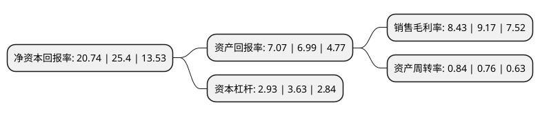

> 本页面由自动化程序生成于 2022年5月20日 01:14
> 内容可能存在错误，如有bug请提交issue至：https://github.com/Eroleice/doc-pi/issues
{.is-warning}

# 上市公司基本情况

## 基本资料

安徽荃银高科种业股份有限公司（以下简称“荃银高科”）成立于2002年07月24日，合肥市。于2010年05月26日在深交所创业板上市。

荃银高科注册资本45,409.844万元，本公司自设立以来一直以现代种业产业化为发展方向，利用现代生物技术，从事高产，优质杂交水稻种子研发，繁育，推广及服务，目主要产品包括“新两优6号”，“新两优香4”等籼型两系杂交水稻种子以及“农丰优909”，“新优188”等籼型三系杂交水稻种子，“新两优6号”于2006年被列为农业部第一批超级稻示范推广品种。以下是详细信息：

- 公司名称: 安徽荃银高科种业股份有限公司
- 股票代码: 300087.SZ
- 所在地: 安徽 - 合肥市
- 成立日期: 2002年07月24日
- 注册资本: 45,409.844万元
- 法定代表人: 覃衡德
- 主营业务: 本公司自设立以来一直以现代种业产业化为发展方向，利用现代生物技术，从事高产，优质杂交水稻种子研发，繁育，推广及服务，目主要产品包括“新两优6号”，“新两优香4”等籼型两系杂交水稻种子以及“农丰优909”，“新优188”等籼型三系杂交水稻种子，“新两优6号”于2006年被列为农业部第一批超级稻示范推广品种
- 公司官网: www.winallseed.com
- 公司介绍: 公司是“育繁推一体化”的高科技种业企业，安徽省农业产业化龙头企业。公司以现代种业技术产业化为发展方向，利用现代生物工程技术，主要从事优良水稻、玉米、小麦等主要农作物种子研发、繁育、推广及服务业务。公司拥有“农业部杂交稻新品种创制重点实验室”等创新平台，牵头组建国字号“水稻商业化分子育种技术创新联盟”；公司首创的“现代青年农场主”模式被农业部评为“全国新型职业农民培育十大模式”之一，被科技部认定为首批“星创天地”，获得教育部“国家教学成果二等奖”，并被安徽省评为农业人才培养的“众创空间”；公司系“中国种业信用明星企业、国家高新技术企业、农业产业化省级龙头企业、安徽省企业技术中心、安徽省创新型企业”。

## 股东及高管情况

上市公司第一大股东为中国种子集团有限公司，持股92,520,965股，占比20.37%，**疑似为**上市公司实际控制人。

截至2022年03月31日，上市公司的前十大股东中，共有3名自然人股东，2名机构股东，5个产品账户，其中5%以上大股东共有2名。上市公司前十大股东明细如下：

> 未能通过持股比例判定出上市公司实际控制人（持股30%以上）
> 可能存在通过间接持股、联合持股、协议控制等方式拥有实际控制权的主体，具体请参考上市公司定期公告！
{.is-warning}

> 截至2022年03月31日，上市公司前十大股东信息如下：

| 股东名称 | 持股数量（股） | 持股比例 |
| --- | --- | --- |
| 中国种子集团有限公司 | 92,520,965 | 20.37% |
| 贾桂兰 | 31,200,672 | 6.87% |
| 张琴 | 22,384,458 | 4.93% |
| 中国建设银行股份有限公司-嘉实农业产业股票型证券投资基金 | 8,087,439 | 1.78% |
| 中国农业银行股份有限公司-银华内需精选混合型证券投资基金(LOF) | 7,900,000 | 1.74% |
| 华夏银行股份有限公司-万家瑞隆混合型证券投资基金 | 6,396,100 | 1.41% |
| 中国建设银行股份有限公司-银华同力精选混合型证券投资基金 | 6,000,000 | 1.32% |
| 张从合 | 5,637,476 | 1.24% |
| 宁波梅山保税港区融轩股权投资中心(有限合伙) | 5,601,636 | 1.23% |
| 安徽荃银高科种业股份有限公司-第一期员工持股计划 | 5,502,000 | 1.21% |

## 利润表分析

上市公司2021年总收入为25.2亿元，净利润为2.12亿元，实现盈利。

## 杜邦分析

> 数据列示周期：2021年 | 2020年 | 2019年
{.is-info}

上市公司的净资产收益率在近一年有所下降，下降幅度为-18.35%，其变化情况分解如下：
- 上市公司的销售毛利率在近一年下降了-8.07%，可能是生产效率的下降、商品原材料价格上涨或商品价格的下跌所致。
- 上市公司的资产周转率在近一年上升了10.53%，可能是源自于更快的销售回款或库存管理效果提升。
- 上市公司的财务杠杆比率在近一年下降了-19.28%，可能是减少负债降低财务费用。

