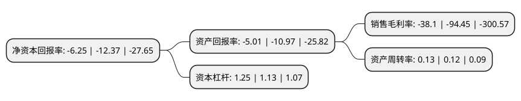

> 本页面由自动化程序生成于 2022年5月20日 01:15
> 内容可能存在错误，如有bug请提交issue至：https://github.com/Eroleice/doc-pi/issues
{.is-warning}

# 上市公司基本情况

## 基本资料

海南神农科技股份有限公司（以下简称“神农科技”）成立于2000年12月29日，海口市。于2011年03月16日在深交所创业板上市。

神农科技注册资本102,400万元，公司以杂交水稻种子的选育，制种，销售和技术服务为主，具备“育，繁，推”一体化经营能力，主要产品为农作物种子，包括杂交水稻种子，玉米种子，蔬菜瓜果种子，棉花种子等。以下是详细信息：

- 公司名称: 海南神农科技股份有限公司
- 股票代码: 300189.SZ
- 所在地: 海南 - 海口市
- 成立日期: 2000年12月29日
- 注册资本: 102,400万元
- 法定代表人: 曹欧劼
- 主营业务: 公司以杂交水稻种子的选育，制种，销售和技术服务为主，具备“育，繁，推”一体化经营能力，主要产品为农作物种子，包括杂交水稻种子，玉米种子，蔬菜瓜果种子，棉花种子等
- 公司官网: www.hnsnkj.com.cn
- 公司介绍: 公司于2000年12月29日注册成立的种业科技股份有限公司，是首批获得农业部核发《全国农作物种子经营许可证》和“国家农作物种子进出口权”的四家股份公司之一，其经营范围包括粮食、棉花、油料等农作物种子的选育、生产、销售和技术服务以及农药、化肥的销售等，主营杂交水稻种子的选育、制种、销售和技术服务。公司是我国种子行业的“国家高技术产业化示范基地”；公司是农业产业化国家重点龙头企业、全国扶贫龙头企业、国家火炬计划重点高新技术企业、海南省高新技术企业、海南省农业产业化重点龙头企业；通过了ISO9001国际标准质量管理体系认证和英国皇家UKAS认证；经过多年的发展，公司在杂交水稻制种技术、新品种、渠道网络、经营规模和效益上均位居行业前列，已经成为国内少数具备育繁推一体化经营能力的农作物种业企业之一。

## 股东及高管情况

上市公司第一大股东为曹欧劼，持股183,666,101股，占比17.94%，**疑似为**上市公司实际控制人。

截至2022年03月31日，上市公司的前十大股东中，共有6名自然人股东，3名机构股东，1个产品账户，其中5%以上大股东共有1名。上市公司前十大股东明细如下：

> 未能通过持股比例判定出上市公司实际控制人（持股30%以上）
> 可能存在通过间接持股、联合持股、协议控制等方式拥有实际控制权的主体，具体请参考上市公司定期公告！
{.is-warning}

> 截至2022年03月31日，上市公司前十大股东信息如下：

| 股东名称 | 持股数量（股） | 持股比例 |
| --- | --- | --- |
| 曹欧劼 | 183,666,101 | 17.94% |
| 湖南省弘德资产经营管理有限公司 | 51,028,330 | 4.98% |
| 杨西德 | 49,700,000 | 4.85% |
| 湖南省财信产业基金管理有限公司 | 21,653,890 | 2.11% |
| 徐双阳 | 6,688,600 | 0.65% |
| 江西核工业瑞丰生化有限责任公司 | 6,085,155 | 0.59% |
| 华泰证券股份有限公司 | 3,872,630 | 0.38% |
| 周建禄 | 3,500,000 | 0.34% |
| 莫小军 | 3,190,143 | 0.31% |
| 戴戎 | 2,725,900 | 0.27% |

## 利润表分析

上市公司2021年总收入为1.47亿元，净利润为-0.57亿元，**未实现盈利**。

## 杜邦分析

> 数据列示周期：2021年 | 2020年 | 2019年
{.is-info}

上市公司的净资产收益率在近一年有所下降，下降幅度为-49.47%，其变化情况分解如下：
- 上市公司的销售毛利率在近一年下降了-59.66%，可能是生产效率的下降、商品原材料价格上涨或商品价格的下跌所致。
- 上市公司的资产周转率在近一年上升了8.33%，可能是源自于更快的销售回款或库存管理效果提升。
- 上市公司的财务杠杆比率在近一年上升了10.62%，可能是增加负债扩大生产规模。

