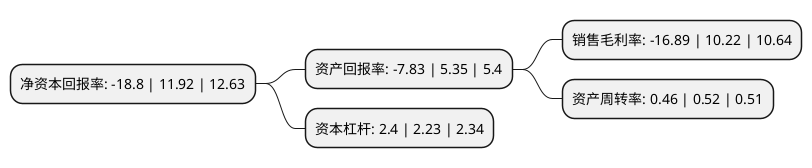

> 本页面由自动化程序生成于 2022年5月20日 01:18
> 内容可能存在错误，如有bug请提交issue至：https://github.com/Eroleice/doc-pi/issues
{.is-warning}

# 上市公司基本情况

## 基本资料

上海雪榕生物科技股份有限公司（以下简称“雪榕生物”）成立于1997年12月08日，上海市。于2016年05月04日在深交所创业板上市。

雪榕生物注册资本50,759.998万元，公司主营鲜品食用菌的研发，工厂化种植与销售，主要产品包括金针菇，真姬菇等鲜品食用菌。以下是详细信息：

- 公司名称: 上海雪榕生物科技股份有限公司
- 股票代码: 300511.SZ
- 所在地: 上海 - 上海市
- 成立日期: 1997年12月08日
- 注册资本: 50,759.998万元
- 法定代表人: 杨勇萍
- 主营业务: 公司主营鲜品食用菌的研发，工厂化种植与销售，主要产品包括金针菇，真姬菇等鲜品食用菌
- 公司官网: www.xuerong.com
- 公司介绍: 公司是一家以现代生物技术为依托，以工业化方式生产农产品的的现代农业企业，主营鲜品食用菌的研发、工厂化种植与销售，主要产品包括金针菇、真姬菇等鲜品食用菌。公司已在上海、吉林、四川、山东、广东、贵州等地区投资建设了集科研、生产、销售于一体的综合性食用菌工厂化企业，并走向全国战略发展布局及多品种布局公司在菌种、工艺、培养基配方等方面，具有核心自主知识产权，并已经完全具备自主发展能力，具备生产金针菇、蟹味菇、白玉菇、杏鲍菇、海鲜菇、香菇、双孢蘑菇、白灵菇、舞茸等多种产品的能力。公司经过了中国质量认证中心的认证(CQC)，并通过了ISO9001:2008质量管理体系、ISO14001:2004环境管理体系、ISO22000:2005食品安全管理体系认证。公司连续多年被农业部、发改委、证监会等八部委联合审定为“农业产业化国家重点龙头企业”，公司雪榕牌金针菇被评为“上海市著名商标”。

## 股东及高管情况

上市公司第一大股东为杨勇萍，持股106,599,450股，占比21%，**疑似为**上市公司实际控制人。

截至2022年03月31日，上市公司的前十大股东中，共有4名自然人股东，5个产品账户，1个海外主体，其中5%以上大股东共有1名。上市公司前十大股东明细如下：

> 未能通过持股比例判定出上市公司实际控制人（持股30%以上）
> 可能存在通过间接持股、联合持股、协议控制等方式拥有实际控制权的主体，具体请参考上市公司定期公告！
{.is-warning}

> 截至2022年03月31日，上市公司前十大股东信息如下：

| 股东名称 | 持股数量（股） | 持股比例 |
| --- | --- | --- |
| 杨勇萍 | 106,599,450 | 21% |
| 浙江银万斯特投资管理有限公司-银万华奕1号私募证券投资基金 | 22,100,000 | 4.35% |
| 诸焕诚 | 13,028,093 | 2.57% |
| 招商银行股份有限公司-华夏磐锐一年定期开放混合型证券投资基金 | 11,221,122 | 2.21% |
| 张建飞 | 9,579,209 | 1.89% |
| 华夏基金-邮储银行-华夏基金秋实混合策略1号集合资产管理计划 | 7,920,792 | 1.56% |
| 青岛君厚私募基金管理有限公司-君厚知存价值共享私募证券投资基金 | 5,213,100 | 1.03% |
| 青岛稳泰私募基金管理有限公司-稳泰旭升2号私募证券投资基金 | 4,950,495 | 0.98% |
| 徐国新 | 4,620,462 | 0.91% |
| UBS   AG | 4,186,393 | 0.82% |

## 利润表分析

上市公司2021年总收入为20.62亿元，净利润为-3.49亿元，**未实现盈利**。

## 杜邦分析

> 数据列示周期：2021年 | 2020年 | 2019年
{.is-info}

上市公司的净资产收益率在近一年有所下降，下降幅度为-257.72%，其变化情况分解如下：
- 上市公司的销售毛利率在近一年下降了-265.26%，可能是生产效率的下降、商品原材料价格上涨或商品价格的下跌所致。
- 上市公司的资产周转率在近一年下降了-11.54%，可能是源自于更慢的销售回款或库存管理效果下降。
- 上市公司的财务杠杆比率在近一年上升了7.62%，可能是增加负债扩大生产规模。

