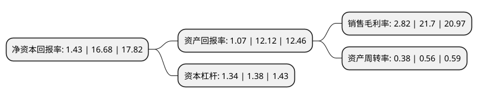

> 本页面由自动化程序生成于 2022年5月20日 01:21
> 内容可能存在错误，如有bug请提交issue至：https://github.com/Eroleice/doc-pi/issues
{.is-warning}

# 上市公司基本情况

## 基本资料

江苏华绿生物科技股份有限公司（以下简称“华绿生物”）成立于2010年06月08日，宿迁市。于2021年04月12日在深交所创业板上市。

华绿生物注册资本11,670万元，食用菌的研发，工厂化种植及销售。主要产品:食用菌产品为金针菇，真姬菇(包括蟹味菇，白玉菇)和杏鲍菇，其中以金针菇为主。以下是详细信息：

- 公司名称: 江苏华绿生物科技股份有限公司
- 股票代码: 300970.SZ
- 所在地: 江苏 - 宿迁市
- 成立日期: 2010年06月08日
- 注册资本: 11,670万元
- 法定代表人: 余养朝
- 主营业务: 食用菌的研发，工厂化种植及销售主要产品:食用菌产品为金针菇，真姬菇(包括蟹味菇，白玉菇)和杏鲍菇，其中以金针菇为主
- 公司官网: www.chinagreenbio.com
- 公司介绍: 公司采用工厂化模式生产鲜品食用菌，是全国食用菌工厂化生产的领先企业之一。2013年12月3日及2016年11月30日，公司被江苏省科学技术厅、江苏省财政厅、江苏省国家税务局、江苏省地方税务局审定为高新技术企业。2013年1月，公司被江苏省农业产业化经营领导小组审定为江苏省农业产业化省级重点龙头企业。2013年7月15日，公司被泗阳县科学技术局审定为江苏省科技型中小企业。2013年9月，公司“CG-FVDA0001”新品种白色金针菇被江苏省科学技术厅审定为高新技术产品。2013年12月，公司被江苏省科学技术厅审定为江苏省农业科技型企业。2014年9月，公司被江苏省教育厅、江苏省科学技术厅审定为江苏省研究生工作站。

## 股东及高管情况

上市公司第一大股东为余养朝，持股35,987,628股，占比30.84%，为上市公司实际控制人。

截至2022年03月31日，上市公司的前十大股东中，共有3名自然人股东，6名机构股东，1个产品账户，其中5%以上大股东共有3名。上市公司前十大股东明细如下：

> 截至2022年03月31日，上市公司前十大股东信息如下：

| 股东名称 | 持股数量（股） | 持股比例 |
| --- | --- | --- |
| 余养朝 | 35,987,628 | 30.84% |
| 阮秀莲 | 9,683,876 | 8.3% |
| 江苏高投发展创业投资有限公司 | 8,640,000 | 7.4% |
| 宁波梅山保税港区苏民投华绿股权投资合伙企业(有限合伙) | 3,571,428 | 3.06% |
| 苏州工业园区天惠食品产业投资合伙企业(有限合伙) | 3,200,000 | 2.74% |
| 陈惠 | 3,000,000 | 2.57% |
| 杭州兴富投资管理合伙企业(有限合伙) | 2,160,000 | 1.85% |
| 合肥国耀伟业创业投资合伙企业(有限合伙) | 2,160,000 | 1.85% |
| 江苏毅达并购成长股权投资基金(有限合伙) | 2,089,068 | 1.79% |
| 国元股权投资有限公司 | 2,000,000 | 1.71% |

## 利润表分析

上市公司2021年总收入为5.78亿元，净利润为0.16亿元，实现盈利。

## 杜邦分析

> 数据列示周期：2021年 | 2020年 | 2019年
{.is-info}

上市公司的净资产收益率在近一年有所下降，下降幅度为-91.43%，其变化情况分解如下：
- 上市公司的销售毛利率在近一年下降了-87%，可能是生产效率的下降、商品原材料价格上涨或商品价格的下跌所致。
- 上市公司的资产周转率在近一年下降了-32.14%，可能是源自于更慢的销售回款或库存管理效果下降。
- 上市公司的财务杠杆比率在近一年下降了-2.9%，可能是减少负债降低财务费用。

