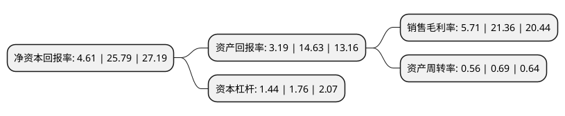

> 本页面由自动化程序生成于 2022年5月20日 01:21
> 内容可能存在错误，如有bug请提交issue至：https://github.com/Eroleice/doc-pi/issues
{.is-warning}

# 上市公司基本情况

## 基本资料

福建万辰生物科技股份有限公司（以下简称“万辰生物”）成立于2011年12月21日，漳州市。于2021年04月19日在深交所创业板上市。

万辰生物注册资本15,350万元，食用菌的研发，种植，销售，主要产品包括金针菇，蟹味菇，白玉菇和海鲜菇等鲜品食用菌以下是详细信息：

- 公司名称: 福建万辰生物科技股份有限公司
- 股票代码: 300972.SZ
- 所在地: 福建 - 漳州市
- 成立日期: 2011年12月21日
- 注册资本: 15,350万元
- 法定代表人: 王健坤
- 主营业务: 食用菌的研发，种植，销售，主要产品包括金针菇，蟹味菇，白玉菇和海鲜菇等鲜品食用菌
- 公司官网: www.vanchen.com
- 公司介绍: 公司是一家致力于食品工业、食品专卖连锁、农业产业化经营运作、商业地产于一体的综合型集团企业，总部设在中国香港，旗下福建东方食品集团有限公司为国家级农业产业化重点龙头企业，“含羞草”品牌荣获中国驰名商标称号，福建东方食品集团一直以专注于休闲食品的产业链打造和现代营销为核心己任。旗下万辰集团(中国香港)股份有限公司是一家专业从事房地产和商业地产开发的房地产企业。旗下零食工坊(中国香港)国际连锁发展有限公司是以专业从事特色精品零食的开发、加工、销售为一体的国际化连锁零售企业，本着“立足中国香港、面向全国、放眼世界”的发展战略，致力于打造中国最具价值的零食专卖连锁品牌。

## 股东及高管情况

上市公司第一大股东为福建含羞草农业开发有限公司，持股40,949,000股，占比26.68%，**疑似为**上市公司实际控制人。

截至2022年03月31日，上市公司的前十大股东中，共有4名自然人股东，6名机构股东，其中5%以上大股东共有3名。上市公司前十大股东明细如下：

> 未能通过持股比例判定出上市公司实际控制人（持股30%以上）
> 可能存在通过间接持股、联合持股、协议控制等方式拥有实际控制权的主体，具体请参考上市公司定期公告！
{.is-warning}

> 截至2022年03月31日，上市公司前十大股东信息如下：

| 股东名称 | 持股数量（股） | 持股比例 |
| --- | --- | --- |
| 福建含羞草农业开发有限公司 | 40,949,000 | 26.68% |
| 漳州金万辰投资有限公司 | 29,935,000 | 19.5% |
| 王泽宁 | 7,800,000 | 5.08% |
| 朱梦星 | 4,147,000 | 2.7% |
| 漳州市芗城区鑫投新页群贤食品投资合伙企业(有限合伙) | 3,840,000 | 2.5% |
| 华泰证券股份有限公司 | 3,801,846 | 2.48% |
| 郑晓雯 | 3,269,200 | 2.13% |
| 厦门东方汇雅股权投资合伙企业(有限合伙) | 2,212,000 | 1.44% |
| 漳州市芗城区漳投股权投资合伙企业(有限合伙) | 2,040,000 | 1.33% |
| 管庆云 | 1,918,300 | 1.25% |

## 利润表分析

上市公司2021年总收入为4.25亿元，净利润为0.24亿元，实现盈利。

## 杜邦分析

> 数据列示周期：2021年 | 2020年 | 2019年
{.is-info}

上市公司的净资产收益率在近一年有所下降，下降幅度为-82.12%，其变化情况分解如下：
- 上市公司的销售毛利率在近一年下降了-73.27%，可能是生产效率的下降、商品原材料价格上涨或商品价格的下跌所致。
- 上市公司的资产周转率在近一年下降了-18.84%，可能是源自于更慢的销售回款或库存管理效果下降。
- 上市公司的财务杠杆比率在近一年下降了-18.18%，可能是减少负债降低财务费用。

