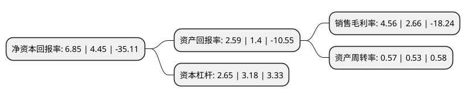

> 本页面由自动化程序生成于 2022年5月20日 01:26
> 内容可能存在错误，如有bug请提交issue至：https://github.com/Eroleice/doc-pi/issues
{.is-warning}

# 上市公司基本情况

## 基本资料

甘肃省敦煌种业集团股份有限公司（以下简称“敦煌种业”）成立于1998年12月28日，酒泉市。于2004年01月15日在上交所主板上市。

敦煌种业注册资本52,780.208万元，主要业务:玉米，棉花，西瓜，甜瓜，蔬菜等农作物良种的繁育，生产，加工，检测，包装和销售，以及相关下游农产品棉花的收购，加工，包装和销售业务。以下是详细信息：

- 公司名称: 甘肃省敦煌种业集团股份有限公司
- 股票代码: 600354.SH
- 所在地: 甘肃 - 酒泉市
- 成立日期: 1998年12月28日
- 注册资本: 52,780.208万元
- 法定代表人: 刘兴斌
- 主营业务: 玉米，棉花，西瓜，甜瓜，蔬菜等农作物良种的繁育，生产，加工，检测，包装和销售，以及相关下游农产品棉花的收购，加工，包装和销售业务
- 公司官网: www.dhseed.com
- 公司介绍: 公司是主要从事种子、棉花、食品加工业务的大型农业综合上市公司。公司依托河西走廊优越的自然资源和良好的农业生产基础条件，实行“公司联基地”、“基地联农户”的产业化经营模式，建立了60万亩稳定的制种基地和国内一流的大型种子加工生产线，拥有一整套国内同行业领先的从亲本提纯、扩繁、田间去杂、去雄授粉、清杂晾晒到收贮保管等过程的质量控制技术操作规程，建立了完善的种子质量控制体系，并通过委托育种、合作育种、联合开发、合资合作、整体吸纳、买断产权品种等形式，形成了覆盖全国不同生态区的市场营销网络。近年来，公司以加快发展特色优势产业和农业产业化经营为主线，又先后投资建成果蔬制品、番茄制品、包装制品、棉蛋白油脂和脱水蔬菜加工等农副产品加工项目，生产的番茄粉、番茄酱、脱水洋葱等产品远销北美、欧洲、中东、东南亚等二十多个国家和地区，不断培育新的产业和新的经济增长点。

## 股东及高管情况

上市公司第一大股东为酒泉地区现代农业(控股集团)有限责任公司，持股68,170,168股，占比12.92%，**疑似为**上市公司实际控制人。

截至2022年03月31日，上市公司的前十大股东中，共有3名自然人股东，4名机构股东，3名其他股东，其中5%以上大股东共有3名。上市公司前十大股东明细如下：

> 未能通过持股比例判定出上市公司实际控制人（持股30%以上）
> 可能存在通过间接持股、联合持股、协议控制等方式拥有实际控制权的主体，具体请参考上市公司定期公告！
{.is-warning}

> 截至2022年03月31日，上市公司前十大股东信息如下：

| 股东名称 | 持股数量（股） | 持股比例 |
| --- | --- | --- |
| 酒泉地区现代农业(控股集团)有限责任公司 | 68,170,168 | 12.92% |
| 江苏融卓投资有限公司 | 55,000,000 | 10.42% |
| 敦煌市供销合作社联合社 | 29,568,876 | 5.6% |
| 金塔县供销合作联社 | 7,579,180 | 1.44% |
| 酒泉市农业科学研究院 | 4,511,494 | 0.85% |
| 甘肃星利达投资管理有限责任公司 | 4,400,000 | 0.83% |
| 罗明星 | 1,950,800 | 0.37% |
| 华泰证券股份有限公司 | 1,736,829 | 0.33% |
| 田立群 | 1,600,000 | 0.3% |
| 胡志斌 | 1,530,000 | 0.29% |

## 利润表分析

上市公司2021年总收入为9.22亿元，净利润为0.42亿元，实现盈利。

## 杜邦分析

> 数据列示周期：2021年 | 2020年 | 2019年
{.is-info}

上市公司的净资产收益率在近一年有所上升，上升幅度为53.93%，其变化情况分解如下：
- 上市公司的销售毛利率在近一年上升了71.43%，可能是生产效率的提升、商品原材料价格下跌或商品价格的上涨所致。
- 上市公司的资产周转率在近一年上升了7.55%，可能是源自于更快的销售回款或库存管理效果提升。
- 上市公司的财务杠杆比率在近一年下降了-16.67%，可能是减少负债降低财务费用。

