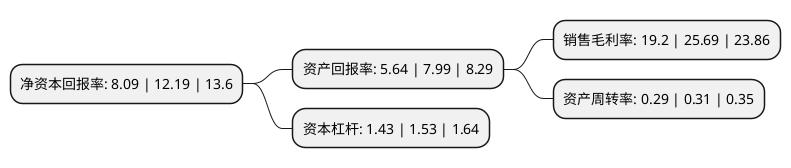

> 本页面由自动化程序生成于 2022年5月20日 01:26
> 内容可能存在错误，如有bug请提交issue至：https://github.com/Eroleice/doc-pi/issues
{.is-warning}

# 上市公司基本情况

## 基本资料

万向德农股份有限公司（以下简称“万向德农”）成立于1995年09月13日，哈尔滨市。于2002年09月16日在上交所主板上市。

万向德农注册资本29,257.8万元，主要产品:玉米，牧草，油葵等农作物种子，高麦芽糖浆，啤酒专用糖浆，麦芽糊精等淀粉糖产品，玉米淀粉及胚芽，纤维，蛋白粉等副产品，生物驱油剂产品。以下是详细信息：

- 公司名称: 万向德农股份有限公司
- 股票代码: 600371.SH
- 所在地: 黑龙江 - 哈尔滨市
- 成立日期: 1995年09月13日
- 注册资本: 29,257.8万元
- 法定代表人: 刘志刚
- 主营业务: 主要产品:玉米，牧草，油葵等农作物种子，高麦芽糖浆，啤酒专用糖浆，麦芽糊精等淀粉糖产品，玉米淀粉及胚芽，纤维，蛋白粉等副产品，生物驱油剂产品
- 公司官网: www.wxdoneed.com
- 公司介绍: 公司成立于1995年，主营业务主要通过控股子公司北京德农种业有限公司完成，北京德农种业有限公司是集科研、生产、经营、服务于一体的现代大型综合高新技术种子企业。公司以科技为先导，建立起一个布局合理的自主研发体系，以科技为先导，下设育种研究中心、综合试验站和试验点。同时，公司与国内企业、高校、科研院所展开全方位的合作公司已形成了渠道畅通、物流顺畅、信息及时、价格合理、服务周到、资源配置合理的营销和服务体系。德农种业曾先后获得中国种业信用骨干企业、种子协会3A信用企业；北京市高新技术企业、北京市农业产业化龙头企业。

## 股东及高管情况

上市公司第一大股东为万向三农集团有限公司，持股142,650,135股，占比48.76%，为上市公司实际控制人。

截至2022年03月31日，上市公司的前十大股东中，共有1名自然人股东，2名机构股东，5个产品账户，2个海外主体，其中5%以上大股东共有1名。上市公司前十大股东明细如下：

> 截至2022年03月31日，上市公司前十大股东信息如下：

| 股东名称 | 持股数量（股） | 持股比例 |
| --- | --- | --- |
| 万向三农集团有限公司 | 142,650,135 | 48.76% |
| 中国建设银行股份有限公司-银华同力精选混合型证券投资基金 | 7,300,000 | 2.5% |
| 华夏银行股份有限公司-万家瑞隆混合型证券投资基金 | 6,383,523 | 2.18% |
| 中国农业银行股份有限公司-银华农业产业股票型发起式证券投资基金 | 4,336,265 | 1.48% |
| JPMORGAN CHASE BANK,NATIONAL   ASSOCIATION | 1,604,318 | 0.55% |
| 中国农业银行股份有限公司-银华内需精选混合型证券投资基金(LOF) | 1,522,330 | 0.52% |
| 陈铭 | 1,500,000 | 0.51% |
| 中国国际金融香港资产管理有限公司-客户资金2 | 1,453,532 | 0.5% |
| 中国工商银行股份有限公司-银华成长先锋混合型证券投资基金 | 1,170,300 | 0.4% |
| UBS   AG | 953,863 | 0.33% |

## 利润表分析

上市公司2021年总收入为2.21亿元，净利润为0.42亿元，实现盈利。

## 杜邦分析

> 数据列示周期：2021年 | 2020年 | 2019年
{.is-info}

上市公司的净资产收益率在近一年有所下降，下降幅度为-33.63%，其变化情况分解如下：
- 上市公司的销售毛利率在近一年下降了-25.26%，可能是生产效率的下降、商品原材料价格上涨或商品价格的下跌所致。
- 上市公司的资产周转率在近一年下降了-6.45%，可能是源自于更慢的销售回款或库存管理效果下降。
- 上市公司的财务杠杆比率在近一年下降了-6.54%，可能是减少负债降低财务费用。

