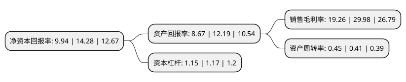

> 本页面由自动化程序生成于 2022年5月20日 01:27
> 内容可能存在错误，如有bug请提交issue至：https://github.com/Eroleice/doc-pi/issues
{.is-warning}

# 上市公司基本情况

## 基本资料

黑龙江北大荒农业股份有限公司（以下简称“北大荒”）成立于1998年11月27日，哈尔滨市。于2002年03月29日在上交所主板上市。

北大荒注册资本177,767.991万元，主营业务:大米销售，种植业。以下是详细信息：

- 公司名称: 黑龙江北大荒农业股份有限公司
- 股票代码: 600598.SH
- 所在地: 黑龙江 - 哈尔滨市
- 成立日期: 1998年11月27日
- 注册资本: 177,767.991万元
- 法定代表人: 王守聪
- 主营业务: 主营业务:大米销售，种植业
- 公司官网: www.hacl.cn
- 公司介绍: 公司是我国目前规模最大、现代化水平较高的农业类上市公司和优质商品粮生产基地，具有明显的规模、资源、技术、管理、绿色产品等优势。主要从事土地发包经营；水稻、玉米等粮食作物的生产和销售；尿素的生产、销售；与种植业生产相关的技术、信息及服务等；化肥零售(仅限分支机构经营)，以及房地产开发与销售。公司拥有丰富的耕地资源和可垦荒地资源，主要分布在世界上土质最肥沃的三大黑土带之一的三江平原上，是一个举世闻名的“天然粮仓”。公司先后荣膺中国上市公司百强、中国50家最受尊敬上市公司、中国上市公司财务安全500强等殊荣；股票曾先后入选上证50指数、红利指数、沪深300指数、中证100指数样本股。自2010年开始，公司连续5年入选“财富中国企业500强排行榜”。

## 股东及高管情况

上市公司第一大股东为北大荒农垦集团有限公司，持股1,140,262,121股，占比64.14%，为上市公司实际控制人。

截至2022年03月31日，上市公司的前十大股东中，共有4名自然人股东，1名机构股东，4个产品账户，1个海外主体，其中5%以上大股东共有1名。上市公司前十大股东明细如下：

> 截至2022年03月31日，上市公司前十大股东信息如下：

| 股东名称 | 持股数量（股） | 持股比例 |
| --- | --- | --- |
| 北大荒农垦集团有限公司 | 1,140,262,121 | 64.14% |
| 香港中央结算有限公司(陆股通) | 24,232,517 | 1.36% |
| 张晓夏 | 7,000,000 | 0.39% |
| 张国清 | 3,641,100 | 0.2% |
| 郑创华 | 3,550,400 | 0.2% |
| 中国农业银行股份有限公司-中证500交易型开放式指数证券投资基金 | 3,405,084 | 0.19% |
| 中国农业银行股份有限公司-银华农业产业股票型发起式证券投资基金 | 3,331,635 | 0.19% |
| 中国工商银行股份有限公司-中证主要消费交易型开放式指数证券投资基金 | 2,896,200 | 0.16% |
| 熊耿 | 2,803,800 | 0.16% |
| 中国银行股份有限公司-泰达宏利集利债券型证券投资基金 | 2,667,449 | 0.15% |

## 利润表分析

上市公司2021年总收入为36.29亿元，净利润为6.99亿元，实现盈利。

## 杜邦分析

> 数据列示周期：2021年 | 2020年 | 2019年
{.is-info}

上市公司的净资产收益率在近一年有所下降，下降幅度为-30.39%，其变化情况分解如下：
- 上市公司的销售毛利率在近一年下降了-35.76%，可能是生产效率的下降、商品原材料价格上涨或商品价格的下跌所致。
- 上市公司的资产周转率在近一年上升了9.76%，可能是源自于更快的销售回款或库存管理效果提升。
- 上市公司的财务杠杆比率在近一年下降了-1.71%，可能是减少负债降低财务费用。

