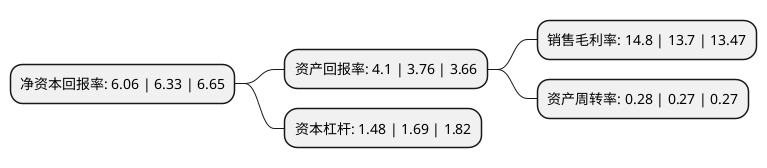

> 本页面由自动化程序生成于 2022年5月20日 01:01
> 内容可能存在错误，如有bug请提交issue至：https://github.com/Eroleice/doc-pi/issues
{.is-warning}

# 上市公司基本情况

## 基本资料

中信海洋直升机股份有限公司（以下简称“中信海直”）成立于1999年02月11日，深圳市。于2000年07月31日在深交所主板上市。

中信海直注册资本77,577.014万元，主要业务:通航飞行业务和维修业务。以下是详细信息：

- 公司名称: 中信海洋直升机股份有限公司
- 股票代码: 000099.SZ
- 所在地: 广东 - 深圳市
- 成立日期: 1999年02月11日
- 注册资本: 77,577.014万元
- 法定代表人: 杨威
- 主营业务: 通航飞行业务和维修业务
- 公司官网: www.cohc.citic
- 公司介绍: 公司目前是中国规模最大的通用航空企业之一，具有通用航空全业务运营资质和能力。公司主营通航飞行业务和维修业务，各项业务实行专业化管理。公司既是中国通航运输服务业中的领军企业，也是中信集团旗下子公司，同时公司还是证券市场首家在主板上市的通航企业。丰富的业务种类、充足的专业人才、较大的机队规模、网络化的运营基地、先进的运营管理体系共同构成了公司的核心竞争力。公司已成功构筑起海上石油、陆上通航、通航维修、通航培训和资本运营五大业务板块齐步并进的格局，并根据自身实际情况及市场需求，正逐步搭建维修集群、无人机、海外市场、机场设计运营、通航城市综合服务等板块。公司在国内最早拥有完备的通用航空管理体系，率先通过英国标准协会的ISO国际质量体系认证，全面实施标准化、规范化、程序化管理，三度获得中国民航最高荣誉奖项“金鸥杯”，连续多年获得民航安全责任优胜单位称号。

## 股东及高管情况

上市公司第一大股东为中国中海直有限责任公司，持股234,119,474股，占比30.18%，为上市公司实际控制人。

截至2022年03月31日，上市公司的前十大股东中，共有2名自然人股东，3名机构股东，4个产品账户，1个海外主体，其中5%以上大股东共有2名。上市公司前十大股东明细如下：

> 截至2022年03月31日，上市公司前十大股东信息如下：

| 股东名称 | 持股数量（股） | 持股比例 |
| --- | --- | --- |
| 中国中海直有限责任公司 | 234,119,474 | 30.18% |
| 中信投资控股有限公司 | 65,555,001 | 8.45% |
| 青岛市科技风险投资有限公司-青岛华资盛通股权投资基金合伙企业(有限合伙) | 38,461,538 | 4.96% |
| 全国社保基金四一三组合 | 14,250,926 | 1.84% |
| 吴晓锋 | 11,400,000 | 1.47% |
| 济南文景投资合伙企业(有限合伙) | 10,769,230 | 1.39% |
| 香港中央结算有限公司(陆股通) | 4,352,519 | 0.56% |
| 深圳市康曼德资本管理有限公司-康曼德003号主动管理型私募证券投资基金 | 3,764,123 | 0.49% |
| 深圳市康曼德资本管理有限公司-康曼德定增7号私募证券投资基金 | 3,580,615 | 0.46% |
| 李涛 | 3,250,100 | 0.42% |

## 利润表分析

上市公司2021年总收入为16.8亿元，净利润为2.48亿元，实现盈利。

## 杜邦分析

> 数据列示周期：2021年 | 2020年 | 2019年
{.is-info}

上市公司的净资产收益率在近一年有所下降，下降幅度为-4.27%，其变化情况分解如下：
- 上市公司的销售毛利率在近一年上升了8.03%，可能是生产效率的提升、商品原材料价格下跌或商品价格的上涨所致。
- 上市公司的资产周转率在近一年上升了3.7%，可能是源自于更快的销售回款或库存管理效果提升。
- 上市公司的财务杠杆比率在近一年下降了-12.43%，可能是减少负债降低财务费用。

