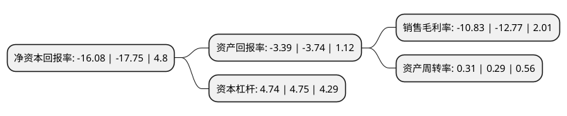

> 本页面由自动化程序生成于 2022年5月20日 01:23
> 内容可能存在错误，如有bug请提交issue至：https://github.com/Eroleice/doc-pi/issues
{.is-warning}

# 上市公司基本情况

## 基本资料

中国南方航空股份有限公司（以下简称“南方航空”）成立于1995年03月25日，广州市。于2003年07月25日在上交所主板上市。

南方航空注册资本1,694,844.523万元，主要业务:(1)提供国内，地区和国际定期及不定期航空客，货，邮，行李运输服务;(2)提供通用航空服务;(3)提供航空器维修服务;(4)经营国内外航空公司的代理业务;(5)提供航空配餐服务(仅限分支机构经营);(6)进行其他航空业务及相关业务，包括为该等业务进行广告宣传;(7)进行其他航空业务及相关业务(限保险兼业代理业务:人身意外伤害险);航空地面延伸业务;民用航空器机型培训(限分支机构凭许可证经营);资产租赁;工程管理与技术咨询;航材销售;旅游代理服务;商品零售批发。以下是详细信息：

- 公司名称: 中国南方航空股份有限公司
- 股票代码: 600029.SH
- 所在地: 广东 - 广州市
- 成立日期: 1995年03月25日
- 注册资本: 1,694,844.523万元
- 法定代表人: 马须伦
- 主营业务: (1)提供国内，地区和国际定期及不定期航空客，货，邮，行李运输服务;(2)提供通用航空服务;(3)提供航空器维修服务;(4)经营国内外航空公司的代理业务;(5)提供航空配餐服务(仅限分支机构经营);(6)进行其他航空业务及相关业务，包括为该等业务进行广告宣传;(7)进行其他航空业务及相关业务(限保险兼业代理业务:人身意外伤害险);航空地面延伸业务;民用航空器机型培训(限分支机构凭许可证经营);资产租赁;工程管理与技术咨询;航材销售;旅游代理服务;商品零售批发
- 公司官网: www.csair.com
- 公司介绍: 公司是中国南方航空集团公司属下航空运输主业公司。公司安全飞行纪录卓越，保持着中国航空公司最好的安全纪录，安全纪录和安全管理水平处于国际领先地位。公司的经营范围包括：提供国内、地区和国际定期及不定期航空客、货、邮、行李运输服务；提供通用航空服务；提供航空器维修服务；经营国内外航空公司的代理业务；提供航空配餐服务；进行其他航空业务及相关业务等。目前，公司每天有2000多个航班飞至全球40多个国家和地区、200多个目的地，提供座位数30万余个。目前，公司在“一带一路”沿线38个国家和地区的68个城市开通了172条航线，每周投入2200多个航班，承运旅客1500多万人次。公司被评为中国质量协会全国“用户满意标杆”企业，并获得中国国家顾客推荐指数航空服务第一名的荣誉。

## 股东及高管情况

上市公司第一大股东为中国南方航空集团有限公司，持股8,600,897,508股，占比50.75%，为上市公司实际控制人。

截至2022年03月31日，上市公司的前十大股东中，共有6名机构股东，2个产品账户，2个海外主体，其中5%以上大股东共有3名。上市公司前十大股东明细如下：

> 截至2022年03月31日，上市公司前十大股东信息如下：

| 股东名称 | 持股数量（股） | 持股比例 |
| --- | --- | --- |
| 中国南方航空集团有限公司 | 8,600,897,508 | 50.75% |
| 南龙控股有限公司 | 2,243,271,577 | 13.24% |
| 香港中央结算(代理人)有限公司 | 1,750,798,857 | 10.33% |
| 香港中央结算有限公司(陆股通) | 612,534,745 | 3.61% |
| 中国航空油料集团有限公司 | 353,261,857 | 2.08% |
| 中国证券金融股份有限公司 | 320,484,148 | 1.89% |
| 美国航空公司 | 270,606,272 | 1.6% |
| 中国国有企业结构调整基金股份有限公司 | 192,659,933 | 1.14% |
| 春秋航空股份有限公司 | 136,431,561 | 0.8% |
| 国新央企运营投资基金管理(广州)有限公司-国新央企运营(广州)投资基金(有限合伙) | 70,006,275 | 0.41% |

## 利润表分析

上市公司2021年总收入为1,016.44亿元，净利润为-110.11亿元，**未实现盈利**。

## 杜邦分析

> 数据列示周期：2021年 | 2020年 | 2019年
{.is-info}

上市公司的净资产收益率在近一年有所下降，下降幅度为-9.41%，其变化情况分解如下：
- 上市公司的销售毛利率在近一年下降了-15.19%，可能是生产效率的下降、商品原材料价格上涨或商品价格的下跌所致。
- 上市公司的资产周转率在近一年上升了6.9%，可能是源自于更快的销售回款或库存管理效果提升。
- 上市公司的财务杠杆比率在近一年下降了-0.21%，可能是减少负债降低财务费用。

