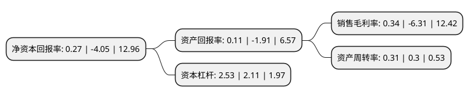

> 本页面由自动化程序生成于 2022年5月20日 01:30
> 内容可能存在错误，如有bug请提交issue至：https://github.com/Eroleice/doc-pi/issues
{.is-warning}

# 上市公司基本情况

## 基本资料

春秋航空股份有限公司（以下简称“春秋航空”）成立于2004年11月01日，上海市。于2015年01月21日在上交所主板上市。

春秋航空注册资本91,646.271万元，主要业务:国内，国际及港澳台航空客货运输业务及与航空运输业务相关的服务。以下是详细信息：

- 公司名称: 春秋航空股份有限公司
- 股票代码: 601021.SH
- 所在地: 上海 - 上海市
- 成立日期: 2004年11月01日
- 注册资本: 91,646.271万元
- 法定代表人: 王煜
- 主营业务: 国内，国际及港澳台航空客货运输业务及与航空运输业务相关的服务
- 公司官网: www.ch.com
- 公司介绍: 公司是国内首家低成本航空公司。自成立以来，公司在严格确保飞行安全和服务质量的前提下，恪守低成本航空的经营模式，借鉴国外低成本航空的成功经验，最大限度地利用现有资产，实现高效率的航空生产运营。公司主要从事国内、国际及港澳台航空客货运输业务及与航空运输业务相关的服务。区别于全服务航空公司，公司凭借价格优势吸引大量对价格较为敏感的自费旅客以及追求高性价比的商务旅客构成的细分市场。公司创新起步、安全、平稳运行，是唯一一家开航当时不进中航信、不通过机票代理，以B2C网上销售和手机直销为主要销售渠道的航空公司。通过多年努力，公司成为中国民营航空公司中第一家获得民航局安全星级评定荣誉，在行业数据公司OAG的准点率报告中，2017年春秋航空在中国大陆航空公司中到港准点率第一。未来，公司将继续巩固低成本航空的业务模式与竞争优势，进一步扩大经营规模，努力实现“成为具有竞争力的国际化、大众化的低成本航空公司”。

## 股东及高管情况

上市公司第一大股东为上海春秋国际旅行社(集团)有限公司，持股504,000,000股，占比54.99%，为上市公司实际控制人。

截至2022年03月31日，上市公司的前十大股东中，共有5名机构股东，4个产品账户，1个海外主体，其中5%以上大股东共有1名。上市公司前十大股东明细如下：

> 截至2022年03月31日，上市公司前十大股东信息如下：

| 股东名称 | 持股数量（股） | 持股比例 |
| --- | --- | --- |
| 上海春秋国际旅行社(集团)有限公司 | 504,000,000 | 54.99% |
| 上海春秋包机旅行社有限公司 | 27,929,314 | 3.05% |
| 上海春翔投资有限公司 | 19,487,007 | 2.13% |
| 中国证券金融股份有限公司 | 16,892,789 | 1.84% |
| 上海春翼投资有限公司 | 13,038,138 | 1.42% |
| 全国社保基金一一四组合 | 8,191,858 | 0.89% |
| 中国建设银行股份有限公司-中欧新蓝筹灵活配置混合型证券投资基金 | 7,895,847 | 0.86% |
| 香港中央结算有限公司(陆股通) | 7,008,421 | 0.76% |
| 中国银行股份有限公司-嘉实价值精选股票型证券投资基金 | 6,955,359 | 0.76% |
| 兴业银行股份有限公司-中欧新趋势股票型证券投资基金(LOF) | 6,475,641 | 0.71% |

## 利润表分析

上市公司2021年总收入为108.58亿元，净利润为0.37亿元，实现盈利。

## 杜邦分析

> 数据列示周期：2021年 | 2020年 | 2019年
{.is-info}

上市公司的净资产收益率在近一年有所下降，下降幅度为-106.67%，其变化情况分解如下：
- 上市公司的销售毛利率在近一年下降了-105.39%，可能是生产效率的下降、商品原材料价格上涨或商品价格的下跌所致。
- 上市公司的资产周转率在近一年上升了3.33%，可能是源自于更快的销售回款或库存管理效果提升。
- 上市公司的财务杠杆比率在近一年上升了19.91%，可能是增加负债扩大生产规模。

