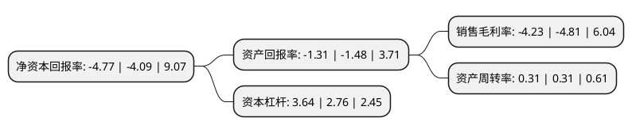

> 本页面由自动化程序生成于 2022年5月20日 01:35
> 内容可能存在错误，如有bug请提交issue至：https://github.com/Eroleice/doc-pi/issues
{.is-warning}

# 上市公司基本情况

## 基本资料

上海吉祥航空股份有限公司（以下简称“吉祥航空”）成立于2006年03月23日，上海市。于2015年05月27日在上交所主板上市。

吉祥航空注册资本196,614.416万元，主营业务:航空客货运输业务，经营范围包括国内(含港澳台)航空客货邮运输，国际航空客货运输业务，航空配餐等。以下是详细信息：

- 公司名称: 上海吉祥航空股份有限公司
- 股票代码: 603885.SH
- 所在地: 上海 - 上海市
- 成立日期: 2006年03月23日
- 注册资本: 196,614.416万元
- 法定代表人: 王均金
- 主营业务: 主营业务:航空客货运输业务，经营范围包括国内(含港澳台)航空客货邮运输，国际航空客货运输业务，航空配餐等
- 公司官网: www.juneyaoair.com
- 公司介绍: 公司系“中国民企百强”企业——上海均瑶(集团)有限公司控股子公司，于2006年9月正式开航运营。公司主营业务为航空客货运输业务，经营范围包括国内(含港澳台)航空客货邮运输、国际航空客货运输业务，航空配餐等。公司品牌定位为更具亲和力的航空体验提供者，以上海、南京为航线网络中心，已开通120多条国内及周边国家、地区定期航班。公司已与中国国航、美联航、长荣航空、新加坡航空、加拿大航空等星空联盟正式成员建立优连合作伙伴关系。此外，所有符合标准的星盟金卡、银卡会员在搭乘含有吉祥航空与星盟伙伴的联程航班时，可享受贵宾休息室、安检绿色通道、优先行李托运及处理、额外免费行李额、优先值机、优先登机、优先候补等贵宾服务。与此同时，公司还积极与各外航开展联运与代码共享合作，以HVC高价值航空承运人战略定位为指导，致力于成为高价值航空企业的卓越代表，发展为国际化现代服务业百年企业。

## 股东及高管情况

上市公司第一大股东为上海均瑶(集团)有限公司，持股1,020,862,080股，占比51.92%，为上市公司实际控制人。

截至2022年03月31日，上市公司的前十大股东中，共有1名自然人股东，5名机构股东，4个产品账户，其中5%以上大股东共有2名。上市公司前十大股东明细如下：

> 截至2022年03月31日，上市公司前十大股东信息如下：

| 股东名称 | 持股数量（股） | 持股比例 |
| --- | --- | --- |
| 上海均瑶(集团)有限公司 | 1,020,862,080 | 51.92% |
| 东方航空产业投资有限公司 | 294,921,623 | 15% |
| 王均豪 | 46,100,212 | 2.34% |
| 上海均瑶航空投资有限公司 | 36,066,977 | 1.83% |
| 中国农业银行股份有限公司-广发均衡优选混合型证券投资基金 | 33,819,958 | 1.72% |
| 青岛城投金融控股集团有限公司 | 21,871,165 | 1.11% |
| 中国建设银行股份有限公司-中欧新蓝筹灵活配置混合型证券投资基金 | 21,710,846 | 1.1% |
| 大众交通(集团)股份有限公司 | 17,660,200 | 0.9% |
| 兴业银行股份有限公司-中欧新趋势股票型证券投资基金(LOF) | 16,290,797 | 0.83% |
| 中国建设银行股份有限公司-广发价值领先混合型证券投资基金 | 15,925,511 | 0.81% |

## 利润表分析

上市公司2021年总收入为117.67亿元，净利润为-4.99亿元，**未实现盈利**。

## 杜邦分析

> 数据列示周期：2021年 | 2020年 | 2019年
{.is-info}

上市公司的净资产收益率在近一年有所上升，上升幅度为16.63%，其变化情况分解如下：
- 上市公司的销售毛利率在近一年下降了-12.06%，可能是生产效率的下降、商品原材料价格上涨或商品价格的下跌所致。
- 上市公司的资产周转率在近一年下降了0%，可能是源自于更慢的销售回款或库存管理效果下降。
- 上市公司的财务杠杆比率在近一年上升了31.88%，可能是增加负债扩大生产规模。

