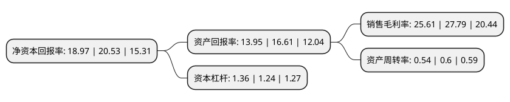

> 本页面由自动化程序生成于 2022年5月20日 01:10
> 内容可能存在错误，如有bug请提交issue至：https://github.com/Eroleice/doc-pi/issues
{.is-warning}

# 上市公司基本情况

## 基本资料

上海百润投资控股集团股份有限公司（以下简称“百润股份”）成立于1997年06月19日，上海市。于2011年03月25日在深交所中小板上市。

百润股份注册资本75,103.944万元，主要从事食用香精和烟用香精产品的研究，开发，生产与销售业务。主要产品为食用香精和烟用香精两大类千余种香精产品，是乳品，饮料，糖果，烘焙，冰品，肉制品，调味品和烟草等行业产品的重要配套原料。以下是详细信息：

- 公司名称: 上海百润投资控股集团股份有限公司
- 股票代码: 002568.SZ
- 所在地: 上海 - 上海市
- 成立日期: 1997年06月19日
- 注册资本: 75,103.944万元
- 法定代表人: 刘晓东
- 主营业务: 主要从事食用香精和烟用香精产品的研究，开发，生产与销售业务主要产品为食用香精和烟用香精两大类千余种香精产品，是乳品，饮料，糖果，烘焙，冰品，肉制品，调味品和烟草等行业产品的重要配套原料
- 公司官网: www.bairun.net
- 公司介绍: 公司是国内最早将感官鉴评技术全面应用于调香及应用领域的香精制造企业之一。是国内最早同时通过ISO9001:2000质量管理体系及HACCP食品安全卫生保证体系认证的香精制造商之一。公司原主要从事香精香料的研发、生产和销售业务，经过对巴克斯酒业进行并购重组后，成为香精香料和预调鸡尾酒双主营业务发展的公司。公司拥有的“百润”是上海市著名商标、上海市名牌产品，百润股份是中国香精香料行业十强企业；巴克斯酒业旗下的“RIO(锐澳)”牌预调鸡尾酒为上海市著名商标、上海市名牌产品、上海名优食品，是预调鸡尾酒行业的领导品牌；两大品牌均获得客户的广泛认可，具有巨大的品牌价值。公司香精香料业务和预调酒鸡尾酒业务的品质保证体系均运行良好。

## 股东及高管情况

上市公司第一大股东为刘晓东，持股303,991,787股，占比40.48%，为上市公司实际控制人。

截至2022年03月31日，上市公司的前十大股东中，共有4名自然人股东，5个产品账户，1个海外主体，其中5%以上大股东共有2名。上市公司前十大股东明细如下：

> 截至2022年03月31日，上市公司前十大股东信息如下：

| 股东名称 | 持股数量（股） | 持股比例 |
| --- | --- | --- |
| 刘晓东 | 303,991,787 | 40.48% |
| 柳海彬 | 44,401,284 | 5.91% |
| 刘晓俊 | 27,664,000 | 3.68% |
| 招商银行股份有限公司-东方红睿泽三年定期开放灵活配置混合型证券投资基金 | 18,252,116 | 2.43% |
| 香港中央结算有限公司(陆股通) | 16,934,956 | 2.25% |
| 中国建设银行股份有限公司-汇添富消费行业混合型证券投资基金 | 14,000,076 | 1.86% |
| 中国工商银行股份有限公司-东方红睿玺三年定期开放灵活配置混合型证券投资基金 | 12,621,094 | 1.68% |
| 中国农业银行股份有限公司-易方达消费行业股票型证券投资基金 | 12,076,108 | 1.61% |
| 宁波银行股份有限公司-东方红智远三年持有期混合型证券投资基金 | 11,057,753 | 1.47% |
| 喻晓春 | 10,390,380 | 1.38% |

## 利润表分析

上市公司2021年总收入为25.94亿元，净利润为6.64亿元，实现盈利。

## 杜邦分析

> 数据列示周期：2021年 | 2020年 | 2019年
{.is-info}

上市公司的净资产收益率在近一年有所下降，下降幅度为-7.6%，其变化情况分解如下：
- 上市公司的销售毛利率在近一年下降了-7.84%，可能是生产效率的下降、商品原材料价格上涨或商品价格的下跌所致。
- 上市公司的资产周转率在近一年下降了-10%，可能是源自于更慢的销售回款或库存管理效果下降。
- 上市公司的财务杠杆比率在近一年上升了9.68%，可能是增加负债扩大生产规模。

