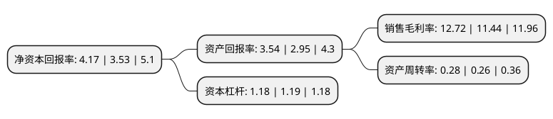

> 本页面由自动化程序生成于 2022年5月20日 01:24
> 内容可能存在错误，如有bug请提交issue至：https://github.com/Eroleice/doc-pi/issues
{.is-warning}

# 上市公司基本情况

## 基本资料

浙江古越龙山绍兴酒股份有限公司（以下简称“古越龙山”）成立于1997年05月08日，绍兴市。于1997年05月16日在上交所主板上市。

古越龙山注册资本91,154.241万元，主要产品:绍兴加饭酒，绍兴元红酒，绍兴香雪酒，绍兴善酿酒和绍兴花雕酒等。以下是详细信息：

- 公司名称: 浙江古越龙山绍兴酒股份有限公司
- 股票代码: 600059.SH
- 所在地: 浙江 - 绍兴市
- 成立日期: 1997年05月08日
- 注册资本: 91,154.241万元
- 法定代表人: 孙爱保
- 主营业务: 主要产品:绍兴加饭酒，绍兴元红酒，绍兴香雪酒，绍兴善酿酒和绍兴花雕酒等
- 公司官网: www.shaoxingwine.com.cn
- 公司介绍: 公司是我国最大的黄酒生产、经营、出口企业，拥有国内一流的黄酒生产工艺设备和全国唯一的省级黄酒技术中心，聚集多名国家级评酒大师，黄酒年生产能力11万吨。主要产品“古越龙山”、“沈永和”、“状元红”、“鉴湖”、“古纤道”牌绍兴酒是国家优质产品，多次荣获国际国内金奖，是中国首批原产地域保护产品。“古越龙山”是黄酒行业唯一集中国名牌、中国驰名商标、国宴专用黄酒于一身的品牌；具有300多年历史的“沈永和”老字号和“鉴湖”是浙江省著名商标。公司产品畅销全国各大城市，远销日本、东南亚、欧美等三十多个国家和地区，享有“东方名酒之冠”的美誉。

## 股东及高管情况

上市公司第一大股东为中国绍兴黄酒集团有限公司，持股334,624,117股，占比36.71%，为上市公司实际控制人。

截至2022年03月31日，上市公司的前十大股东中，共有3名自然人股东，6名机构股东，1个产品账户，其中5%以上大股东共有1名。上市公司前十大股东明细如下：

> 截至2022年03月31日，上市公司前十大股东信息如下：

| 股东名称 | 持股数量（股） | 持股比例 |
| --- | --- | --- |
| 中国绍兴黄酒集团有限公司 | 334,624,117 | 36.71% |
| 深圳市前海富荣资产管理有限公司 | 21,482,277 | 2.36% |
| 国泰君安证券股份有限公司 | 14,231,715 | 1.56% |
| 中信里昂资产管理有限公司-客户资金 | 12,970,500 | 1.42% |
| 汪文政 | 9,720,000 | 1.07% |
| 华泰金融控股(香港)有限公司-自有资金 | 7,195,213 | 0.79% |
| 中信中证资本管理有限公司 | 6,959,644 | 0.76% |
| 吴玉芳 | 4,689,700 | 0.51% |
| 中国建设银行股份有限公司-鹏华中证酒交易型开放式指数证券投资基金 | 4,207,417 | 0.46% |
| 贺正生 | 4,203,948 | 0.46% |

## 利润表分析

上市公司2021年总收入为15.76亿元，净利润为2亿元，实现盈利。

## 杜邦分析

> 数据列示周期：2021年 | 2020年 | 2019年
{.is-info}

上市公司的净资产收益率在近一年有所上升，上升幅度为18.13%，其变化情况分解如下：
- 上市公司的销售毛利率在近一年上升了11.19%，可能是生产效率的提升、商品原材料价格下跌或商品价格的上涨所致。
- 上市公司的资产周转率在近一年上升了7.69%，可能是源自于更快的销售回款或库存管理效果提升。
- 上市公司的财务杠杆比率在近一年下降了-0.84%，可能是减少负债降低财务费用。

