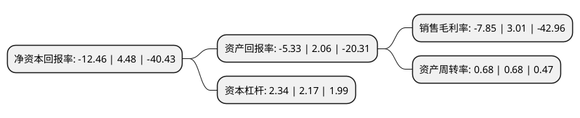

> 本页面由自动化程序生成于 2022年5月20日 01:25
> 内容可能存在错误，如有bug请提交issue至：https://github.com/Eroleice/doc-pi/issues
{.is-warning}

# 上市公司基本情况

## 基本资料

海南椰岛(集团)股份有限公司（以下简称“海南椰岛”）成立于1992年03月03日，海口市。于2000年01月20日在上交所主板上市。

海南椰岛注册资本44,820万元，主要业务:酒类，贸易，淀粉，油类，特色食品饮料，房地产开发，其他。以下是详细信息：

- 公司名称: 海南椰岛(集团)股份有限公司
- 股票代码: 600238.SH
- 所在地: 海南 - 海口市
- 成立日期: 1992年03月03日
- 注册资本: 44,820万元
- 法定代表人: 王晓晴
- 主营业务: 酒类，贸易，淀粉，油类，特色食品饮料，房地产开发，其他
- 公司官网: www.yedao.com
- 公司介绍: 公司坚持立足海南优质天然资源，专注健康生态食品，形成了以酒类产品(酒类业务以保健酒为主)的生产与销售为主要业务、特色食品饮料业务(目前以椰汁饮料为主)和房地产开发为辅业的业务格局。公司的主打产品椰岛鹿龟酒，不仅具有悠久的历史渊源和深厚文化内涵，更融合了现代高科技酿造技术，已成为家喻户晓的知名品牌。其姊妹产品椰岛海王酒自投入市场以来，亦获得良好的市场反映，销售量节节攀升，市场份额迅速扩张。公司白酒品牌海口大曲，是海南人民、商政宴客的首选佳酿，已成为一张响亮的海南酒类名片。公司还立足海南生态和资源优势，积极进军食品饮料行业,以椰岛椰汁为代表的一系列带有浓郁海南特色的产品一上市便广受赞誉，得到了广大消费者的认可。

## 股东及高管情况

上市公司第一大股东为北京东方君盛投资管理有限公司，持股84,450,481股，占比18.8421%，**疑似为**上市公司实际控制人。

截至2022年05月10日，上市公司的前十大股东中，共有2名自然人股东，6名机构股东，2个产品账户，其中5%以上大股东共有4名。上市公司前十大股东明细如下：

> 未能通过持股比例判定出上市公司实际控制人（持股30%以上）
> 可能存在通过间接持股、联合持股、协议控制等方式拥有实际控制权的主体，具体请参考上市公司定期公告！
{.is-warning}

> 截至2022年05月10日，上市公司前十大股东信息如下：

| 股东名称 | 持股数量（股） | 持股比例 |
| --- | --- | --- |
| 北京东方君盛投资管理有限公司 | 84,450,481 | 18.8421% |
| 北京东方君盛投资管理有限公司 | 84,450,481 | 18.8421% |
| 海口市国有资产经营有限公司 | 60,819,632 | 13.57% |
| 海口市国有资产经营有限公司 | 60,329,632 | 13.4604% |
| 海口汇翔健康咨询服务中心(有限合伙) | 12,504,459 | 2.79% |
| 海南信唐贸易合伙企业(有限合伙) | 7,051,403 | 1.57% |
| 中国建设银行股份有限公司-鹏华中证酒交易型开放式指数证券投资基金 | 2,427,400 | 0.54% |
| 中国建设银行股份有限公司-鹏华中证酒指数证券投资基金(LOF) | 1,954,900 | 0.44% |
| 邓亚平 | 1,744,171 | 0.39% |
| 赵金凤 | 1,665,300 | 0.37% |

## 利润表分析

上市公司2021年总收入为8.33亿元，净利润为-0.66亿元，**未实现盈利**。

## 杜邦分析

> 数据列示周期：2021年 | 2020年 | 2019年
{.is-info}

上市公司的净资产收益率在近一年有所下降，下降幅度为-378.12%，其变化情况分解如下：
- 上市公司的销售毛利率在近一年下降了-360.8%，可能是生产效率的下降、商品原材料价格上涨或商品价格的下跌所致。
- 上市公司的资产周转率在近一年下降了0%，可能是源自于更慢的销售回款或库存管理效果下降。
- 上市公司的财务杠杆比率在近一年上升了7.83%，可能是增加负债扩大生产规模。

