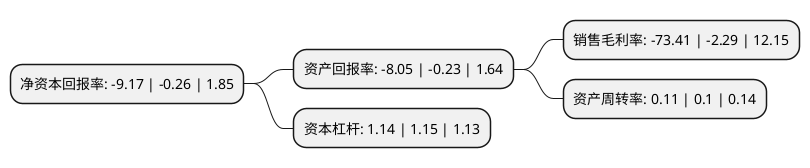

> 本页面由自动化程序生成于 2022年5月20日 01:27
> 内容可能存在错误，如有bug请提交issue至：https://github.com/Eroleice/doc-pi/issues
{.is-warning}

# 上市公司基本情况

## 基本资料

甘肃莫高实业发展股份有限公司（以下简称“莫高股份”）成立于1995年12月29日，兰州市。于2004年03月24日在上交所主板上市。

莫高股份注册资本32,112万元，主要产品为大麦芽，葡萄及葡萄酒，甘草系列产品。以下是详细信息：

- 公司名称: 甘肃莫高实业发展股份有限公司
- 股票代码: 600543.SH
- 所在地: 甘肃 - 兰州市
- 成立日期: 1995年12月29日
- 注册资本: 32,112万元
- 法定代表人: 赵国柱
- 主营业务: 主要产品为大麦芽，葡萄及葡萄酒，甘草系列产品
- 公司官网: www.mogao.com
- 公司介绍: 公司是以农业产业化为龙头，以发展高效特色产业为主导的高新技术现代农业企业。公司主要产品有“莫高”牌葡萄酒、啤酒大麦芽、甘草片。莫高葡萄酒是中国高端葡萄酒的代表。公司在全国葡萄酒行业首创“4S+5P”模式，4S(4Superior)即最佳基地、最优品种、最优工艺、最严格保证体系。5P(5Percent)即100%葡萄原料产自莫高自有庄园，100%葡萄原汁酿在莫高酒庄，100%葡萄酒灌在莫高酒庄，100%无农药残留，100%绿色产品，牢牢定位在葡萄酒高端市场，开发出了干红、干白、加本侬、甜型酒、特种酒、冰酒、白兰地等七大系列200多个产品，生产出了中国第一支黑比诺干红和中国第一支冰酒，二者均被评为国家级优秀新产品。

## 股东及高管情况

上市公司第一大股东为甘肃省农垦集团有限责任公司，持股45,819,636股，占比14.27%，**疑似为**上市公司实际控制人。

截至2022年03月31日，上市公司的前十大股东中，共有5名自然人股东，4名机构股东，1个产品账户，其中5%以上大股东共有3名。上市公司前十大股东明细如下：

> 未能通过持股比例判定出上市公司实际控制人（持股30%以上）
> 可能存在通过间接持股、联合持股、协议控制等方式拥有实际控制权的主体，具体请参考上市公司定期公告！
{.is-warning}

> 截至2022年03月31日，上市公司前十大股东信息如下：

| 股东名称 | 持股数量（股） | 持股比例 |
| --- | --- | --- |
| 甘肃省农垦集团有限责任公司 | 45,819,636 | 14.27% |
| 甘肃黄羊河农工商(集团)有限责任公司 | 42,729,215 | 13.31% |
| 甘肃省农垦资产经营有限公司 | 19,687,266 | 6.13% |
| 周荣华 | 3,818,272 | 1.19% |
| 甘肃兴陇资本管理有限公司 | 3,273,400 | 1.02% |
| 虞晓红 | 1,927,175 | 0.6% |
| 费国英 | 1,759,400 | 0.55% |
| 张西举 | 1,644,500 | 0.51% |
| 汪红星 | 1,482,300 | 0.46% |
| 中国建设银行股份有限公司-鹏华中证酒交易型开放式指数证券投资基金 | 1,350,700 | 0.42% |

## 利润表分析

上市公司2021年总收入为1.4亿元，净利润为-1.04亿元，**未实现盈利**。

## 杜邦分析

> 数据列示周期：2021年 | 2020年 | 2019年
{.is-info}

上市公司的净资产收益率在近一年有所上升，上升幅度为3426.92%，其变化情况分解如下：
- 上市公司的销售毛利率在近一年上升了3105.68%，可能是生产效率的提升、商品原材料价格下跌或商品价格的上涨所致。
- 上市公司的资产周转率在近一年上升了10%，可能是源自于更快的销售回款或库存管理效果提升。
- 上市公司的财务杠杆比率在近一年下降了-0.87%，可能是减少负债降低财务费用。

