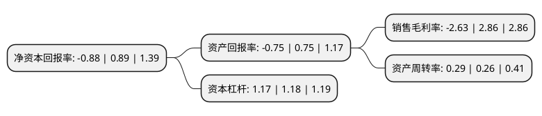

> 本页面由自动化程序生成于 2022年5月20日 01:27
> 内容可能存在错误，如有bug请提交issue至：https://github.com/Eroleice/doc-pi/issues
{.is-warning}

# 上市公司基本情况

## 基本资料

上海金枫酒业股份有限公司（以下简称“金枫酒业”）成立于1992年06月19日，上海市。于1992年09月29日在上交所主板上市。

金枫酒业注册资本66,900.495万元，主营业务范围为食品销售管理(非实物方式)，酒，仓储货运，租赁(房屋，场地)，市外经贸委批准的出口业务等。以下是详细信息：

- 公司名称: 上海金枫酒业股份有限公司
- 股票代码: 600616.SH
- 所在地: 上海 - 上海市
- 成立日期: 1992年06月19日
- 注册资本: 66,900.495万元
- 法定代表人: 唐文杰
- 主营业务: 主营业务范围为食品销售管理(非实物方式)，酒，仓储货运，租赁(房屋，场地)，市外经贸委批准的出口业务等
- 公司官网: www.jinfengwine.com
- 公司介绍: 公司是国内黄酒业率先实现传统黄酒工业化生产的企业，研发能力、盈利能力、酿造工艺、技术装备等位于行业领先水平，被评为上海市文明单位、三优企业、酿酒行业排头兵企业等多项殊荣。公司率先实现“ISO9001质量管理体系、ISO22000食品安全管理体系、ISO14001环境管理体系和OHSAS18001职业健康安全管理体系”全覆盖，并取得了上海市黄酒生产首张QS证书。公司为中国酿酒工业协会副理事长单位，黄酒分会副理事长单位，中国食品科学技术学会黄酒学会副会长单位，上海市酒类流通协会副会长单位并拥有国家级黄酒评委数名。

## 股东及高管情况

上市公司第一大股东为上海市糖业烟酒(集团)有限公司，持股233,352,334股，占比34.88%，为上市公司实际控制人。

截至2022年03月31日，上市公司的前十大股东中，共有3名自然人股东，6名机构股东，1个产品账户，其中5%以上大股东共有1名。上市公司前十大股东明细如下：

> 截至2022年03月31日，上市公司前十大股东信息如下：

| 股东名称 | 持股数量（股） | 持股比例 |
| --- | --- | --- |
| 上海市糖业烟酒(集团)有限公司 | 233,352,334 | 34.88% |
| 顾鹤富 | 17,851,959 | 2.67% |
| 王桂英 | 8,277,149 | 1.24% |
| 上海捷强烟草糖酒(集团)有限公司 | 7,420,312 | 1.11% |
| 中食发(北京)科技发展有限公司 | 6,401,070 | 0.96% |
| 中国建设银行股份有限公司-鹏华中证酒交易型开放式指数证券投资基金 | 3,593,910 | 0.54% |
| 上海益民食品一厂(集团)有限公司 | 3,519,289 | 0.53% |
| 上海海烟投资管理有限公司 | 3,512,231 | 0.52% |
| 上海南上海商业房地产有限公司 | 3,106,972 | 0.46% |
| 彭吉 | 2,586,500 | 0.39% |

## 利润表分析

上市公司2021年总收入为6.49亿元，净利润为-0.18亿元，**未实现盈利**。

## 杜邦分析

> 数据列示周期：2021年 | 2020年 | 2019年
{.is-info}

上市公司的净资产收益率在近一年有所下降，下降幅度为-198.88%，其变化情况分解如下：
- 上市公司的销售毛利率在近一年下降了-191.96%，可能是生产效率的下降、商品原材料价格上涨或商品价格的下跌所致。
- 上市公司的资产周转率在近一年上升了11.54%，可能是源自于更快的销售回款或库存管理效果提升。
- 上市公司的财务杠杆比率在近一年下降了-0.85%，可能是减少负债降低财务费用。

