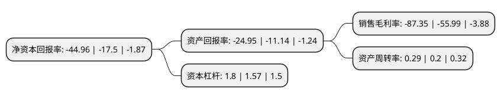

> 本页面由自动化程序生成于 2022年5月20日 01:35
> 内容可能存在错误，如有bug请提交issue至：https://github.com/Eroleice/doc-pi/issues
{.is-warning}

# 上市公司基本情况

## 基本资料

威龙葡萄酒股份有限公司（以下简称“威龙股份”）成立于2007年12月17日，烟台市。于2016年05月16日在上交所主板上市。

威龙股份注册资本33,274.915万元，主营业务为酿酒葡萄种植，葡萄酒生产及销售，主要产品有传统干红/干白葡萄酒，有机干红/干白葡萄酒，以及2014年推出的威龙传奇葡萄白酒等系列产品。以下是详细信息：

- 公司名称: 威龙葡萄酒股份有限公司
- 股票代码: 603779.SH
- 所在地: 山东 - 烟台市
- 成立日期: 2007年12月17日
- 注册资本: 33,274.915万元
- 法定代表人: 黄祖超
- 主营业务: 主营业务为酿酒葡萄种植，葡萄酒生产及销售，主要产品有传统干红/干白葡萄酒，有机干红/干白葡萄酒，以及2014年推出的威龙传奇葡萄白酒等系列产品
- 公司官网: www.weilong.com
- 公司介绍: 公司是中国大型葡萄酒生产企业之一，产销量、利税、市场占有率等综合指标，位居全国行业前茅。威龙传奇——葡萄特酿白酒，拥有国家发明专利，获得中国酒业协会、中国食品工业协会联合推荐，开启中国碱性健康白酒新品类。作为中国有机葡萄酒的倡导者，威龙荣获国家科技进步奖，在有机葡萄酒研发领域，承担国家科技部星火计划重点项目，该项目首批入选国家“十二五”科技计划预备项目库。威龙有机葡萄酒通过了中国、欧盟、美国等国家、组织的有机认证，以及瑞士通用公证行(SGS集团)的零农残检测。威龙传奇——葡萄特酿白酒，拥有国家发明专利，获得中国酒业协会、中国食品工业协会联合推荐，开启中国碱性健康白酒新品类。

## 股东及高管情况

上市公司第一大股东为深圳市仕乾投资发展有限公司，持股74,183,000股，占比22.29%，**疑似为**上市公司实际控制人。

截至2022年03月31日，上市公司的前十大股东中，共有4名自然人股东，4名机构股东，2个产品账户，其中5%以上大股东共有4名。上市公司前十大股东明细如下：

> 未能通过持股比例判定出上市公司实际控制人（持股30%以上）
> 可能存在通过间接持股、联合持股、协议控制等方式拥有实际控制权的主体，具体请参考上市公司定期公告！
{.is-warning}

> 截至2022年03月31日，上市公司前十大股东信息如下：

| 股东名称 | 持股数量（股） | 持股比例 |
| --- | --- | --- |
| 深圳市仕乾投资发展有限公司 | 74,183,000 | 22.29% |
| 于是资本管理(深圳)有限公司-于是鑫诚一号私募证券投资基金 | 62,571,880 | 18.8% |
| 中铁宝盈资产-平安银行-中铁宝盈-润金1号资产管理计划 | 21,356,300 | 6.42% |
| 杨光第 | 20,127,982 | 6.05% |
| 王安荣 | 7,165,039 | 2.15% |
| 无锡通达进出口贸易有限公司 | 6,525,000 | 1.96% |
| 卢智伟 | 6,361,730 | 1.91% |
| 华研数据股份有限公司 | 4,350,000 | 1.31% |
| 深圳市中世邦投资有限公司 | 3,350,565 | 1.01% |
| 唐艳茹 | 3,152,708 | 0.95% |

## 利润表分析

上市公司2021年总收入为4.73亿元，净利润为-4.15亿元，**未实现盈利**。

## 杜邦分析

> 数据列示周期：2021年 | 2020年 | 2019年
{.is-info}

上市公司的净资产收益率在近一年有所上升，上升幅度为156.91%，其变化情况分解如下：
- 上市公司的销售毛利率在近一年上升了56.01%，可能是生产效率的提升、商品原材料价格下跌或商品价格的上涨所致。
- 上市公司的资产周转率在近一年上升了45%，可能是源自于更快的销售回款或库存管理效果提升。
- 上市公司的财务杠杆比率在近一年上升了14.65%，可能是增加负债扩大生产规模。

