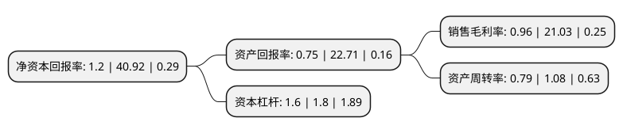

> 本页面由自动化程序生成于 2022年5月20日 01:04
> 内容可能存在错误，如有bug请提交issue至：https://github.com/Eroleice/doc-pi/issues
{.is-warning}

# 上市公司基本情况

## 基本资料

欣龙控股(集团)股份有限公司（以下简称“欣龙控股”）成立于1993年07月16日，澄迈县。于1999年12月09日在深交所主板上市。

欣龙控股注册资本53,839.5万元，主要产品:水刺产品，无纺深加工制品，热轧及其衬布产品，贸易。以下是详细信息：

- 公司名称: 欣龙控股(集团)股份有限公司
- 股票代码: 000955.SZ
- 所在地: 海南 - 澄迈县
- 成立日期: 1993年07月16日
- 注册资本: 53,839.5万元
- 法定代表人: 于春山
- 主营业务: 主要产品:水刺产品，无纺深加工制品，热轧及其衬布产品，贸易
- 公司官网: www.xinlong-holding.com
- 公司介绍: 公司是中国无纺业第一家上市企业。主要业务内容为：研发、制造和销售水刺、纺粘、熔喷等各类非织造布(无纺布)；研发、加工和销售无纺系列的医疗卫生制品、旅游用品、家居用品、个人护理用品、美容化妆用品等无纺深加工产品；针对心血管系统、消化系统内慢性疾病的传统中医方剂的挖掘和中药制剂的研发，传统中医医疗服务及医药销售；石油、橡胶等产品的贸易；证券等投资业务。欣龙集团先后被国家六部委评定为“国家大型一档企业”，被国家科技部认定为“国家重点高新技术企业”，同时被指定为国家级火炬计划项目重点执行单位；先后获得“全国设备管理优秀单位”、“全国质量效益型先进企业”金牌和国际认证联盟最高质量奖项“管理卓越奖”等称号；通过了ISO9001质量体系认证、ISO14001环境体系认证以及标准化良好行为企业4A级最高认证。

## 股东及高管情况

上市公司第一大股东为嘉兴天堂硅谷股权投资有限公司，持股55,144,810股，占比10.24%，**疑似为**上市公司实际控制人。

截至2022年03月31日，上市公司的前十大股东中，共有5名自然人股东，5名机构股东，其中5%以上大股东共有3名。上市公司前十大股东明细如下：

> 未能通过持股比例判定出上市公司实际控制人（持股30%以上）
> 可能存在通过间接持股、联合持股、协议控制等方式拥有实际控制权的主体，具体请参考上市公司定期公告！
{.is-warning}

> 截至2022年03月31日，上市公司前十大股东信息如下：

| 股东名称 | 持股数量（股） | 持股比例 |
| --- | --- | --- |
| 嘉兴天堂硅谷股权投资有限公司 | 55,144,810 | 10.24% |
| 海南筑华科工贸有限公司 | 45,508,591 | 8.45% |
| 嘉兴硅谷天堂鹰杨投资合伙企业(有限合伙) | 33,634,300 | 6.25% |
| 珠海保联资产管理有限公司 | 12,332,700 | 2.29% |
| 广东京都华海科技有限公司 | 6,665,000 | 1.24% |
| 陈捷 | 4,554,250 | 0.85% |
| 王松涛 | 4,015,400 | 0.75% |
| 刘惠敏 | 3,145,273 | 0.58% |
| 周进 | 2,178,454 | 0.4% |
| 郭颖嘉 | 2,066,800 | 0.38% |

## 利润表分析

上市公司2021年总收入为10.16亿元，净利润为0.09亿元，实现盈利。

## 杜邦分析

> 数据列示周期：2021年 | 2020年 | 2019年
{.is-info}

上市公司的净资产收益率在近一年有所下降，下降幅度为-97.07%，其变化情况分解如下：
- 上市公司的销售毛利率在近一年下降了-95.44%，可能是生产效率的下降、商品原材料价格上涨或商品价格的下跌所致。
- 上市公司的资产周转率在近一年下降了-26.85%，可能是源自于更慢的销售回款或库存管理效果下降。
- 上市公司的财务杠杆比率在近一年下降了-11.11%，可能是减少负债降低财务费用。

