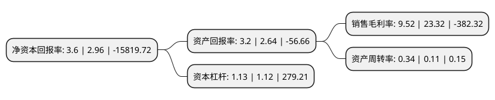

> 本页面由自动化程序生成于 2022年5月20日 01:04
> 内容可能存在错误，如有bug请提交issue至：https://github.com/Eroleice/doc-pi/issues
{.is-warning}

# 上市公司基本情况

## 基本资料

宁夏中银绒业股份有限公司（以下简称“中银绒业”）成立于1998年09月15日，银川市。于2000年07月06日在深交所主板上市。

中银绒业注册资本426,187.705万元，主要产品:优质白中白无毛绒，青无毛绒，紫无毛绒;优质高端白绒条，青绒条，紫绒条;羊绒纱线，羊绒衫，羊绒大衣，围巾等制品。主营业务:羊绒，绒条，纺纱，针织生产及出口销售。以下是详细信息：

- 公司名称: 宁夏中银绒业股份有限公司
- 股票代码: 000982.SZ
- 所在地: 宁夏 - 银川市
- 成立日期: 1998年09月15日
- 注册资本: 426,187.705万元
- 法定代表人: 李向春
- 主营业务: 主要产品:优质白中白无毛绒，青无毛绒，紫无毛绒;优质高端白绒条，青绒条，紫绒条;羊绒纱线，羊绒衫，羊绒大衣，围巾等制品主营业务:羊绒，绒条，纺纱，针织生产及出口销售
- 公司官网: www.zhongyincashmere.com
- 公司介绍: 公司是目前全球最大最优的羊绒制品生产商，羊绒原料收购量位于世界第一，羊绒纱线与制品出口量位居国内第一.拥有多个产品品牌：TODD&DUNCAN(托德邓肯)、BROWN ALLAN(布朗艾伦)、PHILOSOFIE(菲洛索菲)，在纽约最繁华的商业圈拥有两间高端成衣专卖店，在国内各大城市拥有多间品牌旗舰店，同时拥有两个电商网站。在北京、深圳设立分支机构，在美国、英国、日本、中国香港拥有下属子公司，客户遍及中国、北美、欧洲、日韩等主要羊绒制品消费地。拥有多个生产基地：灵武生态纺织园、江阴针织工厂、英国邓肯纱厂、柬埔寨针织工厂,公司正在积极开拓全球高端羊毛、亚麻纱线、面料及服装市场。

## 股东及高管情况

上市公司第一大股东为恒天聚信(深圳)投资中心(有限合伙)，持股272,270,000股，占比6.39%，**疑似为**上市公司实际控制人。

截至2022年03月31日，上市公司的前十大股东中，共有7名机构股东，1个产品账户，1个海外主体，1名其他股东，其中5%以上大股东共有2名。上市公司前十大股东明细如下：

> 未能通过持股比例判定出上市公司实际控制人（持股30%以上）
> 可能存在通过间接持股、联合持股、协议控制等方式拥有实际控制权的主体，具体请参考上市公司定期公告！
{.is-warning}

> 上市公司第一大股东持股不超过10%，请检查是否存在公司控制权风险！
{.is-danger}

> 截至2022年03月31日，上市公司前十大股东信息如下：

| 股东名称 | 持股数量（股） | 持股比例 |
| --- | --- | --- |
| 恒天聚信(深圳)投资中心(有限合伙) | 272,270,000 | 6.39% |
| 中国进出口银行陕西省分行 | 255,474,983 | 5.99% |
| 中国银行股份有限公司宁夏回族自治区分行 | 171,269,797 | 4.02% |
| 恒天金石投资管理有限公司 | 170,994,176 | 4.01% |
| 宁夏中银绒业股份有限公司破产企业财产处置专用账户 | 53,780,353 | 1.26% |
| 香港中央结算有限公司(陆股通) | 50,483,877 | 1.18% |
| 北京晋开投资管理有限公司 | 45,184,594 | 1.06% |
| 北京宗鑫瑞企业管理有限公司 | 45,000,000 | 1.06% |
| 深圳市宏语商务咨询有限公司 | 40,550,000 | 0.95% |
| 宁夏跃尚科技发展有限公司 | 30,920,263 | 0.73% |

## 利润表分析

上市公司2021年总收入为4.33亿元，净利润为0.41亿元，实现盈利。

## 杜邦分析

> 数据列示周期：2021年 | 2020年 | 2019年
{.is-info}

上市公司的净资产收益率在近一年有所上升，上升幅度为21.62%，其变化情况分解如下：
- 上市公司的销售毛利率在近一年下降了-59.18%，可能是生产效率的下降、商品原材料价格上涨或商品价格的下跌所致。
- 上市公司的资产周转率在近一年上升了209.09%，可能是源自于更快的销售回款或库存管理效果提升。
- 上市公司的财务杠杆比率在近一年上升了0.89%，可能是增加负债扩大生产规模。

