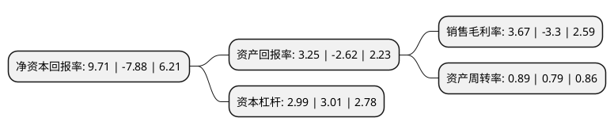

> 本页面由自动化程序生成于 2022年5月20日 01:05
> 内容可能存在错误，如有bug请提交issue至：https://github.com/Eroleice/doc-pi/issues
{.is-warning}

# 上市公司基本情况

## 基本资料

华孚时尚股份有限公司（以下简称“华孚时尚”）成立于2000年10月31日，淮北市。于2005年04月27日在深交所中小板上市。

华孚时尚注册资本170,068.136万元，主营业务:纯棉纱线，混纺纱线，纯棉坯布，混纺坯布等的生产和销售。以下是详细信息：

- 公司名称: 华孚时尚股份有限公司
- 股票代码: 002042.SZ
- 所在地: 安徽 - 淮北市
- 成立日期: 2000年10月31日
- 注册资本: 170,068.136万元
- 法定代表人: 孙伟挺
- 主营业务: 主营业务:纯棉纱线，混纺纱线，纯棉坯布，混纺坯布等的生产和销售
- 公司官网: www.huafuyarn.com
- 公司介绍: 公司是一家面向全球专注经营高档新型纱线的制造商和供应商，已成为全球最大的色纺纱线企业之一。公司以提供时尚环保科技的色纺纱线为主营，响应客户需求，配套提供高档新型的坯纱线、染色纱线，半精纺、气流纺色纺纱线。依托多品种、小批量、快交货的供应链管理能力，提供快速反应的产品交付。同时，致力为客户提供流行趋势发布、各种原料、产品的认证、吊牌、技术咨询及产品创意发布等价值服务。公司连续多年入选“中国棉纺织行业竞争力10强”，获得“全国纺织产品开发贡献奖”、“出口产品一类企业”等多项荣誉，并被授予“中国纱线色彩研发基地”、国家“新型色纺纱产品开发基地”、“中国色纺纱精品基地”和“省级高新技术企业”等称号。“华孚牌”色纺纱已成为色纺行业国际品牌，全球市场占有率居前。

## 股东及高管情况

上市公司第一大股东为华孚控股有限公司，持股520,705,950股，占比30.62%，为上市公司实际控制人。

截至2022年03月31日，上市公司的前十大股东中，共有6名机构股东，3个产品账户，1个海外主体，其中5%以上大股东共有2名。上市公司前十大股东明细如下：

> 截至2022年03月31日，上市公司前十大股东信息如下：

| 股东名称 | 持股数量（股） | 持股比例 |
| --- | --- | --- |
| 华孚控股有限公司 | 520,705,950 | 30.62% |
| 安徽飞亚纺织有限公司 | 129,058,312 | 7.59% |
| 深圳市华人投资有限公司 | 62,923,500 | 3.7% |
| 金鹰基金-工商银行-万向信托-万向信托-星辰39号事务管理类单一资金信托 | 59,429,476 | 3.49% |
| 金元顺安基金-兴业银行-上海爱建信托-爱建信托欣欣7号定向增发事务管理类单一资金信托 | 53,478,704 | 3.14% |
| 广西沣盛供应链管理有限公司 | 45,283,102 | 2.66% |
| 国泰君安证券股份有限公司 | 32,023,886 | 1.88% |
| 香港中央结算有限公司(陆股通) | 26,317,949 | 1.55% |
| 安徽省农业产业化发展基金有限公司 | 24,038,461 | 1.41% |
| 中信建投证券股份有限公司 | 21,408,946 | 1.26% |

## 利润表分析

上市公司2021年总收入为167.08亿元，净利润为6.13亿元，实现盈利。

## 杜邦分析

> 数据列示周期：2021年 | 2020年 | 2019年
{.is-info}

上市公司的净资产收益率在近一年有所下降，下降幅度为-223.22%，其变化情况分解如下：
- 上市公司的销售毛利率在近一年下降了-211.21%，可能是生产效率的下降、商品原材料价格上涨或商品价格的下跌所致。
- 上市公司的资产周转率在近一年上升了12.66%，可能是源自于更快的销售回款或库存管理效果提升。
- 上市公司的财务杠杆比率在近一年下降了-0.66%，可能是减少负债降低财务费用。

