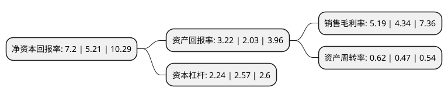

> 本页面由自动化程序生成于 2022年5月20日 01:06
> 内容可能存在错误，如有bug请提交issue至：https://github.com/Eroleice/doc-pi/issues
{.is-warning}

# 上市公司基本情况

## 基本资料

孚日集团股份有限公司（以下简称“孚日股份”）成立于1999年08月11日，潍坊市。于2006年11月24日在深交所中小板上市。

孚日股份注册资本90,805.335万元，主营业务:毛巾系列产品，装饰布系列产品等家用纺织品的生产和销售。以下是详细信息：

- 公司名称: 孚日集团股份有限公司
- 股票代码: 002083.SZ
- 所在地: 山东 - 潍坊市
- 成立日期: 1999年08月11日
- 注册资本: 90,805.335万元
- 法定代表人: 肖茂昌
- 主营业务: 主营业务:毛巾系列产品，装饰布系列产品等家用纺织品的生产和销售
- 公司官网: www.sunvim.com
- 公司介绍: 公司一家以家用纺织品为主导产业，集国内外贸易、地产、热电、电机等多元产业于一体的综合性企业集团。作为一家大型家用纺织品制造商，公司致力于向全球市场提供品质卓越、健康环保的家纺产品，拥有国家级技术中心、实验室和博士后科研工作站，配套完备的中试基地及检测实验室，形成了强大的技术研发能力。公司三大主导产品巾被、床上用品、装饰布艺，均已通过质量、环境、安全健康等系列国际认证。凭借优质的产品和良好的信誉，公司与国际主要家纺品牌形成了长期的、全方位、多层次的紧密合作关系，产品出口亚洲、欧洲、美洲、澳洲以及中东等多个国家和地区，在世界家纺市场上建立起良好的声誉。多年来，集团荣获“全国出口商品质量稳定企业”、“全国精神文明建设工作先进单位”、“全国模范劳动关系和谐企业”、“国家高新技术企业”、“全国民营企业500强”、“中华慈善突出贡献奖”等多项荣誉称号。

## 股东及高管情况

上市公司第一大股东为高密华荣实业发展有限公司，持股170,000,000股，占比18.72%，**疑似为**上市公司实际控制人。

截至2022年04月27日，上市公司的前十大股东中，共有6名自然人股东，4名机构股东，其中5%以上大股东共有7名。上市公司前十大股东明细如下：

> 未能通过持股比例判定出上市公司实际控制人（持股30%以上）
> 可能存在通过间接持股、联合持股、协议控制等方式拥有实际控制权的主体，具体请参考上市公司定期公告！
{.is-warning}

> 截至2022年04月27日，上市公司前十大股东信息如下：

| 股东名称 | 持股数量（股） | 持股比例 |
| --- | --- | --- |
| 高密华荣实业发展有限公司 | 170,000,000 | 18.72% |
| 高密华荣实业发展有限公司 | 170,000,000 | 18.72% |
| 高密华荣实业发展有限公司 | 170,000,000 | 18.72% |
| 孙日贵 | 58,145,617 | 6.4029% |
| 孙日贵 | 58,145,617 | 6.4% |
| 孙日贵 | 57,573,517 | 6.3403% |
| 高密安信投资管理股份有限公司 | 50,800,000 | 5.59% |
| 门雅静 | 6,043,200 | 0.67% |
| 杨宝坤 | 5,450,000 | 0.6% |
| 杨子明 | 3,763,975 | 0.41% |

## 杜邦分析

> 数据列示周期：2021年 | 2020年 | 2019年
{.is-info}

上市公司的净资产收益率在近一年有所上升，上升幅度为38.2%，其变化情况分解如下：
- 上市公司的销售毛利率在近一年上升了19.59%，可能是生产效率的提升、商品原材料价格下跌或商品价格的上涨所致。
- 上市公司的资产周转率在近一年上升了31.91%，可能是源自于更快的销售回款或库存管理效果提升。
- 上市公司的财务杠杆比率在近一年下降了-12.84%，可能是减少负债降低财务费用。

