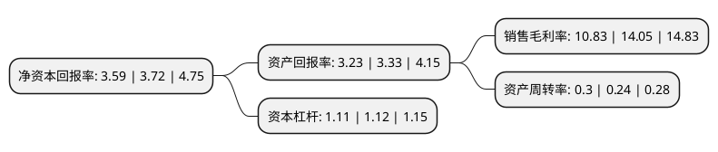

> 本页面由自动化程序生成于 2022年5月20日 01:06
> 内容可能存在错误，如有bug请提交issue至：https://github.com/Eroleice/doc-pi/issues
{.is-warning}

# 上市公司基本情况

## 基本资料

宏达高科控股股份有限公司（以下简称“宏达高科”）成立于1997年07月24日，嘉兴市。于2007年08月03日在深交所中小板上市。

宏达高科注册资本17,676.253万元，主要产品:汽车内饰面料和服饰面料。主营业务:经编面料的织造，染整与销售。以下是详细信息：

- 公司名称: 宏达高科控股股份有限公司
- 股票代码: 002144.SZ
- 所在地: 浙江 - 嘉兴市
- 成立日期: 1997年07月24日
- 注册资本: 17,676.253万元
- 法定代表人: 沈国甫
- 主营业务: 主要产品:汽车内饰面料和服饰面料主营业务:经编面料的织造，染整与销售
- 公司官网: www.zjhongda.com.cn
- 公司介绍: 公司是一家集经编织物织造和染色后整理于一体的大型企业。目前公司已成为全国最大的汽车内饰面料生产厂家之一，拥有从德国等国家引进的具有世界先进水平整经机等先进设备，已形成织造、染色、起绒、定型一条龙生产线，技术设备和生产规模在全国经编行业中处于领先地位。公司已通过ISO9001质量体系认证和“清洁生产”审核，企业技术中心被认定为高性能经编材料省级研发中心。“宏达”牌针织面料先后荣获“国家免检产品”、“中国针织名牌产品”等称号。公司增发股份用于收购深圳威尔德，进入旺盛发展期的医疗器械行业，抵抗纺织行业整体经济效益下滑的行业周期风险。

## 股东及高管情况

上市公司第一大股东为沈国甫，持股41,294,390股，占比23.36%，**疑似为**上市公司实际控制人。

截至2022年03月31日，上市公司的前十大股东中，共有10名自然人股东，其中5%以上大股东共有1名。上市公司前十大股东明细如下：

> 未能通过持股比例判定出上市公司实际控制人（持股30%以上）
> 可能存在通过间接持股、联合持股、协议控制等方式拥有实际控制权的主体，具体请参考上市公司定期公告！
{.is-warning}

> 截至2022年03月31日，上市公司前十大股东信息如下：

| 股东名称 | 持股数量（股） | 持股比例 |
| --- | --- | --- |
| 沈国甫 | 41,294,390 | 23.36% |
| 毛志林 | 8,529,001 | 4.83% |
| 李宏 | 4,430,000 | 2.51% |
| 白宁 | 4,350,911 | 2.46% |
| 姜龙银 | 2,350,000 | 1.33% |
| 周宇光 | 2,255,331 | 1.28% |
| 马月娟 | 1,826,911 | 1.03% |
| 张建福 | 965,262 | 0.55% |
| 陈峰 | 840,000 | 0.48% |
| 沈建林 | 766,000 | 0.43% |

## 杜邦分析

> 数据列示周期：2021年 | 2020年 | 2019年
{.is-info}

上市公司的净资产收益率在近一年有所下降，下降幅度为-3.49%，其变化情况分解如下：
- 上市公司的销售毛利率在近一年下降了-22.92%，可能是生产效率的下降、商品原材料价格上涨或商品价格的下跌所致。
- 上市公司的资产周转率在近一年上升了25%，可能是源自于更快的销售回款或库存管理效果提升。
- 上市公司的财务杠杆比率在近一年下降了-0.89%，可能是减少负债降低财务费用。

