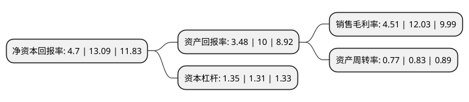

> 本页面由自动化程序生成于 2022年5月20日 01:08
> 内容可能存在错误，如有bug请提交issue至：https://github.com/Eroleice/doc-pi/issues
{.is-warning}

# 上市公司基本情况

## 基本资料

江苏联发纺织股份有限公司（以下简称“联发股份”）成立于2002年11月11日，南通市。于2010年04月23日在深交所中小板上市。

联发股份注册资本32,887.92万元，主营业务:生产销售色织布，服装，纺织品。主产品是中高档色织面料，包括中高纱支及具有免烫，三防，去污，抗菌，抗紫外线，防远红外线，吸湿排汗等生态，环保功能的各类色织面料。同时兼营中高档系列衬衫，棉纱，特种纤维。以下是详细信息：

- 公司名称: 江苏联发纺织股份有限公司
- 股票代码: 002394.SZ
- 所在地: 江苏 - 南通市
- 成立日期: 2002年11月11日
- 注册资本: 32,887.92万元
- 法定代表人: 薛庆龙
- 主营业务: 主营业务:生产销售色织布，服装，纺织品主产品是中高档色织面料，包括中高纱支及具有免烫，三防，去污，抗菌，抗紫外线，防远红外线，吸湿排汗等生态，环保功能的各类色织面料同时兼营中高档系列衬衫，棉纱，特种纤维
- 公司官网: www.lianfa.cn
- 公司介绍: 公司是一家集纺纱、染色、织造、整理、制衣于一体的大型纺织集团，产品为纱线、色织布、衬衣三大系列。公司拥有染色11000吨，色织布6000万米，色织布后整理能力6000万米，衬衫500万件，产品具有质量好、档次高、技术含量大、花色品种多、绿色环保等特色。在国内外色织行业有较大的影响和知名度，产品销往全国20多个省市，出口日本、美国、英国、意大利等36个国家和地区。“双钱”色织布被认定为“江苏名牌”产品、“出口免验”产品。“JAMESKING”衬衫品牌在广东、深圳、上海等开设专卖店200多家，全面打造衬衫品牌。产品生产严格执行GB、日本JIS、英国M＆S、美国AATCC的最高质量标准，优等品率始终保持在99%以上。

## 股东及高管情况

上市公司第一大股东为江苏联发集团股份有限公司，持股130,934,100股，占比39.81%，为上市公司实际控制人。

截至2022年03月31日，上市公司的前十大股东中，共有6名自然人股东，3名机构股东，1个产品账户，其中5%以上大股东共有2名。上市公司前十大股东明细如下：

> 截至2022年03月31日，上市公司前十大股东信息如下：

| 股东名称 | 持股数量（股） | 持股比例 |
| --- | --- | --- |
| 江苏联发集团股份有限公司 | 130,934,100 | 39.81% |
| 上海港鸿投资有限公司 | 18,364,200 | 5.58% |
| 薛庆龙 | 3,025,796 | 0.92% |
| 陈振华 | 2,760,400 | 0.84% |
| 廖祖海 | 2,100,000 | 0.64% |
| 广州市领泰投资有限公司 | 2,000,000 | 0.61% |
| 中国光大银行股份有限公司-大成策略回报混合型证券投资基金 | 1,894,000 | 0.58% |
| 余洪涛 | 1,668,894 | 0.51% |
| 吴吉林 | 1,643,900 | 0.5% |
| 陈月环 | 1,280,304 | 0.39% |

## 利润表分析

上市公司2021年总收入为38.96亿元，净利润为1.75亿元，实现盈利。

## 杜邦分析

> 数据列示周期：2021年 | 2020年 | 2019年
{.is-info}

上市公司的净资产收益率在近一年有所下降，下降幅度为-64.09%，其变化情况分解如下：
- 上市公司的销售毛利率在近一年下降了-62.51%，可能是生产效率的下降、商品原材料价格上涨或商品价格的下跌所致。
- 上市公司的资产周转率在近一年下降了-7.23%，可能是源自于更慢的销售回款或库存管理效果下降。
- 上市公司的财务杠杆比率在近一年上升了3.05%，可能是增加负债扩大生产规模。

