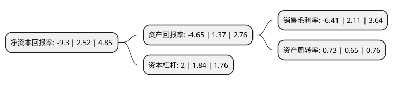

> 本页面由自动化程序生成于 2022年5月20日 01:08
> 内容可能存在错误，如有bug请提交issue至：https://github.com/Eroleice/doc-pi/issues
{.is-warning}

# 上市公司基本情况

## 基本资料

湖南梦洁家纺股份有限公司（以下简称“梦洁股份”）成立于1981年04月09日，长沙市。于2010年04月29日在深交所中小板上市。

梦洁股份注册资本75,598.144万元，公司主要从事以床上用品为主的家用纺织品的研发，设计，生产和销售，公司主要产品为寝饰套件(包括绗绣套件，绣花套件)和芯被类产品。以下是详细信息：

- 公司名称: 湖南梦洁家纺股份有限公司
- 股票代码: 002397.SZ
- 所在地: 湖南 - 长沙市
- 成立日期: 1981年04月09日
- 注册资本: 75,598.144万元
- 法定代表人: 姜天武
- 主营业务: 公司主要从事以床上用品为主的家用纺织品的研发，设计，生产和销售，公司主要产品为寝饰套件(包括绗绣套件，绣花套件)和芯被类产品
- 公司官网: www.mendale.com
- 公司介绍: 公司是一家专注于家纺主业的现代化企业集团，产品包括寝室套件、被类、枕垫类、小家饰、儿童家纺、毛毯、宾馆用品、棉制品、弹簧床垫、沙发等10大类2000多个品种的产品群。公司立足于家纺行业，致力为顾客提供高品质的家居生活方式，传导充满爱的家居生活态度。公司主要从事家纺产品的设计、制造、销售以及提供高品质的家居生活服务，拥有梦洁(MENDALE)、寐(MINE)、梦洁宝贝(MJ-BABY)、梦洁床垫、平实美学、觅(MEE)、Dreamcoco、Poeffen等在国内外家纺市场有重要影响力的自主品牌。在美国、欧盟、东南亚等二十多个国家和地区进行了涉外商标注册，产品出口美国、欧盟、东南亚等多个国家和地区。

## 股东及高管情况

上市公司第一大股东为姜天武，持股116,088,490股，占比15.36%，**疑似为**上市公司实际控制人。

截至2022年03月31日，上市公司的前十大股东中，共有10名自然人股东，其中5%以上大股东共有5名。上市公司前十大股东明细如下：

> 未能通过持股比例判定出上市公司实际控制人（持股30%以上）
> 可能存在通过间接持股、联合持股、协议控制等方式拥有实际控制权的主体，具体请参考上市公司定期公告！
{.is-warning}

> 截至2022年03月31日，上市公司前十大股东信息如下：

| 股东名称 | 持股数量（股） | 持股比例 |
| --- | --- | --- |
| 姜天武 | 116,088,490 | 15.36% |
| 伍静 | 81,252,932 | 10.75% |
| 李建伟 | 51,758,982 | 6.85% |
| 李菁 | 42,866,928 | 5.67% |
| 张爱纯 | 40,089,976 | 5.3% |
| 李军 | 24,902,318 | 3.29% |
| 徐冬梅 | 19,882,358 | 2.63% |
| 何晓霞 | 4,413,370 | 0.58% |
| 刘心怡 | 4,316,400 | 0.57% |
| 涂云华 | 4,204,403 | 0.56% |

## 利润表分析

上市公司2021年总收入为24.62亿元，净利润为-1.58亿元，**未实现盈利**。

## 杜邦分析

> 数据列示周期：2021年 | 2020年 | 2019年
{.is-info}

上市公司的净资产收益率在近一年有所下降，下降幅度为-469.05%，其变化情况分解如下：
- 上市公司的销售毛利率在近一年下降了-403.79%，可能是生产效率的下降、商品原材料价格上涨或商品价格的下跌所致。
- 上市公司的资产周转率在近一年上升了12.31%，可能是源自于更快的销售回款或库存管理效果提升。
- 上市公司的财务杠杆比率在近一年上升了8.7%，可能是增加负债扩大生产规模。

