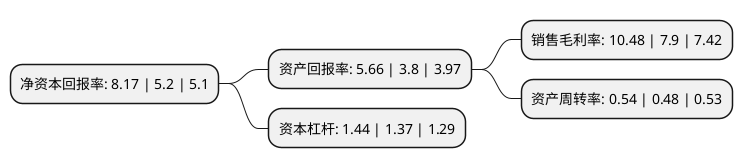

> 本页面由自动化程序生成于 2022年5月20日 01:11
> 内容可能存在错误，如有bug请提交issue至：https://github.com/Eroleice/doc-pi/issues
{.is-warning}

# 上市公司基本情况

## 基本资料

兴业皮革科技股份有限公司（以下简称“兴业科技”）成立于1992年12月14日，泉州市。于2012年05月07日在深交所中小板上市。

兴业科技注册资本29,186.294万元，主要产品:纳帕系列，自然摔系列，特殊效应革系列，产品被广泛应用于制造皮鞋，箱包，皮具等。主营业务:从事中高档牛头层鞋面革的开发，生产与销售。以下是详细信息：

- 公司名称: 兴业皮革科技股份有限公司
- 股票代码: 002674.SZ
- 所在地: 福建 - 泉州市
- 成立日期: 1992年12月14日
- 注册资本: 29,186.294万元
- 法定代表人: 吴华春
- 主营业务: 主要产品:纳帕系列，自然摔系列，特殊效应革系列，产品被广泛应用于制造皮鞋，箱包，皮具等主营业务:从事中高档牛头层鞋面革的开发，生产与销售
- 公司官网: www.xingyeleather.com
- 公司介绍: 公司是中国天然皮革鞣制行业首家A股上市公司、中国制革工业龙头企业之一、高新技术企业，是中国皮革行业纳税大户。公司专注于中高端天然牛头层皮产品研发、生产与销售，现已形成以纳帕皮系列、自然摔纹皮系列和特殊效应皮系列等为主的产品布局，广泛应用于皮鞋、箱包、真皮家具等制造领域。凭借强大的技术研发、生产制造、人才发展、经营管理和客户服务的实力，以及在“市场导向，科技创新，环保优先，品质保证”等价值链全方位的扎实实践，公司已成为众多国内外知名品牌的重要战略合作伙伴，是中国《绿色之星》产品优秀企业，“兴业皮革”品牌获得“真皮标志,生态皮革”授牌。公司采用国际标准化管理模式，具备完善的管理体系，先后通过ISO9001质量管理体系和ISO14001环境管理体系认证，并建立GB/T28001-2001职业健康安全管理体系。公司以“绿色皮革、百年兴业”为愿景，以“服务品牌，引领时尚”、“做绿色时尚引领者”为使命，以“执着、勤劳、爱拼、奉献、融合、分享”为企业核心价值精神，坚定不移地走“资源节约型、环境友好型”的新型皮革工业发展道路，励精图治抓管理、精工细作创名牌。

## 股东及高管情况

上市公司第一大股东为石河子万兴股权投资合伙企业(有限合伙)，持股84,744,000股，占比29.04%，**疑似为**上市公司实际控制人。

截至2022年03月31日，上市公司的前十大股东中，共有6名自然人股东，4名机构股东，其中5%以上大股东共有4名。上市公司前十大股东明细如下：

> 未能通过持股比例判定出上市公司实际控制人（持股30%以上）
> 可能存在通过间接持股、联合持股、协议控制等方式拥有实际控制权的主体，具体请参考上市公司定期公告！
{.is-warning}

> 截至2022年03月31日，上市公司前十大股东信息如下：

| 股东名称 | 持股数量（股） | 持股比例 |
| --- | --- | --- |
| 石河子万兴股权投资合伙企业(有限合伙) | 84,744,000 | 29.04% |
| 吴国仕 | 39,666,886 | 13.59% |
| 石河子恒大股权投资合伙企业(有限合伙) | 31,464,000 | 10.78% |
| 荣通国际有限公司 | 16,889,800 | 5.79% |
| 华佳发展有限公司 | 10,220,700 | 3.5% |
| 施海渤 | 7,600,000 | 2.6% |
| 吴美莉 | 3,794,656 | 1.3% |
| 王坚宏 | 2,857,858 | 0.98% |
| 陈明生 | 1,845,300 | 0.63% |
| 万荣和 | 1,695,000 | 0.58% |

## 杜邦分析

> 数据列示周期：2021年 | 2020年 | 2019年
{.is-info}

上市公司的净资产收益率在近一年有所上升，上升幅度为57.12%，其变化情况分解如下：
- 上市公司的销售毛利率在近一年上升了32.66%，可能是生产效率的提升、商品原材料价格下跌或商品价格的上涨所致。
- 上市公司的资产周转率在近一年上升了12.5%，可能是源自于更快的销售回款或库存管理效果提升。
- 上市公司的财务杠杆比率在近一年上升了5.11%，可能是增加负债扩大生产规模。

