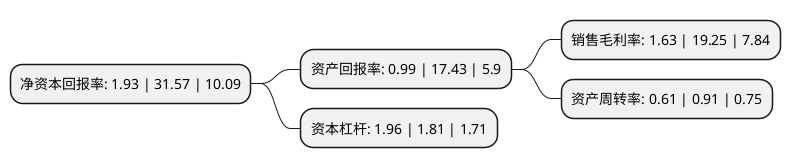

> 本页面由自动化程序生成于 2022年5月20日 01:19
> 内容可能存在错误，如有bug请提交issue至：https://github.com/Eroleice/doc-pi/issues
{.is-warning}

# 上市公司基本情况

## 基本资料

厦门延江新材料股份有限公司（以下简称“延江股份”）成立于2000年04月03日，厦门市。于2017年06月02日在深交所创业板上市。

延江股份注册资本22,761万元，主营业务:一次性卫生用品面层材料的研发，生产和销售，致力于为客户提供创新型的面层材料。主要产品为3D打孔无纺布和PE打孔膜，主要是用作妇女卫生用品，婴儿纸尿布等一次性卫生用品的面层材料，其中3D打孔无纺布业已应用于高端纸尿布的底层材料。以下是详细信息：

- 公司名称: 厦门延江新材料股份有限公司
- 股票代码: 300658.SZ
- 所在地: 福建 - 厦门市
- 成立日期: 2000年04月03日
- 注册资本: 22,761万元
- 法定代表人: 谢继华
- 主营业务: 主营业务:一次性卫生用品面层材料的研发，生产和销售，致力于为客户提供创新型的面层材料主要产品为3D打孔无纺布和PE打孔膜，主要是用作妇女卫生用品，婴儿纸尿布等一次性卫生用品的面层材料，其中3D打孔无纺布业已应用于高端纸尿布的底层材料
- 公司官网: www.yanjan.com
- 公司介绍: 公司是一家专业生产即弃卫生用品表层材料的供应商；主要产品包括PE打孔膜、3D打孔无纺布、热风无纺布、ADL导流层等。产品应用于卫生巾、护垫、婴儿和成人纸尿裤以及医疗和食品包装等行业。多年来，延江始终和客户一起密切合作，持续创新，不断为市场提供全新的技术和价值，共同赢得了市场，从而得到客户的信赖和支持。公司产品广泛应用于世界和中国大陆著名品牌以及中国大陆的大部分地区性知名品牌。公司的产品正被越来越多的国家了解和认可，并远销欧美,亚洲，非洲及中东地区。

## 股东及高管情况

上市公司第一大股东为谢继华，持股59,019,075股，占比25.93%，**疑似为**上市公司实际控制人。

截至2022年03月31日，上市公司的前十大股东中，共有7名自然人股东，2名机构股东，1个产品账户，其中5%以上大股东共有6名。上市公司前十大股东明细如下：

> 未能通过持股比例判定出上市公司实际控制人（持股30%以上）
> 可能存在通过间接持股、联合持股、协议控制等方式拥有实际控制权的主体，具体请参考上市公司定期公告！
{.is-warning}

> 截至2022年03月31日，上市公司前十大股东信息如下：

| 股东名称 | 持股数量（股） | 持股比例 |
| --- | --- | --- |
| 谢继华 | 59,019,075 | 25.93% |
| 谢继权 | 30,259,500 | 13.29% |
| 谢影秋 | 15,129,750 | 6.65% |
| 谢淑冬 | 15,129,750 | 6.65% |
| 谢道平 | 13,629,750 | 5.99% |
| 林彬彬 | 13,629,750 | 5.99% |
| 上海延钗企业管理咨询合伙企业(有限合伙) | 4,556,250 | 2% |
| 上海瑙延企业管理咨询合伙企业(有限合伙) | 3,037,500 | 1.33% |
| 徐雪玲 | 3,000,000 | 1.32% |
| 融通富国(深圳)基金管理有限公司-融通富国成长8号私募证券投资基金 | 1,500,000 | 0.66% |

## 利润表分析

上市公司2021年总收入为12.49亿元，净利润为0.2亿元，实现盈利。

## 杜邦分析

> 数据列示周期：2021年 | 2020年 | 2019年
{.is-info}

上市公司的净资产收益率在近一年有所下降，下降幅度为-93.89%，其变化情况分解如下：
- 上市公司的销售毛利率在近一年下降了-91.53%，可能是生产效率的下降、商品原材料价格上涨或商品价格的下跌所致。
- 上市公司的资产周转率在近一年下降了-32.97%，可能是源自于更慢的销售回款或库存管理效果下降。
- 上市公司的财务杠杆比率在近一年上升了8.29%，可能是增加负债扩大生产规模。

