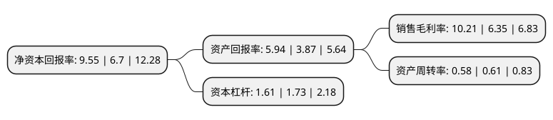

> 本页面由自动化程序生成于 2022年5月20日 01:21
> 内容可能存在错误，如有bug请提交issue至：https://github.com/Eroleice/doc-pi/issues
{.is-warning}

# 上市公司基本情况

## 基本资料

山东南山智尚科技股份有限公司（以下简称“南山智尚”）成立于2007年04月29日，烟台市。于2020年12月22日在深交所创业板上市。

南山智尚注册资本36,000万元，主营业务为精纺呢绒及正装职业装的研发，设计，生产与销售。以下是详细信息：

- 公司名称: 山东南山智尚科技股份有限公司
- 股票代码: 300918.SZ
- 所在地: 山东 - 烟台市
- 成立日期: 2007年04月29日
- 注册资本: 36,000万元
- 法定代表人: 赵亮
- 主营业务: 主营业务为精纺呢绒及正装职业装的研发，设计，生产与销售
- 公司官网: www.nanshanchina.com
- 公司介绍: 公司集纺织服饰智能制造与品牌运营为一体，主营业务为精纺呢绒及正装职业装的研发、设计、生产与销售。公司拥有完善的毛纺织服饰产业链，涵盖了集面料研发、毛条加工、染色、纺纱、织造、后整理于一体的精纺呢绒业务体系，以及集成衣研发、设计、制造、品牌运营于一体的服装业务体系。公司为国内精纺呢绒、正装职业装领军企业，“南山”牌精纺呢绒、“缔尔玛”牌职业装先后被国家工商总局认定为中国驰名商标。公司为精梳毛机织物单项冠军示范企业，“缔尔玛”牌职业装先后获评“中国职业装十大顶级品牌”、“中国服装成长品牌”。公司是国家级高新技术企业、中国纺织工业联合会认定的纺织技术创新示范企业，公司检测中心是中国合格评定国家认可委员会认可的实验室。公司凭借自身的科技实力与市场影响力，多次参与制定了纺织领域国家及行业技术标准。截至本招股说明书签署日，公司已形成专利71项，其中发明专利24项，获得山东省科技进步奖3次、中国纺织行业专利奖优秀奖2次。

## 股东及高管情况

上市公司第一大股东为南山集团有限公司，持股243,000,000股，占比67.5%，为上市公司实际控制人。

截至2022年03月31日，上市公司的前十大股东中，共有6名自然人股东，4名机构股东，其中5%以上大股东共有1名。上市公司前十大股东明细如下：

> 截至2022年03月31日，上市公司前十大股东信息如下：

| 股东名称 | 持股数量（股） | 持股比例 |
| --- | --- | --- |
| 南山集团有限公司 | 243,000,000 | 67.5% |
| 烟台南晟投资合伙企业(有限合伙) | 13,500,000 | 3.75% |
| 烟台盛坤投资合伙企业(有限合伙) | 13,500,000 | 3.75% |
| 郑锦强 | 2,524,300 | 0.7% |
| 远连成 | 2,279,900 | 0.63% |
| 中信证券股份有限公司 | 1,472,773 | 0.41% |
| 鱼杰 | 694,831 | 0.19% |
| 邓兴文 | 680,000 | 0.19% |
| 黄朝江 | 658,402 | 0.18% |
| 黄朝红 | 658,402 | 0.18% |

## 利润表分析

上市公司2021年总收入为14.91亿元，净利润为1.52亿元，实现盈利。

## 杜邦分析

> 数据列示周期：2021年 | 2020年 | 2019年
{.is-info}

上市公司的净资产收益率在近一年有所上升，上升幅度为42.54%，其变化情况分解如下：
- 上市公司的销售毛利率在近一年上升了60.79%，可能是生产效率的提升、商品原材料价格下跌或商品价格的上涨所致。
- 上市公司的资产周转率在近一年下降了-4.92%，可能是源自于更慢的销售回款或库存管理效果下降。
- 上市公司的财务杠杆比率在近一年下降了-6.94%，可能是减少负债降低财务费用。

