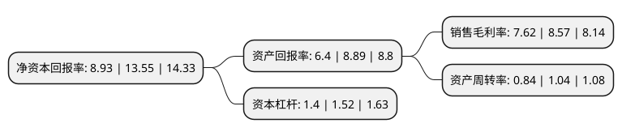

> 本页面由自动化程序生成于 2022年5月20日 01:22
> 内容可能存在错误，如有bug请提交issue至：https://github.com/Eroleice/doc-pi/issues
{.is-warning}

# 上市公司基本情况

## 基本资料

杭州万事利丝绸文化股份有限公司（以下简称“万事利”）成立于2007年09月13日，杭州市。于2021年09月22日在深交所创业板上市。

万事利注册资本13,453.728万元，专业从事丝绸相关产品的研发设计，生产与销售。主要产品按照客户群体和是否具备终端消费品牌可分为丝绸文化创意品和OEM丝绸制品。以下是详细信息：

- 公司名称: 杭州万事利丝绸文化股份有限公司
- 股票代码: 301066.SZ
- 所在地: 浙江 - 杭州市
- 成立日期: 2007年09月13日
- 注册资本: 13,453.728万元
- 法定代表人: 李建华
- 主营业务: 专业从事丝绸相关产品的研发设计，生产与销售主要产品按照客户群体和是否具备终端消费品牌可分为丝绸文化创意品和OEM丝绸制品
- 公司官网: www.wensli.cn
- 公司介绍: 公司将中国传统丝绸文化与创意设计、数码印花生产工艺相结合，专业从事丝绸相关产品的研发设计、生产与销售。公司主要产品按照客户群体和是否具备终端消费品牌可分为丝绸文化创意品和OEM丝绸制品，其中以“万事利”自有品牌为核心的丝绸文化创意品主要包括丝巾、组合套装、家纺、品牌服装、围巾、丝绸工艺品；以技术加工为核心向知名女装品牌提供的OEM丝绸制品主要包括丝绸面料、OEM服装。此外，公司凭借工艺优势还向客户提供数码印花加工服务。公司丝绸文化创意品将文化创意以丝绸相关产品的形式进行体现，主要以“万事利”核心品牌面向终端消费者。凭借着文化创意优势和品牌美誉度，公司丝绸文化创意品市场认可度较高，并成功服务了北京奥运会、上海世博会、广州亚运会、G20杭州峰会、北京“一带一路”国际合作高峰论坛、厦门金砖国家领导人会晤等一系列国际盛会，用丝绸文化创意和工艺技术彰显了中国文化的魅力。

## 股东及高管情况

上市公司第一大股东为万事利集团有限公司，持股55,074,009股，占比40.94%，为上市公司实际控制人。

截至2022年04月28日，上市公司的前十大股东中，共有2名自然人股东，6名机构股东，2个产品账户，其中5%以上大股东共有7名。上市公司前十大股东明细如下：

> 截至2022年04月28日，上市公司前十大股东信息如下：

| 股东名称 | 持股数量（股） | 持股比例 |
| --- | --- | --- |
| 万事利集团有限公司 | 55,074,009 | 40.94% |
| 杭州丝奥投资有限公司 | 12,000,000 | 8.92% |
| 杭州丝奥投资有限公司 | 12,000,000 | 8.92% |
| 浙江浙商产业投资基金合伙企业(有限合伙) | 10,092,919 | 7.5% |
| 舟山丝弦投资合伙企业(有限合伙) | 8,000,000 | 5.95% |
| 舟山丝昱投资合伙企业(有限合伙) | 8,000,000 | 5.95% |
| 林祥 | 7,110,037 | 5.28% |
| 国信证券-农业银行-国信证券鼎信19号员工参与战略配售集合资产管理计划 | 3,363,432 | 2.5% |
| 杭州盈思投资合伙企业(有限合伙) | 2,049,340 | 1.52% |
| 陈曙华 | 1,229,504 | 0.91% |

## 利润表分析

上市公司2021年总收入为6.69亿元，净利润为0.51亿元，实现盈利。

## 杜邦分析

> 数据列示周期：2021年 | 2020年 | 2019年
{.is-info}

上市公司的净资产收益率在近一年有所下降，下降幅度为-34.1%，其变化情况分解如下：
- 上市公司的销售毛利率在近一年下降了-11.09%，可能是生产效率的下降、商品原材料价格上涨或商品价格的下跌所致。
- 上市公司的资产周转率在近一年下降了-19.23%，可能是源自于更慢的销售回款或库存管理效果下降。
- 上市公司的财务杠杆比率在近一年下降了-7.89%，可能是减少负债降低财务费用。

