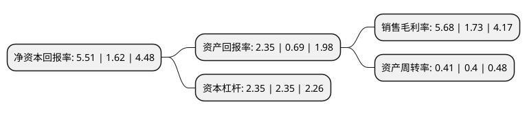

> 本页面由自动化程序生成于 2022年5月20日 01:25
> 内容可能存在错误，如有bug请提交issue至：https://github.com/Eroleice/doc-pi/issues
{.is-warning}

# 上市公司基本情况

## 基本资料

江苏阳光股份有限公司（以下简称“江苏阳光”）成立于1994年02月18日，无锡市。于1999年09月27日在上交所主板上市。

江苏阳光注册资本178,334.033万元，主要产品为精纺呢绒面料，服装和毛纺等。以下是详细信息：

- 公司名称: 江苏阳光股份有限公司
- 股票代码: 600220.SH
- 所在地: 江苏 - 无锡市
- 成立日期: 1994年02月18日
- 注册资本: 178,334.033万元
- 法定代表人: 陈丽芬
- 主营业务: 主要产品为精纺呢绒面料，服装和毛纺等
- 公司官网: www.sunshine.com.cn
- 公司介绍: 公司自成立以来，始终坚持“立足高起点、利用高科技、发展高精尖、创出高效益”的发展战略。公司科研实力雄厚，装备水平先进，在纺织行业内技术优势明显。每年为国内外主要服装企业提供高端毛纺面料，是全球高端品牌服装长期供应商。公司是国内知名的精纺呢绒生产企业和薄型面料生产基地。公司主要从事精纺呢绒面料、毛纺、电汽的生产和销售。近年来公司一直进入中国毛纺、毛针织行业竞争力10强、中国纺织服装企业竞争力500强、中国纺织服装行业品牌价值50强企业。

## 股东及高管情况

上市公司第一大股东为江苏阳光集团有限公司，持股226,311,454股，占比12.69%，**疑似为**上市公司实际控制人。

截至2022年03月31日，上市公司的前十大股东中，共有7名自然人股东，1名机构股东，2个产品账户，其中5%以上大股东共有4名。上市公司前十大股东明细如下：

> 未能通过持股比例判定出上市公司实际控制人（持股30%以上）
> 可能存在通过间接持股、联合持股、协议控制等方式拥有实际控制权的主体，具体请参考上市公司定期公告！
{.is-warning}

> 截至2022年03月31日，上市公司前十大股东信息如下：

| 股东名称 | 持股数量（股） | 持股比例 |
| --- | --- | --- |
| 江苏阳光集团有限公司 | 226,311,454 | 12.69% |
| 陈丽芬 | 148,181,020 | 8.31% |
| 郁琴芬 | 144,300,000 | 8.09% |
| 孙宁玲 | 91,648,980 | 5.14% |
| 花晓东 | 30,460,000 | 1.71% |
| 刘荷娣 | 19,740,000 | 1.11% |
| 高敏 | 17,000,000 | 0.95% |
| 中欧基金-农业银行-中欧中证金融资产管理计划 | 16,890,300 | 0.95% |
| 博时基金-农业银行-博时中证金融资产管理计划 | 16,890,300 | 0.95% |
| 高惠丰 | 16,500,000 | 0.93% |

## 杜邦分析

> 数据列示周期：2021年 | 2020年 | 2019年
{.is-info}

上市公司的净资产收益率在近一年有所上升，上升幅度为240.12%，其变化情况分解如下：
- 上市公司的销售毛利率在近一年上升了228.32%，可能是生产效率的提升、商品原材料价格下跌或商品价格的上涨所致。
- 上市公司的资产周转率在近一年上升了2.5%，可能是源自于更快的销售回款或库存管理效果提升。
- 上市公司的财务杠杆比率在近一年下降了0%，可能是减少负债降低财务费用。

