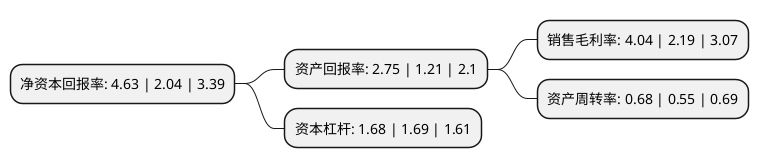

> 本页面由自动化程序生成于 2022年5月20日 01:25
> 内容可能存在错误，如有bug请提交issue至：https://github.com/Eroleice/doc-pi/issues
{.is-warning}

# 上市公司基本情况

## 基本资料

浙江金鹰股份有限公司（以下简称“金鹰股份”）成立于1994年09月23日，舟山市。于2000年06月02日在上交所主板上市。

金鹰股份注册资本36,471.854万元，主要产品:纺机及配件，塑机及配件，绢纺织品，亚麻纺织品，服装。以下是详细信息：

- 公司名称: 浙江金鹰股份有限公司
- 股票代码: 600232.SH
- 所在地: 浙江 - 舟山市
- 成立日期: 1994年09月23日
- 注册资本: 36,471.854万元
- 法定代表人: 傅国定
- 主营业务: 主要产品:纺机及配件，塑机及配件，绢纺织品，亚麻纺织品，服装
- 公司官网: www.cn-goldeneagle.com
- 公司介绍: 公司是我国纺织行业龙头企业。公司所从事的主要业务是麻、毛、丝、绢纺织机械成套设备制造销售。亚麻纺、绢纺、织造、染整、制衣。公司控股子公司浙江金鹰塑料机械有限公司生产的注塑机械系列设备，控股子公司浙江金鹰瑞翔新材料有限公司的动力电池三元正极材料研发、制造、销售。公司亚麻纺织品出口主要集中在美、欧和日本。公司绢纺产品居行业龙头地位。公司先后被列入“中国500家最大机械工业企业”、“国家机电产品出口基地企业”。被授予“全国‘五一’劳动奖状先进单位”、“全国精神文明建设先进单位”、“全国首批重合同守信用单位”、“浙江省最佳经济效益工业企业”、“浙江省技术进步优秀企业”等荣誉。

## 股东及高管情况

上市公司第一大股东为浙江金鹰集团有限公司，持股177,173,451股，占比48.58%，为上市公司实际控制人。

截至2022年03月31日，上市公司的前十大股东中，共有8名自然人股东，1名机构股东，1个海外主体，其中5%以上大股东共有1名。上市公司前十大股东明细如下：

> 截至2022年03月31日，上市公司前十大股东信息如下：

| 股东名称 | 持股数量（股） | 持股比例 |
| --- | --- | --- |
| 浙江金鹰集团有限公司 | 177,173,451 | 48.58% |
| 顾兴华 | 3,099,100 | 0.85% |
| 曾新建 | 2,750,420 | 0.75% |
| 董淑芬 | 2,377,900 | 0.65% |
| 敖东胜 | 1,658,418 | 0.45% |
| 余运湘 | 1,537,100 | 0.42% |
| JPMORGAN   CHASE BANK,NATIONAL ASSOCIATION | 1,411,409 | 0.39% |
| 陈玉麒 | 1,352,301 | 0.37% |
| 吴建新 | 1,050,000 | 0.29% |
| 刘芳 | 1,007,800 | 0.28% |

## 利润表分析

上市公司2021年总收入为12.08亿元，净利润为0.48亿元，实现盈利。

## 杜邦分析

> 数据列示周期：2021年 | 2020年 | 2019年
{.is-info}

上市公司的净资产收益率在近一年有所上升，上升幅度为126.96%，其变化情况分解如下：
- 上市公司的销售毛利率在近一年上升了84.47%，可能是生产效率的提升、商品原材料价格下跌或商品价格的上涨所致。
- 上市公司的资产周转率在近一年上升了23.64%，可能是源自于更快的销售回款或库存管理效果提升。
- 上市公司的财务杠杆比率在近一年下降了-0.59%，可能是减少负债降低财务费用。

