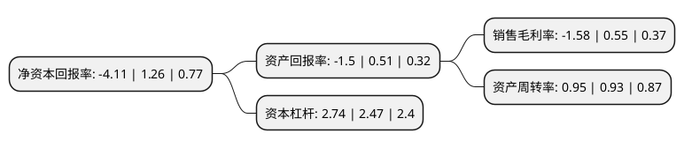

> 本页面由自动化程序生成于 2022年5月20日 01:26
> 内容可能存在错误，如有bug请提交issue至：https://github.com/Eroleice/doc-pi/issues
{.is-warning}

# 上市公司基本情况

## 基本资料

华纺股份有限公司（以下简称“华纺股份”）成立于1999年09月03日，滨州市。于2001年09月03日在上交所主板上市。

华纺股份注册资本62,981.966万元，主要产品:印染布，棉布，棉纱，毛条，毛纱，呢绒面料。以下是详细信息：

- 公司名称: 华纺股份有限公司
- 股票代码: 600448.SH
- 所在地: 山东 - 滨州市
- 成立日期: 1999年09月03日
- 注册资本: 62,981.966万元
- 法定代表人: 盛守祥
- 主营业务: 主要产品:印染布，棉布，棉纱，毛条，毛纱，呢绒面料
- 公司官网: www.hfgf.cn
- 公司介绍: 公司是中国规模最大综合纺织印染企业之一，国家纺织产品开发中心的印染产品开发基地，中国纺织印染行业销售10强企业。公司年生产能力2亿米，出口占总产量80%，是中国纺织企业全行业出口百强。公司开发的天丝染整技术被被列为国家技术开发项目，获省级科技进步一等奖。公司生产的大豆蛋白纤维织物、棉/锦贡缎弹力印花、天丝条卡双面染色砂洗面料、竹纤维斜纹弹力面料、棉涤高织竹节面料、双嵌条弹力面料、自然弹力条卡等入围“中国流行面料”。公司以印染加工为主业，形成包含纺纱、服装、家纺成品、纺织贸易、品牌开发、“B2B”平台、金融投资及热电等业务的多元化发展模式。

## 股东及高管情况

上市公司第一大股东为滨州安泰控股集团有限公司，持股117,364,470股，占比18.63%，**疑似为**上市公司实际控制人。

截至2022年03月31日，上市公司的前十大股东中，共有4名自然人股东，4名机构股东，2个产品账户，其中5%以上大股东共有1名。上市公司前十大股东明细如下：

> 未能通过持股比例判定出上市公司实际控制人（持股30%以上）
> 可能存在通过间接持股、联合持股、协议控制等方式拥有实际控制权的主体，具体请参考上市公司定期公告！
{.is-warning}

> 截至2022年03月31日，上市公司前十大股东信息如下：

| 股东名称 | 持股数量（股） | 持股比例 |
| --- | --- | --- |
| 滨州安泰控股集团有限公司 | 117,364,470 | 18.63% |
| 汇达资产托管有限责任公司 | 20,921,880 | 3.32% |
| 中诚资本管理(北京)有限公司-中诚资本润华私募股权投资基金 | 19,717,092 | 3.13% |
| 天津珑曜恒达企业管理咨询有限公司 | 12,069,700 | 1.92% |
| 朱木清 | 7,100,000 | 1.13% |
| 夏一定 | 6,338,220 | 1.01% |
| 李枫 | 6,300,000 | 1% |
| 华泰证券股份有限公司 | 5,482,697 | 0.87% |
| 李巍 | 4,214,700 | 0.67% |
| 芜湖长元股权投资基金(有限合伙) | 3,178,560 | 0.5% |

## 利润表分析

上市公司2021年总收入为36.21亿元，净利润为-0.58亿元，**未实现盈利**。

## 杜邦分析

> 数据列示周期：2021年 | 2020年 | 2019年
{.is-info}

上市公司的净资产收益率在近一年有所下降，下降幅度为-426.19%，其变化情况分解如下：
- 上市公司的销售毛利率在近一年下降了-387.27%，可能是生产效率的下降、商品原材料价格上涨或商品价格的下跌所致。
- 上市公司的资产周转率在近一年上升了2.15%，可能是源自于更快的销售回款或库存管理效果提升。
- 上市公司的财务杠杆比率在近一年上升了10.93%，可能是增加负债扩大生产规模。

