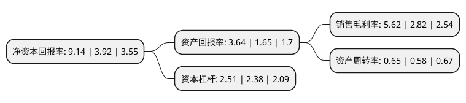

> 本页面由自动化程序生成于 2022年5月20日 01:26
> 内容可能存在错误，如有bug请提交issue至：https://github.com/Eroleice/doc-pi/issues
{.is-warning}

# 上市公司基本情况

## 基本资料

福建凤竹纺织科技股份有限公司（以下简称“凤竹纺织”）成立于1991年04月11日，泉州市。于2004年04月21日在上交所主板上市。

凤竹纺织注册资本27,200万元，主要产品:织造，染纱，染整加工，污水处理。以下是详细信息：

- 公司名称: 福建凤竹纺织科技股份有限公司
- 股票代码: 600493.SH
- 所在地: 福建 - 泉州市
- 成立日期: 1991年04月11日
- 注册资本: 27,200万元
- 法定代表人: 陈强
- 主营业务: 主要产品:织造，染纱，染整加工，污水处理
- 公司官网: www.fynex.com.cn
- 公司介绍: 公司是一家以针织染整加工和针织成品布、筒子色纱生产及环保设施运营为主营业务的上市公司。公司坚持以客户为中心，以市场为导向，以成本低、品种新、质量高、服务优、交期准为专业要求，致力成为全球高档针织面料领导品牌。公司拥有织造、染纱、漂染、污水处理厂及棉纺子公司，主要产品为针织坯布、针织面料、针织用纱、筒子色纱和服装等，在行业内率先通过ISO9001管理体系和ISO14001环境管理体系认证，国际生态纺织品Oeko-Tex Standard100认证，Intertek生态产品Ⅰ类认证。凤竹牌针织成品面料荣获“福建省名牌产品”、“中国名牌产品”、“国家免检产品”称号。

## 股东及高管情况

上市公司第一大股东为陈澄清，持股29,147,520股，占比10.72%，**疑似为**上市公司实际控制人。

截至2022年03月31日，上市公司的前十大股东中，共有9名自然人股东，1个产品账户，其中5%以上大股东共有3名。上市公司前十大股东明细如下：

> 未能通过持股比例判定出上市公司实际控制人（持股30%以上）
> 可能存在通过间接持股、联合持股、协议控制等方式拥有实际控制权的主体，具体请参考上市公司定期公告！
{.is-warning}

> 截至2022年03月31日，上市公司前十大股东信息如下：

| 股东名称 | 持股数量（股） | 持股比例 |
| --- | --- | --- |
| 陈澄清 | 29,147,520 | 10.72% |
| 李常春 | 23,643,600 | 8.69% |
| 李明锋 | 23,256,000 | 8.55% |
| 北京中潞福银投资有限公司-中潞壹号证券投资基金 | 10,060,000 | 3.7% |
| 陈慧 | 7,389,209 | 2.72% |
| 李萍影 | 6,377,265 | 2.34% |
| 顾宝军 | 5,220,000 | 1.92% |
| 陈乃勤 | 2,891,657 | 1.06% |
| 顾宝华 | 2,500,000 | 0.92% |
| 周宇光 | 1,499,017 | 0.55% |

## 利润表分析

上市公司2021年总收入为13.01亿元，净利润为0.73亿元，实现盈利。

## 杜邦分析

> 数据列示周期：2021年 | 2020年 | 2019年
{.is-info}

上市公司的净资产收益率在近一年有所上升，上升幅度为133.16%，其变化情况分解如下：
- 上市公司的销售毛利率在近一年上升了99.29%，可能是生产效率的提升、商品原材料价格下跌或商品价格的上涨所致。
- 上市公司的资产周转率在近一年上升了12.07%，可能是源自于更快的销售回款或库存管理效果提升。
- 上市公司的财务杠杆比率在近一年上升了5.46%，可能是增加负债扩大生产规模。

