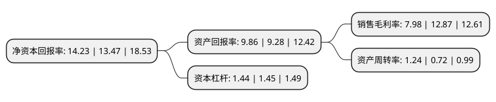

> 本页面由自动化程序生成于 2022年5月20日 01:30
> 内容可能存在错误，如有bug请提交issue至：https://github.com/Eroleice/doc-pi/issues
{.is-warning}

# 上市公司基本情况

## 基本资料

浙江航民股份有限公司（以下简称“航民股份”）成立于1998年01月06日，杭州市。于2004年08月09日在上交所主板上市。

航民股份注册资本105,081.886万元，印染及印染纺织品，染料，电力，蒸汽，织造布，黄金饰品的加工及批发业务。以下是详细信息：

- 公司名称: 浙江航民股份有限公司
- 股票代码: 600987.SH
- 所在地: 浙江 - 杭州市
- 成立日期: 1998年01月06日
- 注册资本: 105,081.886万元
- 法定代表人: 朱重庆
- 主营业务: 印染及印染纺织品，染料，电力，蒸汽，织造布，黄金饰品的加工及批发业务
- 公司官网: www.hmgf.com
- 公司介绍: 浙江航民股份有限公司成立于1998年1月，位于杭州市萧山东部航民工业园内，于2004年8月9日在上海证券交易所上市(证券代码600987)，是一家专注于在“穿着和佩戴”方面改善人们生活品质，满足人们穿戴舒适漂亮的美好愿望，聚焦“纺织印染+黄金饰品”双主业发展，并以热电、非织造布生产、工业用水、污水处理及海运物流等产业相配套的公司。公司是中国“印染行业竞争力十强企业”(加工能力位列全国第二)，“飞航”牌多种纤维混纺面料、高纺真面料及印花面料等在市场上享有较高的知名度，畅销全国，远销东南亚、中东、北美、欧盟和港澳台等国家和地区；同时，公司也是中国黄金首饰产业重要生产基地，黄金饰品加工量位居全国第三，“航民首饰”注册商标被认定为中国驰名商标，长期为老庙黄金、老凤祥为代表的多家国内知名黄金珠宝首饰品牌商提供优质的黄金饰品加工服务。

## 股东及高管情况

上市公司第一大股东为浙江航民实业集团有限公司，持股446,965,306股，占比42.53%，为上市公司实际控制人。

截至2022年03月31日，上市公司的前十大股东中，共有1名自然人股东，7名机构股东，2个产品账户，其中5%以上大股东共有2名。上市公司前十大股东明细如下：

> 截至2022年03月31日，上市公司前十大股东信息如下：

| 股东名称 | 持股数量（股） | 持股比例 |
| --- | --- | --- |
| 浙江航民实业集团有限公司 | 446,965,306 | 42.53% |
| 环冠珠宝金饰有限公司 | 78,213,477 | 7.44% |
| 陈升 | 50,000,000 | 4.76% |
| 中矿国际投资有限公司 | 29,200,000 | 2.78% |
| 杭州钢铁集团有限公司 | 23,315,838 | 2.22% |
| 万向三农集团有限公司 | 22,825,198 | 2.17% |
| 中国建设银行股份有限公司-中欧价值发现股票型证券投资基金 | 22,655,599 | 2.16% |
| 佛山市顺德金纺集团有限公司 | 17,205,764 | 1.64% |
| 中国工商银行股份有限公司-中欧潜力价值灵活配置混合型证券投资基金 | 12,945,215 | 1.23% |
| 太平洋机电(集团)有限公司 | 12,397,520 | 1.18% |

## 利润表分析

上市公司2021年总收入为94.91亿元，净利润为7.57亿元，实现盈利。

## 杜邦分析

> 数据列示周期：2021年 | 2020年 | 2019年
{.is-info}

上市公司的净资产收益率在近一年有所上升，上升幅度为5.64%，其变化情况分解如下：
- 上市公司的销售毛利率在近一年下降了-38%，可能是生产效率的下降、商品原材料价格上涨或商品价格的下跌所致。
- 上市公司的资产周转率在近一年上升了72.22%，可能是源自于更快的销售回款或库存管理效果提升。
- 上市公司的财务杠杆比率在近一年下降了-0.69%，可能是减少负债降低财务费用。

