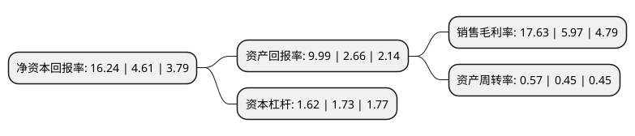

> 本页面由自动化程序生成于 2022年5月20日 01:31
> 内容可能存在错误，如有bug请提交issue至：https://github.com/Eroleice/doc-pi/issues
{.is-warning}

# 上市公司基本情况

## 基本资料

百隆东方股份有限公司（以下简称“百隆东方”）成立于2004年04月29日，宁波市。于2012年06月12日在上交所主板上市。

百隆东方注册资本150,000万元，色纺纱的研发，生产和销售以下是详细信息：

- 公司名称: 百隆东方股份有限公司
- 股票代码: 601339.SH
- 所在地: 浙江 - 宁波市
- 成立日期: 2004年04月29日
- 注册资本: 150,000万元
- 法定代表人: 杨卫新
- 主营业务: 色纺纱的研发，生产和销售
- 公司官网: www.bros.com.cn
- 公司介绍: 公司是全球最大的色纺纱制造企业之一，面向全球采购棉花及其他各类纤维，多渠道地保证生产原材料的稳定供应，并在越南、浙江、山东、河北、江苏等地设有生产子公司，均配备有经验丰富生产团队及精良的染色、纺纱设备，年产各类色纺纱近15万吨。同时，公司已在全球范围内建立起完整的营销布局，凭出色的营销团队竭诚为世界各地客户提供服务。公司始终将创新作为企业持续健康发展的源泉动力，积极研发各类新型产品，目前推出的色纺纱颜色已达5,500余种，基本上覆盖全部的流行色系列，可以满足各类布料生产的需要。公司每两年推出一套标准色卡，同时每年推出春夏和秋冬两套流行色卡，始终紧贴市场需求及流行颜色趋势。百隆纱线畅销欧美、亚洲、非洲、中国香港、中国内地等地区，客户包括UNIQLO、NIKE、GAP、H&M、POLO、ADIDAS、李宁、安踏、森马、美特斯邦威等世界著名服饰品牌。

## 股东及高管情况

上市公司第一大股东为新国投资发展有限公司，持股445,799,814股，占比29.72%，**疑似为**上市公司实际控制人。

截至2022年03月31日，上市公司的前十大股东中，共有3名自然人股东，3名机构股东，2个产品账户，2个海外主体，其中5%以上大股东共有4名。上市公司前十大股东明细如下：

> 未能通过持股比例判定出上市公司实际控制人（持股30%以上）
> 可能存在通过间接持股、联合持股、协议控制等方式拥有实际控制权的主体，具体请参考上市公司定期公告！
{.is-warning}

> 截至2022年03月31日，上市公司前十大股东信息如下：

| 股东名称 | 持股数量（股） | 持股比例 |
| --- | --- | --- |
| 新国投资发展有限公司 | 445,799,814 | 29.72% |
| 杨卫新 | 273,852,704 | 18.26% |
| 三牛有限公司 | 186,000,372 | 12.4% |
| 杨卫国 | 115,525,122 | 7.7% |
| 郑亚斐 | 75,000,000 | 5% |
| 宁波九牛投资咨询有限公司 | 17,908,760 | 1.19% |
| 广发证券资管-工商银行-广发资管平衡精选一年持有混合型集合资产管理计划 | 9,503,013 | 0.63% |
| MERRILL LYNCH   INTERNATIONAL | 4,517,919 | 0.3% |
| 中国建设银行股份有限公司-富国科技创新灵活配置混合型证券投资基金 | 3,802,392 | 0.25% |
| UBS   AG | 3,654,512 | 0.24% |

## 利润表分析

上市公司2021年总收入为77.74亿元，净利润为13.7亿元，实现盈利。

## 杜邦分析

> 数据列示周期：2021年 | 2020年 | 2019年
{.is-info}

上市公司的净资产收益率在近一年有所上升，上升幅度为252.28%，其变化情况分解如下：
- 上市公司的销售毛利率在近一年上升了195.31%，可能是生产效率的提升、商品原材料价格下跌或商品价格的上涨所致。
- 上市公司的资产周转率在近一年上升了26.67%，可能是源自于更快的销售回款或库存管理效果提升。
- 上市公司的财务杠杆比率在近一年下降了-6.36%，可能是减少负债降低财务费用。

