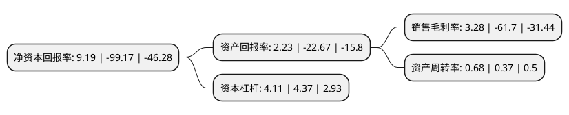

> 本页面由自动化程序生成于 2022年5月20日 01:31
> 内容可能存在错误，如有bug请提交issue至：https://github.com/Eroleice/doc-pi/issues
{.is-warning}

# 上市公司基本情况

## 基本资料

浙文影业集团股份有限公司（以下简称“浙文影业”）成立于2002年12月13日，杭州市。于2011年05月27日在上交所主板上市。

浙文影业注册资本116,054.245万元，主要从事各类针织毛纺纱线以及高档精纺呢绒面料生产与销售。发行人主导产品为“鹿港牌”精纺纱线(腈纶仿羊绒系列纱线，全羊绒纱，全毛纱，毛腈纱，混纺纱)及半精纺纱(全羊绒纱，丝羊绒纱，各种纤维混合纱)以及呢绒面料。以下是详细信息：

- 公司名称: 浙文影业集团股份有限公司
- 股票代码: 601599.SH
- 所在地: 浙江 - 杭州市
- 成立日期: 2002年12月13日
- 注册资本: 116,054.245万元
- 法定代表人: 蒋国兴
- 主营业务: 主要从事各类针织毛纺纱线以及高档精纺呢绒面料生产与销售发行人主导产品为“鹿港牌”精纺纱线(腈纶仿羊绒系列纱线，全羊绒纱，全毛纱，毛腈纱，混纺纱)及半精纺纱(全羊绒纱，丝羊绒纱，各种纤维混合纱)以及呢绒面料
- 公司官网: www.lugangwool.com
- 公司介绍: 公司是一家纺织、服装、酒店、影视行业多元化发展的上市企业。公司主要从事各类针织毛纺纱线以及高档精纺呢绒面料生产与销售。纺织板块专注于SINFONIA、ARMONIA、REGAL精纺纱、半精纺纱、粗纺纱、花式纱等各类针织纱线、高档精纺呢绒面料以及LANIFICIO LA MALPENGA职业装和PALLADIO高端商务服装的生产，影视板块下属世纪长龙影视和天意影视两家公司，公司将经“集约化经营、专业化生产”为经营宗旨，永不满足，坚持产品创新，加快资源整合，引入专业团队，强化品牌管理，努力跻身业内一流企业。公司始终把技术创新作为公司发展战略的重要环节，先后添置了意大利产快速小样机，引进日本APEX3电脑服装设计系统，聘请意大利专业设计师，提升研发综合实力，并与国内著名院校联合建办了省针织纱研究工程中心，并通过与国际一流品牌运营商的紧密合作，以国际流行趋势为先导，建立了快速反应的产品超前研发机制，并对客户要求进行一对一的研发，满足客户个性化的需求，使公司产品始终处于行业高端水平。

## 股东及高管情况

上市公司第一大股东为浙江省文化产业投资集团有限公司，持股267,817,489股，占比23.08%，**疑似为**上市公司实际控制人。

截至2022年05月16日，上市公司的前十大股东中，共有7名自然人股东，3名机构股东，其中5%以上大股东共有3名。上市公司前十大股东明细如下：

> 未能通过持股比例判定出上市公司实际控制人（持股30%以上）
> 可能存在通过间接持股、联合持股、协议控制等方式拥有实际控制权的主体，具体请参考上市公司定期公告！
{.is-warning}

> 截至2022年05月16日，上市公司前十大股东信息如下：

| 股东名称 | 持股数量（股） | 持股比例 |
| --- | --- | --- |
| 浙江省文化产业投资集团有限公司 | 267,817,489 | 23.08% |
| 钱文龙 | 116,800,022 | 10.06% |
| 钱文龙 | 115,921,122 | 9.9885% |
| 缪进义 | 47,499,404 | 4.09% |
| 钱忠伟 | 37,321,006 | 3.22% |
| 陈瀚海 | 19,820,000 | 1.71% |
| 张维东 | 18,436,300 | 1.59% |
| 张家港市金城创融创业投资有限公司 | 15,500,000 | 1.34% |
| 黄杨 | 13,281,790 | 1.14% |
| 攀华集团有限公司 | 13,190,000 | 1.14% |

## 利润表分析

上市公司2021年总收入为24.52亿元，净利润为0.8亿元，实现盈利。

## 杜邦分析

> 数据列示周期：2021年 | 2020年 | 2019年
{.is-info}

上市公司的净资产收益率在近一年有所下降，下降幅度为-109.27%，其变化情况分解如下：
- 上市公司的销售毛利率在近一年下降了-105.32%，可能是生产效率的下降、商品原材料价格上涨或商品价格的下跌所致。
- 上市公司的资产周转率在近一年上升了83.78%，可能是源自于更快的销售回款或库存管理效果提升。
- 上市公司的财务杠杆比率在近一年下降了-5.95%，可能是减少负债降低财务费用。

