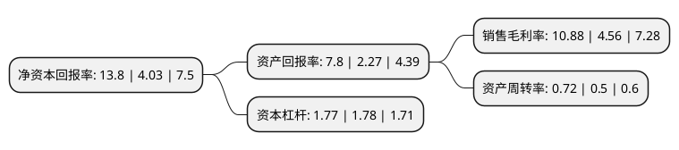

> 本页面由自动化程序生成于 2022年5月20日 01:32
> 内容可能存在错误，如有bug请提交issue至：https://github.com/Eroleice/doc-pi/issues
{.is-warning}

# 上市公司基本情况

## 基本资料

浙江台华新材料股份有限公司（以下简称“台华新材”）成立于2001年02月21日，嘉兴市。于2017年09月21日在上交所主板上市。

台华新材注册资本86,887.822万元，主要产品:锦纶长丝，锦纶坯布和锦纶成品面料，此外还生产部分少量涤纶产品;主营业务:锦纶织造业务。以下是详细信息：

- 公司名称: 浙江台华新材料股份有限公司
- 股票代码: 603055.SH
- 所在地: 浙江 - 嘉兴市
- 成立日期: 2001年02月21日
- 注册资本: 86,887.822万元
- 法定代表人: 施清岛
- 主营业务: 主要产品:锦纶长丝，锦纶坯布和锦纶成品面料，此外还生产部分少量涤纶产品;主营业务:锦纶织造业务
- 公司官网: www.textaihua.com
- 公司介绍: 公司拥有完整的研发、纺丝、织造、染整及销售一体的产业链，能够研发、生产环保健康、户外运动、特种防护等三大系列、多种高档功能性锦纶面料，是国内少有的能够生产高档尼龙66-FDY产品的“国家火炬计划重点高新技术企业”。公司系中外合资股份有限公司，下属包括从事纺丝、织造、染整业务的多家控股子公司。公司从德国、日本等著名生产厂商引进锦纶6、锦纶66民用丝生产线，生产锦纶FDY、ATY、DTY等长丝；公司还从德国、日本、中国台湾等地区引进成套的染色、压光、涂层等后整理一体化作业设备，生产多种中高档户外运动和环保健康等功能性锦纶面料。依靠完整的产业链配套优势和规模化产业集群优势，公司与国内外著名羽绒服、知名品牌运动休闲服、户外运动服装等生产厂商建立了良好的合作关系，成功跻身国内外同行前列，产品远销世界各地，在业内以“速度快、品质优、服务好”的特色赢得海内外客户美誉。

## 股东及高管情况

上市公司第一大股东为福華環球有限公司，持股281,588,888股，占比32.41%，为上市公司实际控制人。

截至2022年03月31日，上市公司的前十大股东中，共有1名自然人股东，4名机构股东，5个产品账户，其中5%以上大股东共有4名。上市公司前十大股东明细如下：

> 截至2022年03月31日，上市公司前十大股东信息如下：

| 股东名称 | 持股数量（股） | 持股比例 |
| --- | --- | --- |
| 福華環球有限公司 | 281,588,888 | 32.41% |
| 嘉兴市创友投资管理有限公司 | 150,259,011 | 17.29% |
| 嘉兴华南投资管理有限公司 | 128,230,200 | 14.76% |
| 施清岛 | 57,803,468 | 6.65% |
| 嘉兴市华秀投资管理有限公司 | 37,789,935 | 4.35% |
| 招商银行股份有限公司-交银施罗德新成长混合型证券投资基金 | 19,385,542 | 2.23% |
| 中国农业银行股份有限公司-交银施罗德精选混合型证券投资基金 | 14,596,258 | 1.68% |
| 中国工商银行股份有限公司-交银施罗德趋势优先混合型证券投资基金 | 14,050,315 | 1.62% |
| 北京银行股份有限公司-广发盛锦混合型证券投资基金 | 10,255,766 | 1.18% |
| 中国建设银行股份有限公司-交银施罗德阿尔法核心混合型证券投资基金 | 7,822,896 | 0.9% |

## 利润表分析

上市公司2021年总收入为42.56亿元，净利润为4.63亿元，实现盈利。

## 杜邦分析

> 数据列示周期：2021年 | 2020年 | 2019年
{.is-info}

上市公司的净资产收益率在近一年有所上升，上升幅度为242.43%，其变化情况分解如下：
- 上市公司的销售毛利率在近一年上升了138.6%，可能是生产效率的提升、商品原材料价格下跌或商品价格的上涨所致。
- 上市公司的资产周转率在近一年上升了44%，可能是源自于更快的销售回款或库存管理效果提升。
- 上市公司的财务杠杆比率在近一年下降了-0.56%，可能是减少负债降低财务费用。

