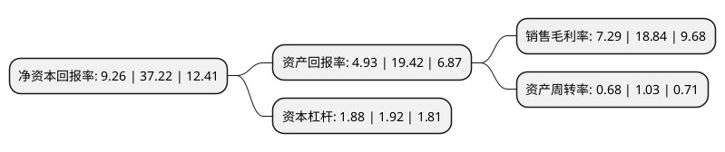

> 本页面由自动化程序生成于 2022年5月20日 01:33
> 内容可能存在错误，如有bug请提交issue至：https://github.com/Eroleice/doc-pi/issues
{.is-warning}

# 上市公司基本情况

## 基本资料

杭州诺邦无纺股份有限公司（以下简称“诺邦股份”）成立于2002年11月27日，杭州市。于2017年02月22日在上交所主板上市。

诺邦股份注册资本17,907.5万元，公司是一家专业从事差异化，个性化水刺非织造材料及其制品研发，生产和销售业务的企业。主要产品为水刺非织造材料。以下是详细信息：

- 公司名称: 杭州诺邦无纺股份有限公司
- 股票代码: 603238.SH
- 所在地: 浙江 - 杭州市
- 成立日期: 2002年11月27日
- 注册资本: 17,907.5万元
- 法定代表人: 任建华
- 主营业务: 公司是一家专业从事差异化，个性化水刺非织造材料及其制品研发，生产和销售业务的企业主要产品为水刺非织造材料
- 公司官网: www.nbond.cn
- 公司介绍: 公司是一家专业从事差异化、个性化水刺非织造材料及其制品研发、生产和销售业务的企业。产品涉及工业电子擦拭、高档美容卫材、静电提花去尘、民用清洗擦布、工业合成革基布、医疗护理卫用、汽车隔音等多领域多用途的系列化产品集群，并有多支产品成为全球独创的新型水刺布，公司已成为全球水刺无纺布行业中品种最为领先的企业。诺邦现已发展成为一家以开发生产非织造材料为主业，持续拓展非织造材料制品业务领域的产业链化企业，下有全资子公司邦怡科技，控股子公司杭州国光旅游；邦怡科技下有控股子公司邦怡讯，国光下设全资子公司纳奇科。其中，国光旅游历经多年发展，已是一家致力于各种多功能、高性能、环保型湿巾的开发及应用技术研发生产的高新技术企业，出口规模多年来位居行业前列。

## 股东及高管情况

上市公司第一大股东为杭州老板实业集团有限公司，持股97,026,750股，占比54.18%，为上市公司实际控制人。

截至2022年03月31日，上市公司的前十大股东中，共有6名自然人股东，4名机构股东，其中5%以上大股东共有2名。上市公司前十大股东明细如下：

> 截至2022年03月31日，上市公司前十大股东信息如下：

| 股东名称 | 持股数量（股） | 持股比例 |
| --- | --- | --- |
| 杭州老板实业集团有限公司 | 97,026,750 | 54.18% |
| 杭州金诺创投资管理合伙企业(有限合伙) | 10,882,250 | 6.08% |
| 杭州合诺创投资管理合伙企业(有限合伙) | 7,830,000 | 4.37% |
| 中国国际金融香港资产管理有限公司-客户资金 | 2,760,536 | 1.54% |
| 张杰 | 1,812,500 | 1.01% |
| 龚金瑞 | 1,711,000 | 0.96% |
| 任建永 | 1,450,000 | 0.81% |
| 陈永明 | 1,295,895 | 0.72% |
| 任富佳 | 870,000 | 0.49% |
| 王刚 | 870,000 | 0.49% |

## 利润表分析

上市公司2021年总收入为15.19亿元，净利润为1.1亿元，实现盈利。

## 杜邦分析

> 数据列示周期：2021年 | 2020年 | 2019年
{.is-info}

上市公司的净资产收益率在近一年有所下降，下降幅度为-75.12%，其变化情况分解如下：
- 上市公司的销售毛利率在近一年下降了-61.31%，可能是生产效率的下降、商品原材料价格上涨或商品价格的下跌所致。
- 上市公司的资产周转率在近一年下降了-33.98%，可能是源自于更慢的销售回款或库存管理效果下降。
- 上市公司的财务杠杆比率在近一年下降了-2.08%，可能是减少负债降低财务费用。

