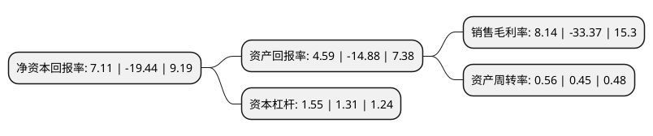

> 本页面由自动化程序生成于 2022年5月20日 01:34
> 内容可能存在错误，如有bug请提交issue至：https://github.com/Eroleice/doc-pi/issues
{.is-warning}

# 上市公司基本情况

## 基本资料

浙江健盛集团股份有限公司（以下简称“健盛集团”）成立于1993年12月06日，杭州市。于2015年01月27日在上交所主板上市。

健盛集团注册资本39,294.265万元，主营业务为从事各类棉袜的生产及销售。公司产品主要短筒袜，中筒袜，长筒袜，连裤袜等棉袜产品，除生产常规棉袜以外，还生产各类体育用袜，如高尔夫袜，滑雪袜，网球袜，跑步袜等;同时生产多种特殊功能袜，如双罗口袜，紧身袜，竹纤维袜，红外线保暖袜，抗菌防臭袜等。以下是详细信息：

- 公司名称: 浙江健盛集团股份有限公司
- 股票代码: 603558.SH
- 所在地: 浙江 - 杭州市
- 成立日期: 1993年12月06日
- 注册资本: 39,294.265万元
- 法定代表人: 张茂义
- 主营业务: 主营业务为从事各类棉袜的生产及销售公司产品主要短筒袜，中筒袜，长筒袜，连裤袜等棉袜产品，除生产常规棉袜以外，还生产各类体育用袜，如高尔夫袜，滑雪袜，网球袜，跑步袜等;同时生产多种特殊功能袜，如双罗口袜，紧身袜，竹纤维袜，红外线保暖袜，抗菌防臭袜等
- 公司官网: www.jasangroup.com
- 公司介绍: 公司是一家以专业生产、出口高品质男袜、女袜、童袜、连裤袜和运动袜而闻名海内外的现代化织袜企业。公司使用的机器都是从意大利、韩国、日本等国家及地区引进的先进生产设备。公司通过了ISO9001：2008质量体系认证和世界上许多知名企业的社会责任体系认证。产品销往日本、欧洲、澳大利亚等国家和地区。公司现已成为一家世界知名品牌的袜子生产基地。经过多年的发展积累，通过实施“注重生产管理、强化研发创新、把握时尚潮流、满足运动需求”的发展战略。公司已同众多国际品牌建立了深厚的合作关系，形成了日本、欧洲、大洋洲三大稳固市场。2017年，公司收购俏尔婷婷100%股权，俏尔婷婷是一家无缝贴身衣物的专业制造商，拥有国际先进的意大利圣东尼电脑提花针织机、定型设备和全套进口染色、缝纫以及专业设计软件，可生产一次成型立体无缝高档贴身衣物，具有良好的发展前景和较强盈利能力，是我国无缝针织行业的重要企业。

## 股东及高管情况

上市公司第一大股东为张茂义，持股139,662,262股，占比35.54%，为上市公司实际控制人。

截至2022年03月31日，上市公司的前十大股东中，共有5名自然人股东，1名机构股东，4个产品账户，其中5%以上大股东共有1名。上市公司前十大股东明细如下：

> 截至2022年03月31日，上市公司前十大股东信息如下：

| 股东名称 | 持股数量（股） | 持股比例 |
| --- | --- | --- |
| 张茂义 | 139,662,262 | 35.54% |
| 夏可才 | 17,567,936 | 4.47% |
| 杭州易登贸易有限公司 | 14,100,000 | 3.59% |
| 宁波银行股份有限公司-中泰星元价值优选灵活配置混合型证券投资基金 | 11,928,926 | 3.04% |
| 李秀东 | 10,277,600 | 2.62% |
| 浙江健盛集团股份有限公司回购专用证券账户 | 9,793,300 | 2.49% |
| 浙江健盛集团股份有限公司-第二期员工持股计划 | 9,167,000 | 2.33% |
| 胡天兴 | 8,640,000 | 2.2% |
| 中国工商银行股份有限公司-华安安信消费服务混合型证券投资基金 | 8,577,300 | 2.18% |
| 姜风 | 7,606,100 | 1.94% |

## 利润表分析

上市公司2021年总收入为20.51亿元，净利润为1.67亿元，实现盈利。

## 杜邦分析

> 数据列示周期：2021年 | 2020年 | 2019年
{.is-info}

上市公司的净资产收益率在近一年有所下降，下降幅度为-136.57%，其变化情况分解如下：
- 上市公司的销售毛利率在近一年下降了-124.39%，可能是生产效率的下降、商品原材料价格上涨或商品价格的下跌所致。
- 上市公司的资产周转率在近一年上升了24.44%，可能是源自于更快的销售回款或库存管理效果提升。
- 上市公司的财务杠杆比率在近一年上升了18.32%，可能是增加负债扩大生产规模。

