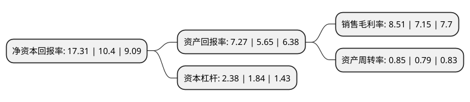

> 本页面由自动化程序生成于 2022年5月20日 01:36
> 内容可能存在错误，如有bug请提交issue至：https://github.com/Eroleice/doc-pi/issues
{.is-warning}

# 上市公司基本情况

## 基本资料

牧高笛户外用品股份有限公司（以下简称“牧高笛”）成立于2006年10月31日，衢州市。于2017年03月07日在上交所主板上市。

牧高笛注册资本6,669万元，主要产品包括帐篷，睡袋，自充垫等户外装备，以及冲锋衣，羽绒服，登山鞋，运动背包等户外服装，鞋及配饰。主要从事露营帐篷，户外服饰及其他户外用品的设计，生产和销售。以下是详细信息：

- 公司名称: 牧高笛户外用品股份有限公司
- 股票代码: 603908.SH
- 所在地: 浙江 - 衢州市
- 成立日期: 2006年10月31日
- 注册资本: 6,669万元
- 法定代表人: 陆暾华
- 主营业务: 主要产品包括帐篷，睡袋，自充垫等户外装备，以及冲锋衣，羽绒服，登山鞋，运动背包等户外服装，鞋及配饰主要从事露营帐篷，户外服饰及其他户外用品的设计，生产和销售
- 公司官网: www.mobigarden.com.cn
- 公司介绍: 公司是一家专业从事露营帐篷、户外服饰及其他户外用品研发设计、生产和销售的企业，公司的主要产品包括帐篷、睡袋、自充垫等户外装备，以及冲锋衣、羽绒服、登山鞋、运动背包等户外服装、鞋及配饰。公司目前同时经营OEM/ODM业务与自主品牌业务。公司自设立至今一直专注于露营帐篷产品的研发、设计、生产和销售，以OEM/ODM的模式为全球客户提供高品质帐篷产品的开发设计和生产制造服务。公司大部分的露营帐篷产品出口至法国、英国、美国和澳大利亚等国家。

## 股东及高管情况

上市公司第一大股东为宁波大牧投资有限公司，持股35,440,853股，占比53.14%，为上市公司实际控制人。

截至2022年03月31日，上市公司的前十大股东中，共有2名机构股东，8个产品账户，其中5%以上大股东共有2名。上市公司前十大股东明细如下：

> 截至2022年03月31日，上市公司前十大股东信息如下：

| 股东名称 | 持股数量（股） | 持股比例 |
| --- | --- | --- |
| 宁波大牧投资有限公司 | 35,440,853 | 53.14% |
| 浙江嘉拓投资管理有限公司 | 7,756,100 | 11.63% |
| 中国工商银行-中银收益混合型证券投资基金 | 1,374,700 | 2.06% |
| 广发证券资管-工商银行-广发资管平衡精选一年持有混合型集合资产管理计划 | 1,348,200 | 2.02% |
| 中国农业银行股份有限公司-富国价值优势混合型证券投资基金 | 1,026,100 | 1.54% |
| 中国银行股份有限公司-富国红利混合型证券投资基金 | 666,600 | 1% |
| 中国建设银行股份有限公司-汇添富消费行业混合型证券投资基金 | 600,000 | 0.9% |
| 上海雷钧资产管理有限公司-雷钧安享3号私募证券投资基金 | 458,300 | 0.69% |
| 中国工商银行股份有限公司-富国新机遇灵活配置混合型发起式证券投资基金 | 435,674 | 0.65% |
| 上海雷钧资产管理有限公司-雷钧安享1号私募证券投资基金 | 392,900 | 0.59% |

## 利润表分析

上市公司2021年总收入为9.23亿元，净利润为0.78亿元，实现盈利。

## 杜邦分析

> 数据列示周期：2021年 | 2020年 | 2019年
{.is-info}

上市公司的净资产收益率在近一年有所上升，上升幅度为66.44%，其变化情况分解如下：
- 上市公司的销售毛利率在近一年上升了19.02%，可能是生产效率的提升、商品原材料价格下跌或商品价格的上涨所致。
- 上市公司的资产周转率在近一年上升了7.59%，可能是源自于更快的销售回款或库存管理效果提升。
- 上市公司的财务杠杆比率在近一年上升了29.35%，可能是增加负债扩大生产规模。

