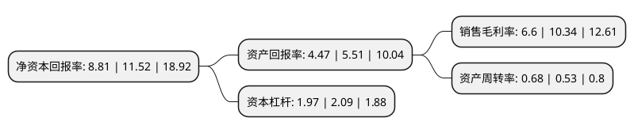

> 本页面由自动化程序生成于 2022年5月20日 01:36
> 内容可能存在错误，如有bug请提交issue至：https://github.com/Eroleice/doc-pi/issues
{.is-warning}

# 上市公司基本情况

## 基本资料

浙江迎丰科技股份有限公司（以下简称“迎丰股份”）成立于2008年08月02日，绍兴市。于2021年01月29日在上交所主板上市。

迎丰股份注册资本44,000万元，公司专业从事纺织品的印染加工业务，致力于为客户提供专业化，一体化，个性化的印染综合服务，主要包括针织面料印染和梭织面料印染两大系列。以下是详细信息：

- 公司名称: 浙江迎丰科技股份有限公司
- 股票代码: 605055.SH
- 所在地: 浙江 - 绍兴市
- 成立日期: 2008年08月02日
- 注册资本: 44,000万元
- 法定代表人: 傅双利
- 主营业务: 公司专业从事纺织品的印染加工业务，致力于为客户提供专业化，一体化，个性化的印染综合服务，主要包括针织面料印染和梭织面料印染两大系列
- 公司官网: www.zj-yfkj.com
- 公司介绍: 公司专业从事纺织品的印染加工业务，致力于为客户提供专业化、一体化、个性化的印染综合服务，务质量，致力于建设节能环保型和智能制造型印染企业。经过多年发展，公司凭借较强的技术开发能力、严格的质量管理、先进的生产及环保设备，有效满足了市场不断升级的消费需求，销售规模快速提升，迎丰印染品牌效应逐步彰显，已具有较高的市场知名度与品牌影响力。公司为国家高新技术企业、国家级绿色工厂、浙江省两化深度融合国家综合示范区示范试点企业、浙江省绿色企业，牵头承担的纺织品印染全流程绿色制造关键技术开发与系统集成项目已列入国家工信部2017年绿色制造系统集成项目，并得到国家工业转型升级专项资金支持，2019年入选中国印染行业协会发布的中国印染企业30强榜单，公司整体技术水平和产品开发能力居行业前列。

## 股东及高管情况

上市公司第一大股东为浙江浙宇控股集团有限公司，持股218,273,684股，占比49.61%，为上市公司实际控制人。

截至2022年03月31日，上市公司的前十大股东中，共有5名自然人股东，5名机构股东，其中5%以上大股东共有2名。上市公司前十大股东明细如下：

> 截至2022年03月31日，上市公司前十大股东信息如下：

| 股东名称 | 持股数量（股） | 持股比例 |
| --- | --- | --- |
| 浙江浙宇控股集团有限公司 | 218,273,684 | 49.61% |
| 绍兴迎丰领航投资合伙企业(有限合伙) | 37,894,737 | 8.61% |
| 马越波 | 20,842,105 | 4.74% |
| 马颖波 | 20,614,737 | 4.69% |
| 傅双利 | 15,322,107 | 3.48% |
| 浙江绍兴迎丰世纪投资合伙企业(有限合伙) | 14,210,526 | 3.23% |
| 上海旭强投资中心(有限合伙) | 9,473,684 | 2.15% |
| 浙江绍兴互赢双利投资合伙企业(有限合伙) | 9,473,684 | 2.15% |
| 马雅萍 | 6,947,368 | 1.58% |
| 马漫烨 | 6,947,368 | 1.58% |

## 利润表分析

上市公司2021年总收入为12.61亿元，净利润为0.83亿元，实现盈利。

## 杜邦分析

> 数据列示周期：2021年 | 2020年 | 2019年
{.is-info}

上市公司的净资产收益率在近一年有所下降，下降幅度为-23.52%，其变化情况分解如下：
- 上市公司的销售毛利率在近一年下降了-36.17%，可能是生产效率的下降、商品原材料价格上涨或商品价格的下跌所致。
- 上市公司的资产周转率在近一年上升了28.3%，可能是源自于更快的销售回款或库存管理效果提升。
- 上市公司的财务杠杆比率在近一年下降了-5.74%，可能是减少负债降低财务费用。

