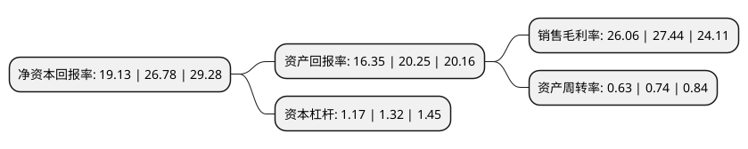

> 本页面由自动化程序生成于 2022年5月20日 01:36
> 内容可能存在错误，如有bug请提交issue至：https://github.com/Eroleice/doc-pi/issues
{.is-warning}

# 上市公司基本情况

## 基本资料

浙江大自然户外用品股份有限公司（以下简称“浙江自然”）成立于2000年09月04日，台州市。于2021年05月06日在上交所主板上市。

浙江自然注册资本10,112.36万元，主要从事充气床垫，户外箱包，头枕坐垫等户外运动用品的研发，设计，生产和销售。以下是详细信息：

- 公司名称: 浙江大自然户外用品股份有限公司
- 股票代码: 605080.SH
- 所在地: 浙江 - 台州市
- 成立日期: 2000年09月04日
- 注册资本: 10,112.36万元
- 法定代表人: 夏永辉
- 主营业务: 主要从事充气床垫，户外箱包，头枕坐垫等户外运动用品的研发，设计，生产和销售
- 公司官网: www.zjnature.com
- 公司介绍: 公司是国家高新技术企业，已经通过了质量管理体系认证、环境管理体系认证、职业健康安全管理体系认证以及多家行业高端客户的产品认证,主要从事充气床垫、户外箱包、头枕坐垫等户外运动用品的研发、设计、生产和销售。公司在长期的生产经营过程中，掌握了TPU薄膜及面料复合技术、聚氨酯软泡发泡技术、高周波熔接技术、热压熔接技术等关键工艺和技术，公司主要产品广泛的应用于户外运动领域的多项场景中。公司坚持以“成为全球领先的户外运动用品供应商”为理念和目标，逐步成长为全球户外运动用品领域的重要参与者。公司致力于为全球客户提供高品质的户外运动用品，主要销售至欧洲、北美洲、大洋洲等发达国家和地区。公司已经与全球知名公司迪卡侬、SEA TOSUMMIT、Kathmandu、INTERSPORT、REI、历德超市等建立了长期稳定的合作关系，积累了优质的全球客户资源。公司被认定为“浙江省级高新技术企业研究开发中心”、“浙江省企业技术中心”。

## 股东及高管情况

上市公司第一大股东为上海扬大企业管理有限公司，持股54,000,000股，占比53.4%，为上市公司实际控制人。

截至2022年03月31日，上市公司的前十大股东中，共有2名自然人股东，6名机构股东，2个产品账户，其中5%以上大股东共有2名。上市公司前十大股东明细如下：

> 截至2022年03月31日，上市公司前十大股东信息如下：

| 股东名称 | 持股数量（股） | 持股比例 |
| --- | --- | --- |
| 上海扬大企业管理有限公司 | 54,000,000 | 53.4% |
| 天台瑞聚股权投资中心(有限合伙) | 6,750,000 | 6.67% |
| 上海雨帆投资有限公司 | 3,375,000 | 3.34% |
| 上海九麟投资有限公司 | 3,375,000 | 3.34% |
| 天台民商投资中心(有限合伙) | 3,033,708 | 3% |
| 李俊峰 | 2,275,281 | 2.25% |
| 中国农业银行股份有限公司-大成高新技术产业股票型证券投资基金 | 2,136,660 | 2.11% |
| 基本养老保险基金一二零一组合 | 1,729,397 | 1.71% |
| 仇清清 | 1,516,857 | 1.5% |
| 上海国鸿智言创业投资合伙企业(有限合伙) | 1,516,854 | 1.5% |

## 利润表分析

上市公司2021年总收入为8.42亿元，净利润为2.19亿元，实现盈利。

## 杜邦分析

> 数据列示周期：2021年 | 2020年 | 2019年
{.is-info}

上市公司的净资产收益率在近一年有所下降，下降幅度为-28.57%，其变化情况分解如下：
- 上市公司的销售毛利率在近一年下降了-5.03%，可能是生产效率的下降、商品原材料价格上涨或商品价格的下跌所致。
- 上市公司的资产周转率在近一年下降了-14.86%，可能是源自于更慢的销售回款或库存管理效果下降。
- 上市公司的财务杠杆比率在近一年下降了-11.36%，可能是减少负债降低财务费用。

