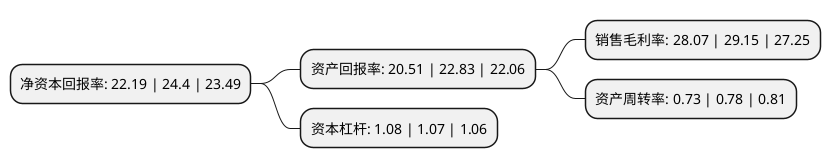

> 本页面由自动化程序生成于 2022年5月20日 01:36
> 内容可能存在错误，如有bug请提交issue至：https://github.com/Eroleice/doc-pi/issues
{.is-warning}

# 上市公司基本情况

## 基本资料

浙江华生科技股份有限公司（以下简称“华生科技”）成立于2006年09月30日，嘉兴市。于2021年04月30日在上交所主板上市。

华生科技注册资本10,000万元，主营业务:专业从事塑胶复合材料的研发，生产，销售业务，主要产品包括气密材料和柔性材料两大类。以下是详细信息：

- 公司名称: 浙江华生科技股份有限公司
- 股票代码: 605180.SH
- 所在地: 浙江 - 嘉兴市
- 成立日期: 2006年09月30日
- 注册资本: 10,000万元
- 法定代表人: 蒋生华
- 主营业务: 主营业务:专业从事塑胶复合材料的研发，生产，销售业务，主要产品包括气密材料和柔性材料两大类
- 公司官网: www.huashengflex.com
- 公司介绍: 公司是一家专业从事塑胶复合材料的研发、生产、销售业务的高新技术企业。根据产品在气密性标准上的不同，公司主要产品可分为气密材料和柔性材料两大类。其中，气密材料包括拉丝气垫材料和充气游艇材料，主要应用在划水板、体操垫、充气游艇等运动、休闲领域；柔性材料包括篷盖材料和灯箱广告材料，主要应用在交通物流、平面广告等领域。在设立的早期阶段，公司即引进中国台湾等地区的先进生产设备从事灯箱广告材料的研发、生产和销售，是浙江省海宁地区(海宁为“中国经编名城”)灯箱广告材料生产制造领域的主要引领者之一。在长期的生产经营过程中，公司经营管理团队高度重视产品研发及相关核心技术的掌握。随着市场环境的变化及自身研发技术的持续进步，公司逐步研发成功篷盖材料、充气游艇材料和拉丝气垫材料等拥有较高技术含量的产品，不断丰富公司的产品线，并向下游市场推广应用，获得成功。

## 股东及高管情况

上市公司第一大股东为蒋瑜慧，持股37,406,250股，占比37.41%，为上市公司实际控制人。

截至2022年03月31日，上市公司的前十大股东中，共有8名自然人股东，2名机构股东，其中5%以上大股东共有3名。上市公司前十大股东明细如下：

> 截至2022年03月31日，上市公司前十大股东信息如下：

| 股东名称 | 持股数量（股） | 持股比例 |
| --- | --- | --- |
| 蒋瑜慧 | 37,406,250 | 37.41% |
| 浙江华生投资管理有限公司 | 17,812,500 | 17.81% |
| 蒋生华 | 8,015,625 | 8.02% |
| 王明珍 | 4,453,125 | 4.45% |
| 海宁华册投资合伙企业(有限合伙) | 3,750,000 | 3.75% |
| 王明芬 | 3,562,500 | 3.56% |
| 廖小平 | 339,200 | 0.34% |
| 陈锦洪 | 300,000 | 0.3% |
| 刘国珍 | 200,600 | 0.2% |
| 陶恬怡 | 180,002 | 0.18% |

## 利润表分析

上市公司2021年总收入为6.42亿元，净利润为1.8亿元，实现盈利。

## 杜邦分析

> 数据列示周期：2021年 | 2020年 | 2019年
{.is-info}

上市公司的净资产收益率在近一年有所下降，下降幅度为-9.06%，其变化情况分解如下：
- 上市公司的销售毛利率在近一年下降了-3.7%，可能是生产效率的下降、商品原材料价格上涨或商品价格的下跌所致。
- 上市公司的资产周转率在近一年下降了-6.41%，可能是源自于更慢的销售回款或库存管理效果下降。
- 上市公司的财务杠杆比率在近一年上升了0.93%，可能是增加负债扩大生产规模。

