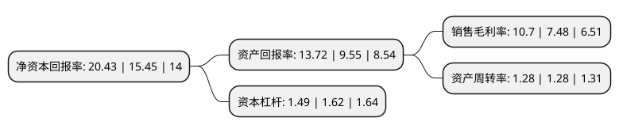

> 本页面由自动化程序生成于 2022年5月20日 01:36
> 内容可能存在错误，如有bug请提交issue至：https://github.com/Eroleice/doc-pi/issues
{.is-warning}

# 上市公司基本情况

## 基本资料

芜湖富春染织股份有限公司（以下简称“富春染织”）成立于2002年07月15日，芜湖市。于2021年05月28日在上交所主板上市。

富春染织注册资本12,480万元，主营业务为色纱的研发，生产和销售。以下是详细信息：

- 公司名称: 芜湖富春染织股份有限公司
- 股票代码: 605189.SH
- 所在地: 安徽 - 芜湖市
- 成立日期: 2002年07月15日
- 注册资本: 12,480万元
- 法定代表人: 何培富
- 主营业务: 主营业务为色纱的研发，生产和销售
- 公司官网: www.fc858.com
- 公司介绍: 公司作为国内领先的色纱生产企业之一，主营业务为色纱的研发、生产和销售。自成立以来，公司坚持以科技、绿色、专业、时尚为宗旨，以市场潮流和客户需求为导向，围绕自主品牌“天外天”，依托自主开发、涵盖六百余种色彩的富春标准色卡，通过“仓储式生产为主，订单式生产为辅”的经营模式，致力于为客户提供高品质的色纱系列产品。公司通过全球采购优质原材料，引进国内外先进的生产、环保设备设施和信息管理系统，自主研发染整新技术和新工艺，不断创新产品品质和提升服务能力，赢得了客户的广泛赞誉和肯定。公司为国家高新技术企业，拥有“省认定企业技术中心”，曾获得安徽省高新技术产品17项，安徽省新产品2项，安徽省科学技术三等奖1项。公司十分注重品牌建设与产品质量管理，公司“天外天”商标获得“中国驰名商标”称号，通过了ISO9001质量管理体系认证、ISO14001环境管理体系认证、OHSAS18001职业健康安全管理体系认证、全球有机纺织品资格认证(GOTS)以及OEKO-TEX Standard100认证，并获得“中国质量信用AAA级单位”、“全国质量品牌诚信信得过企业”等荣誉称号。

## 股东及高管情况

上市公司第一大股东为何培富，持股56,320,000股，占比45.13%，为上市公司实际控制人。

截至2022年03月31日，上市公司的前十大股东中，共有3名自然人股东，3名机构股东，4个产品账户，其中5%以上大股东共有5名。上市公司前十大股东明细如下：

> 截至2022年03月31日，上市公司前十大股东信息如下：

| 股东名称 | 持股数量（股） | 持股比例 |
| --- | --- | --- |
| 何培富 | 56,320,000 | 45.13% |
| 何壁宇 | 7,040,000 | 5.64% |
| 何璧颖 | 7,040,000 | 5.64% |
| 芜湖富春创业投资合伙企业(有限合伙) | 6,528,000 | 5.23% |
| 芜湖勤慧创业投资合伙企业(有限合伙) | 6,272,000 | 5.03% |
| 淮北安元投资基金有限公司 | 3,040,000 | 2.44% |
| 安徽信安基石产业升级基金合伙企业(有限合伙) | 2,848,000 | 2.28% |
| 宁波磐磬股权投资合伙企业(有限合伙) | 2,240,000 | 1.79% |
| 中国建设银行股份有限公司-宝盈新兴产业灵活配置混合型证券投资基金 | 1,362,100 | 1.09% |
| 中国工商银行股份有限公司-宝盈优势产业灵活配置混合型证券投资基金 | 1,353,000 | 1.08% |

## 利润表分析

上市公司2021年总收入为21.75亿元，净利润为2.32亿元，实现盈利。

## 杜邦分析

> 数据列示周期：2021年 | 2020年 | 2019年
{.is-info}

上市公司的净资产收益率在近一年有所上升，上升幅度为32.23%，其变化情况分解如下：
- 上市公司的销售毛利率在近一年上升了43.05%，可能是生产效率的提升、商品原材料价格下跌或商品价格的上涨所致。
- 上市公司的资产周转率在近一年下降了0%，可能是源自于更慢的销售回款或库存管理效果下降。
- 上市公司的财务杠杆比率在近一年下降了-8.02%，可能是减少负债降低财务费用。

