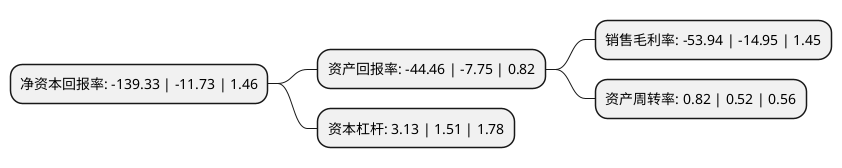

> 本页面由自动化程序生成于 2022年5月20日 01:05
> 内容可能存在错误，如有bug请提交issue至：https://github.com/Eroleice/doc-pi/issues
{.is-warning}

# 上市公司基本情况

## 基本资料

中捷资源投资股份有限公司（以下简称“ST中捷”）成立于1994年08月31日，台州市。于2004年07月15日在深交所中小板上市。

ST中捷注册资本68,781.504万元，中捷股份主要产品为平缝，曲折缝，包缝，绷缝，特种机，绣花机等以下是详细信息：

- 公司名称: 中捷资源投资股份有限公司
- 股票代码: 002021.SZ
- 所在地: 浙江 - 台州市
- 成立日期: 1994年08月31日
- 注册资本: 68,781.504万元
- 法定代表人: 张黎曙
- 主营业务: 中捷股份主要产品为平缝，曲折缝，包缝，绷缝，特种机，绣花机等
- 公司官网: www.zoje.com
- 公司介绍: 公司是全球最大的工业缝纫机生产基地之一，形成了缝纫机铸造、机壳加工、涂装、装配等工艺全部自动化的现代化无区域公司。公司拥有世界上先进的装配、涂装、铸造、机壳加工自动化装备，拥有行业内“省级研究院”和研发中心，在欧洲设有研发机构。国际化的设备、先进的科技，凝练成卓越的品质，形成独特的产业集群，为众多缝制设备企业提供良好的发展平台，成为集聚度高、产品科技含量高、品牌知名度与美誉度高。公司产品通过德国莱茵公司ISO9001质量体系认证和欧洲CE认证，出口到欧洲、美洲、中东、东南亚、非洲等多个国家和地区。

## 股东及高管情况

上市公司第一大股东为玉环市恒捷创业投资合伙企业(有限合伙)，持股129,605,889股，占比18.84%，**疑似为**上市公司实际控制人。

截至2022年03月31日，上市公司的前十大股东中，共有8名自然人股东，2名机构股东，其中5%以上大股东共有2名。上市公司前十大股东明细如下：

> 未能通过持股比例判定出上市公司实际控制人（持股30%以上）
> 可能存在通过间接持股、联合持股、协议控制等方式拥有实际控制权的主体，具体请参考上市公司定期公告！
{.is-warning}

> 截至2022年03月31日，上市公司前十大股东信息如下：

| 股东名称 | 持股数量（股） | 持股比例 |
| --- | --- | --- |
| 玉环市恒捷创业投资合伙企业(有限合伙) | 129,605,889 | 18.84% |
| 宁波沅熙股权投资合伙企业(有限合伙) | 42,523,997 | 6.18% |
| 蔡开坚 | 10,840,000 | 1.58% |
| 蔡开坚 | 10,840,000 | 1.58% |
| 孙军敏 | 5,301,200 | 0.77% |
| 孙军敏 | 5,301,200 | 0.77% |
| 张义平 | 3,458,000 | 0.5% |
| 张艳平 | 3,253,000 | 0.47% |
| 张艳平 | 3,253,000 | 0.47% |
| 鲁崇明 | 3,250,000 | 0.47% |

## 利润表分析

上市公司2021年总收入为9.59亿元，净利润为-5.18亿元，**未实现盈利**。

## 杜邦分析

> 数据列示周期：2021年 | 2020年 | 2019年
{.is-info}

上市公司的净资产收益率在近一年有所上升，上升幅度为1087.81%，其变化情况分解如下：
- 上市公司的销售毛利率在近一年上升了260.8%，可能是生产效率的提升、商品原材料价格下跌或商品价格的上涨所致。
- 上市公司的资产周转率在近一年上升了57.69%，可能是源自于更快的销售回款或库存管理效果提升。
- 上市公司的财务杠杆比率在近一年上升了107.28%，可能是增加负债扩大生产规模。

