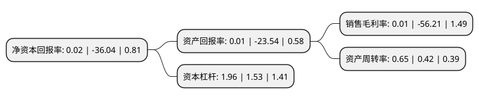

> 本页面由自动化程序生成于 2022年5月20日 01:07
> 内容可能存在错误，如有bug请提交issue至：https://github.com/Eroleice/doc-pi/issues
{.is-warning}

# 上市公司基本情况

## 基本资料

浙江方正电机股份有限公司（以下简称“方正电机”）成立于2001年12月20日，丽水市。于2007年12月12日在深交所中小板上市。

方正电机注册资本49,944.493万元，主要业务:公司主要从事微特电机的研究开发，生产及销售;同时经营相关设备，产品的进出口业务。主要产品:家用缝纫机电机，工业用缝纫机电机，缝纫机用变频调速伺服电机，电脑高速自动平缝机，汽车电机。以下是详细信息：

- 公司名称: 浙江方正电机股份有限公司
- 股票代码: 002196.SZ
- 所在地: 浙江 - 丽水市
- 成立日期: 2001年12月20日
- 注册资本: 49,944.493万元
- 法定代表人: 冯融
- 主营业务: 公司主要从事微特电机的研究开发，生产及销售;同时经营相关设备，产品的进出口业务主要产品:家用缝纫机电机，工业用缝纫机电机，缝纫机用变频调速伺服电机，电脑高速自动平缝机，汽车电机
- 公司官网: www.fdm.com.cn
- 公司介绍: 公司是专业生产缝制设备动力源的外贸出口企业，主要产品为缝纫机马达，其中工业缝纫机马达和家用缝纫机马达等系列产品远销欧美、中东、东南亚等多个国家和地区，家用缝纫机马达产量及出口量均全国领先。为了更好地和客户沟通、交流，更快更准地掌握市场行情、充分利用互联网优势，公司投资建设售后服务信息管理系统和发货查询系统，重点开发电子采购系统。公司获得浙江省“五个一批”重点骨干企业、浙江省名牌产品企业、浙江省著名商标企业、浙江省“五个一批”重点骨干企业等荣誉称号。

## 股东及高管情况

上市公司第一大股东为卓越汽车有限公司，持股40,000,000股，占比8.01%，**疑似为**上市公司实际控制人。

截至2022年03月31日，上市公司的前十大股东中，共有4名自然人股东，2名机构股东，4个产品账户，其中5%以上大股东共有2名。上市公司前十大股东明细如下：

> 未能通过持股比例判定出上市公司实际控制人（持股30%以上）
> 可能存在通过间接持股、联合持股、协议控制等方式拥有实际控制权的主体，具体请参考上市公司定期公告！
{.is-warning}

> 上市公司第一大股东持股不超过10%，请检查是否存在公司控制权风险！
{.is-danger}

> 截至2022年03月31日，上市公司前十大股东信息如下：

| 股东名称 | 持股数量（股） | 持股比例 |
| --- | --- | --- |
| 卓越汽车有限公司 | 40,000,000 | 8.01% |
| 张敏 | 33,626,337 | 6.73% |
| 中振汉江装备科技有限公司 | 20,000,000 | 4% |
| 中国银行股份有限公司-华安文体健康主题灵活配置混合型证券投资基金 | 14,984,450 | 3% |
| 卓斌 | 10,722,677 | 2.15% |
| 樊青樟 | 10,183,300 | 2.04% |
| 银华基金-北京诚通金控投资有限公司-银华基金-诚通金控4号单一资产管理计划 | 10,000,000 | 2% |
| 翁伟文 | 6,795,781 | 1.36% |
| 中国建设银行股份有限公司-中欧新蓝筹灵活配置混合型证券投资基金 | 6,318,100 | 1.27% |
| 中国邮政储蓄银行股份有限公司-东方新能源汽车主题混合型证券投资基金 | 5,751,335 | 1.15% |

## 利润表分析

上市公司2021年总收入为18.9亿元，净利润为0亿元，实现盈利。

## 杜邦分析

> 数据列示周期：2021年 | 2020年 | 2019年
{.is-info}

上市公司的净资产收益率在近一年有所下降，下降幅度为-100.06%，其变化情况分解如下：
- 上市公司的销售毛利率在近一年下降了-100.02%，可能是生产效率的下降、商品原材料价格上涨或商品价格的下跌所致。
- 上市公司的资产周转率在近一年上升了54.76%，可能是源自于更快的销售回款或库存管理效果提升。
- 上市公司的财务杠杆比率在近一年上升了28.1%，可能是增加负债扩大生产规模。

