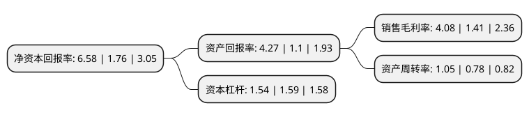

> 本页面由自动化程序生成于 2022年5月20日 01:11
> 内容可能存在错误，如有bug请提交issue至：https://github.com/Eroleice/doc-pi/issues
{.is-warning}

# 上市公司基本情况

## 基本资料

金轮蓝海股份有限公司（以下简称“金轮股份”）成立于2004年12月14日，南通市。于2014年01月28日在深交所中小板上市。

金轮股份注册资本17,547.856万元，公司的主营业务是纺织梳理器材和不锈钢装饰材料的研发，生产和销售。以下是详细信息：

- 公司名称: 金轮蓝海股份有限公司
- 股票代码: 002722.SZ
- 所在地: 江苏 - 南通市
- 成立日期: 2004年12月14日
- 注册资本: 17,547.856万元
- 法定代表人: 汤华军
- 主营业务: 公司的主营业务是纺织梳理器材和不锈钢装饰材料的研发，生产和销售
- 公司官网: www.geron-china.com
- 公司介绍: 公司是一家集研发、销售、制造为一体的纺织梳理器材中外合资企业。公司经营范围包括金属针布、弹性盖板针布、弹性毛纺针布、固定盖板、整体锡林、顶梳和分梳辊等全系列梳理元件。公司为全球客户提供金轮“狼牙”、“先锋”、“钻石”三个品牌的优质产品以及配套的技术服务，并提供从普通梳理机到高速高产梳理机全方位的梳理技术解决方案。公司被国家科技部认定为“国家高新技术企业”和“国家火炬计划重点高新技术企业”。2015年，公司购买森达装饰100%股权，森达装饰主要业务为生产销售各类不锈钢装饰材料板，主要产品包括：以铬镍钼不锈钢(300系)和铬系不锈钢(400系)材质为主的各类装饰材料板，主要应用于电梯装潢、高档家电面板、厨房及卫生间用品、楼宇室内外装潢等。

## 股东及高管情况

上市公司第一大股东为南通金轮控股有限公司，持股54,527,143股，占比31.07%，为上市公司实际控制人。

截至2022年03月31日，上市公司的前十大股东中，共有5名自然人股东，2名机构股东，3个产品账户，其中5%以上大股东共有2名。上市公司前十大股东明细如下：

> 截至2022年03月31日，上市公司前十大股东信息如下：

| 股东名称 | 持股数量（股） | 持股比例 |
| --- | --- | --- |
| 南通金轮控股有限公司 | 54,527,143 | 31.07% |
| 安富国际(香港)投资有限公司 | 17,205,904 | 9.8% |
| 朱善忠 | 7,346,800 | 4.19% |
| 金轮蓝海股份有限公司-第二期员工持股计划 | 5,053,225 | 2.88% |
| 洪亮 | 4,278,807 | 2.44% |
| 张营 | 3,572,900 | 2.04% |
| 中信信托有限责任公司-中信信托成泉汇涌八期金融投资集合资金信托计划 | 2,025,400 | 1.15% |
| 中信信托有限责任公司-中信信托鑫涌成泉金融投资集合资金信托计划 | 1,770,300 | 1.01% |
| 李树元 | 1,590,600 | 0.91% |
| 朱善兵 | 1,514,507 | 0.86% |

## 利润表分析

上市公司2021年总收入为31.49亿元，净利润为1.28亿元，实现盈利。

## 杜邦分析

> 数据列示周期：2021年 | 2020年 | 2019年
{.is-info}

上市公司的净资产收益率在近一年有所上升，上升幅度为273.86%，其变化情况分解如下：
- 上市公司的销售毛利率在近一年上升了189.36%，可能是生产效率的提升、商品原材料价格下跌或商品价格的上涨所致。
- 上市公司的资产周转率在近一年上升了34.62%，可能是源自于更快的销售回款或库存管理效果提升。
- 上市公司的财务杠杆比率在近一年下降了-3.14%，可能是减少负债降低财务费用。

