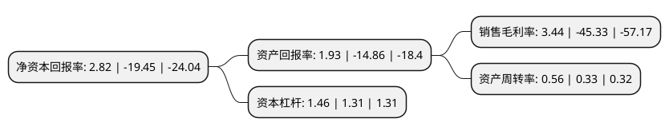

> 本页面由自动化程序生成于 2022年5月20日 01:16
> 内容可能存在错误，如有bug请提交issue至：https://github.com/Eroleice/doc-pi/issues
{.is-warning}

# 上市公司基本情况

## 基本资料

宁波慈星股份有限公司（以下简称“慈星股份”）成立于2003年08月10日，宁波市。于2012年03月29日在深交所创业板上市。

慈星股份注册资本78,054.178万元，主要业务为主要从事电脑针织机械的研发，生产和销售，公司主要产品包括电脑针织横机和电脑无缝针织内衣机，其中电脑针织横机主要用于毛衫生产，电脑无缝针织内衣机用于无缝针织内衣的生产。以下是详细信息：

- 公司名称: 宁波慈星股份有限公司
- 股票代码: 300307.SZ
- 所在地: 浙江 - 宁波市
- 成立日期: 2003年08月10日
- 注册资本: 78,054.178万元
- 法定代表人: 孙平范
- 主营业务: 主要业务为主要从事电脑针织机械的研发，生产和销售，公司主要产品包括电脑针织横机和电脑无缝针织内衣机，其中电脑针织横机主要用于毛衫生产，电脑无缝针织内衣机用于无缝针织内衣的生产
- 公司官网: www.ci-xing.com
- 公司介绍: 公司所属行业隶属于“C73专用设备制造业”，细分为针织机械行业，公司以“企业永续经营、建设幸福家园、成为针织行业的典范”为使命，主要从事针织机械的研发、生产和销售，是一家致力于提高我国针织机械技术水平、推动针织工艺发展的进步，实现针织业产业升级的高新技术企业，公司主要产品为智能针织机械设备，以电脑针织横机和电脑针织鞋面机为主，其中毛衫用电脑横机主要用于毛衫的生产，鞋面机则主要用于飞织鞋鞋面的生产。除了智能针织机械设备的业务发展以外，公司也积极投资布局机器人及移动互联网产业。公司现有多项发明专利、实用新型专利、外观设计专利以及软件著作权，是国家科技进步二等奖、“制造2025”示范企业、国家火炬计划实施单位等荣誉获得者。

## 股东及高管情况

上市公司第一大股东为宁波裕人智慧科技(集团)有限公司，持股135,754,541股，占比17.39%，**疑似为**上市公司实际控制人。

截至2022年03月31日，上市公司的前十大股东中，共有4名自然人股东，6名机构股东，其中5%以上大股东共有2名。上市公司前十大股东明细如下：

> 未能通过持股比例判定出上市公司实际控制人（持股30%以上）
> 可能存在通过间接持股、联合持股、协议控制等方式拥有实际控制权的主体，具体请参考上市公司定期公告！
{.is-warning}

> 截至2022年03月31日，上市公司前十大股东信息如下：

| 股东名称 | 持股数量（股） | 持股比例 |
| --- | --- | --- |
| 宁波裕人智慧科技(集团)有限公司 | 135,754,541 | 17.39% |
| 裕人企业有限公司 | 123,377,907 | 15.81% |
| 徐松达 | 39,027,000 | 5% |
| 广微控股(珠海横琴)有限公司 | 38,940,089 | 4.99% |
| 刘少林 | 29,100,000 | 3.73% |
| 宁波创福投资合伙企业(有限合伙) | 17,210,107 | 2.2% |
| 宁波福裕投资合伙企业(有限合伙) | 16,999,972 | 2.18% |
| 孙平范 | 11,700,056 | 1.5% |
| 廖文峰 | 7,119,500 | 0.91% |
| 中国国际金融(香港)有限公司-中金稳定收益专户 | 4,921,170 | 0.63% |

## 利润表分析

上市公司2021年总收入为21.31亿元，净利润为0.73亿元，实现盈利。

## 杜邦分析

> 数据列示周期：2021年 | 2020年 | 2019年
{.is-info}

上市公司的净资产收益率在近一年有所下降，下降幅度为-114.5%，其变化情况分解如下：
- 上市公司的销售毛利率在近一年下降了-107.59%，可能是生产效率的下降、商品原材料价格上涨或商品价格的下跌所致。
- 上市公司的资产周转率在近一年上升了69.7%，可能是源自于更快的销售回款或库存管理效果提升。
- 上市公司的财务杠杆比率在近一年上升了11.45%，可能是增加负债扩大生产规模。

