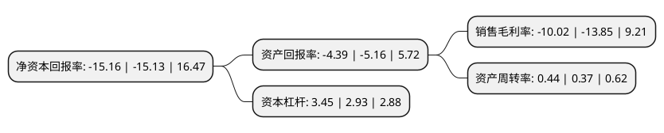

> 本页面由自动化程序生成于 2022年5月20日 01:27
> 内容可能存在错误，如有bug请提交issue至：https://github.com/Eroleice/doc-pi/issues
{.is-warning}

# 上市公司基本情况

## 基本资料

卓郎智能技术股份有限公司（以下简称“卓郎智能”）成立于1993年02月25日，乌鲁木齐市。于2003年12月03日在上交所主板上市。

卓郎智能注册资本189,541.3万元，主要产品及提供的劳务:智能化纺织成套设备及核心零部件的研发，生产和销售以下是详细信息：

- 公司名称: 卓郎智能技术股份有限公司
- 股票代码: 600545.SH
- 所在地: 新疆 - 乌鲁木齐市
- 成立日期: 1993年02月25日
- 注册资本: 189,541.3万元
- 法定代表人: 潘雪平
- 主营业务: 主要产品及提供的劳务:智能化纺织成套设备及核心零部件的研发，生产和销售
- 公司官网: www.saurer.com
- 公司介绍: 公司是一家专注于纱线加工机械和专件的全球领先运营技术集团，是在全球范围天然纤维纺织机械领域少数能够提供从开清棉组、梳棉机、粗纱机、细纱机、络筒机、加捻机、倍捻机及全自动转杯纺纱机的整体解决方案提供商。作为一家拥有悠久传承的公司，公司一直在引领行业创新。公司主要从事智能化纺织成套设备及核心零部件的研发、生产和销售，通过多年经营积累及技术沉淀，形成了卓郎(Saurer)、赐来福(Schlafhorst)、青泽(Zinser)、阿尔玛(Allma)、福克曼(Volkmann)等多个历史悠久、全球知名的纺织机械行业品牌。

## 股东及高管情况

上市公司第一大股东为江苏金昇实业股份有限公司，持股889,759,677股，占比46.94%，为上市公司实际控制人。

截至2022年03月31日，上市公司的前十大股东中，共有8名机构股东，2个产品账户，其中5%以上大股东共有2名。上市公司前十大股东明细如下：

> 截至2022年03月31日，上市公司前十大股东信息如下：

| 股东名称 | 持股数量（股） | 持股比例 |
| --- | --- | --- |
| 江苏金昇实业股份有限公司 | 889,759,677 | 46.94% |
| 卓郎智能技术股份有限公司回购专用证券账户 | 107,500,773 | 5.67% |
| 国开金融有限责任公司 | 61,778,441 | 3.26% |
| 江苏华泰战略新兴产业投资基金(有限合伙) | 49,688,858 | 2.62% |
| 常州和合投资合伙企业(有限合伙) | 38,513,087 | 2.03% |
| 乌鲁木齐国有资产经营(集团)有限公司 | 30,072,467 | 1.59% |
| 深圳市龙鼎数铭股权投资合伙企业(有限合伙) | 18,103,647 | 0.96% |
| 华山投资有限公司 | 16,612,641 | 0.88% |
| 上海永钧股权投资合伙企业(有限合伙) | 16,611,641 | 0.88% |
| 常州合众投资合伙企业(有限合伙) | 11,324,837 | 0.6% |

## 杜邦分析

> 数据列示周期：2021年 | 2020年 | 2019年
{.is-info}

上市公司的净资产收益率在近一年有所上升，上升幅度为0.2%，其变化情况分解如下：
- 上市公司的销售毛利率在近一年下降了-27.65%，可能是生产效率的下降、商品原材料价格上涨或商品价格的下跌所致。
- 上市公司的资产周转率在近一年上升了18.92%，可能是源自于更快的销售回款或库存管理效果提升。
- 上市公司的财务杠杆比率在近一年上升了17.75%，可能是增加负债扩大生产规模。

