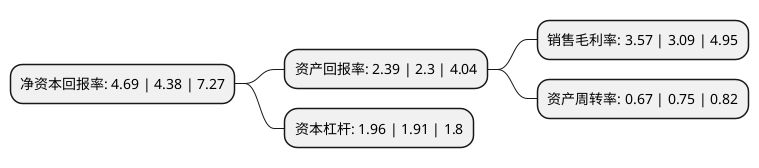

> 本页面由自动化程序生成于 2022年5月20日 01:29
> 内容可能存在错误，如有bug请提交issue至：https://github.com/Eroleice/doc-pi/issues
{.is-warning}

# 上市公司基本情况

## 基本资料

上工申贝(集团)股份有限公司（以下简称“上工申贝”）成立于1994年04月19日，上海市。于1994年03月11日在上交所主板上市。

上工申贝注册资本71,316.648万元，主要产品:缝制设备包括工业缝纫机，家用缝纫机及特种用途工业定制机器等。主要业务:工业缝制设备和家用缝纫机的研发，生产和销售。以下是详细信息：

- 公司名称: 上工申贝(集团)股份有限公司
- 股票代码: 600843.SH
- 所在地: 上海 - 上海市
- 成立日期: 1994年04月19日
- 注册资本: 71,316.648万元
- 法定代表人: 张敏
- 主营业务: 主要产品:缝制设备包括工业缝纫机，家用缝纫机及特种用途工业定制机器等工业缝制设备和家用缝纫机的研发，生产和销售
- 公司官网: www.sgsbgroup.com
- 公司介绍: 公司从事工业缝制设备和家用缝纫机的研发、生产和销售，经营业务还涉及编织横机、办公机械、物流服务和商贸流通等领域。公司生产的工业缝制设备已广泛应用于诸多不同的行业，在传统的服装、箱包、皮鞋加工领域，拥有LV、GUCCI、HERMES、BOSS、ARMANI等顶级客户；在汽车内饰加工领域，为奔驰、宝马、奥迪、通用等知名汽车制造商提供高端缝纫产品；在航空航天及新材料领域，公司同样拥有波音、空客、中国商飞等大型客户。公司已经成长为一家专业生产高端缝制设备和提供缝纫应用技术解决方案的供应商。公司拥有一支强大的海内外研发队伍，具备先进的试验手段，具有较强的产品和应用技术持续开发能力。公司研发团队进行的工业4.0在缝制设备上应用的研发已取得初步成果。公司技术中心被认定为上海市级研发中心，控股子公司上工宝石的技术研发中心被认定为浙江省级研发中心。

## 股东及高管情况

上市公司第一大股东为上海浦科飞人投资有限公司，持股60,000,000股，占比8.41%，**疑似为**上市公司实际控制人。

截至2022年03月31日，上市公司的前十大股东中，共有2名自然人股东，6名机构股东，1个海外主体，1名其他股东，其中5%以上大股东共有2名。上市公司前十大股东明细如下：

> 未能通过持股比例判定出上市公司实际控制人（持股30%以上）
> 可能存在通过间接持股、联合持股、协议控制等方式拥有实际控制权的主体，具体请参考上市公司定期公告！
{.is-warning}

> 上市公司第一大股东持股不超过10%，请检查是否存在公司控制权风险！
{.is-danger}

> 截至2022年03月31日，上市公司前十大股东信息如下：

| 股东名称 | 持股数量（股） | 持股比例 |
| --- | --- | --- |
| 上海浦科飞人投资有限公司 | 60,000,000 | 8.41% |
| 上海市浦东新区国有资产监督管理委员会 | 45,395,358 | 6.37% |
| 上海星河数码投资有限公司 | 30,000,000 | 4.21% |
| 台州盛文股权投资合伙企业(有限合伙) | 22,222,222 | 3.12% |
| 威海启顺贸易有限公司 | 20,839,509 | 2.91% |
| 中国长城资产管理股份有限公司 | 17,260,400 | 2.42% |
| 吴建昕 | 11,468,089 | 1.61% |
| 陆凌云 | 10,101,010 | 1.42% |
| 上海国际集团资产管理有限公司 | 6,258,153 | 0.88% |
| KGI ASIA LIMITED | 5,534,040 | 0.78% |

## 利润表分析

上市公司2021年总收入为31.24亿元，净利润为0.83亿元，实现盈利。

## 杜邦分析

> 数据列示周期：2020年 | 2019年 | 2018年
{.is-info}

上市公司的净资产收益率在近一年有所上升，上升幅度为7.08%，其变化情况分解如下：
- 上市公司的销售毛利率在近一年上升了15.53%，可能是生产效率的提升、商品原材料价格下跌或商品价格的上涨所致。
- 上市公司的资产周转率在近一年下降了-10.67%，可能是源自于更慢的销售回款或库存管理效果下降。
- 上市公司的财务杠杆比率在近一年上升了2.62%，可能是增加负债扩大生产规模。

